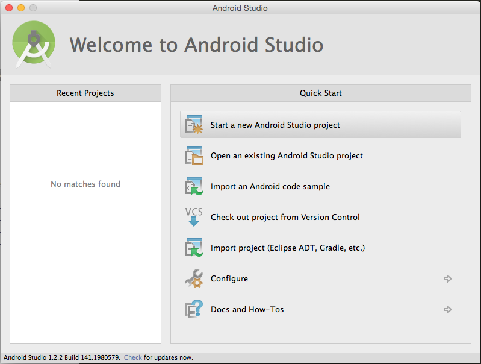
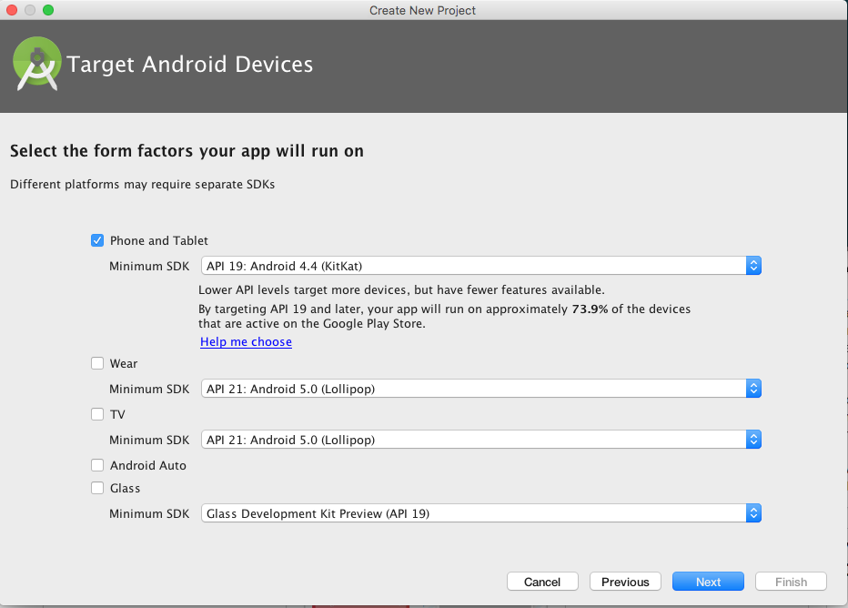
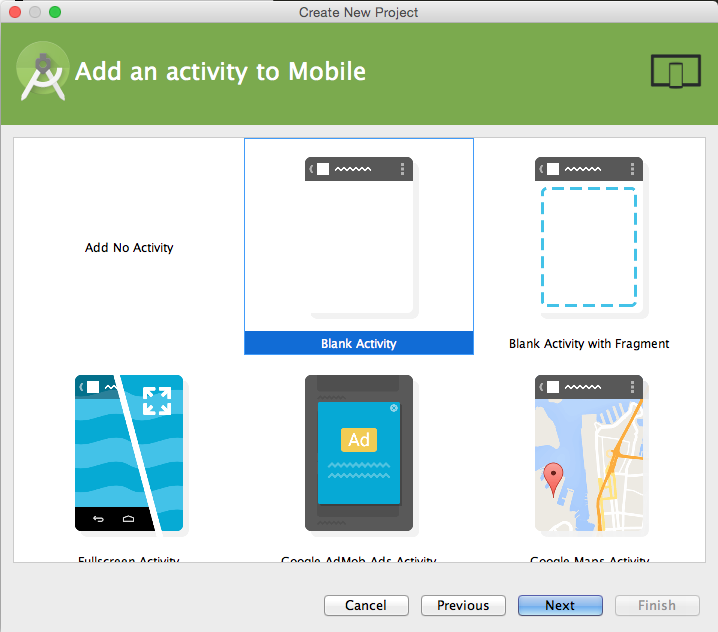
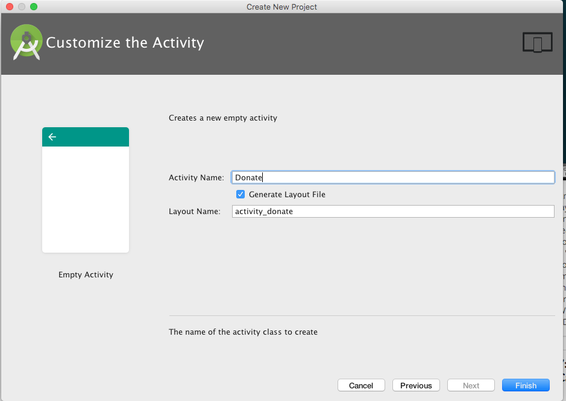
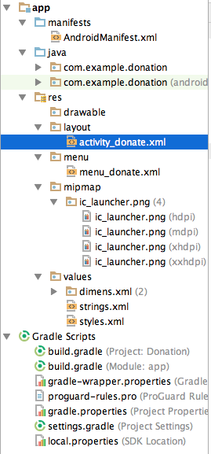
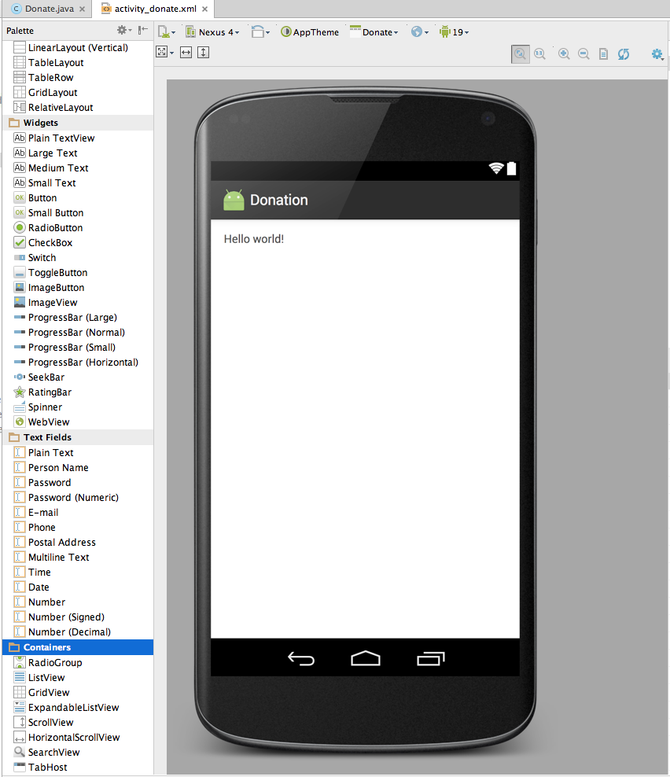
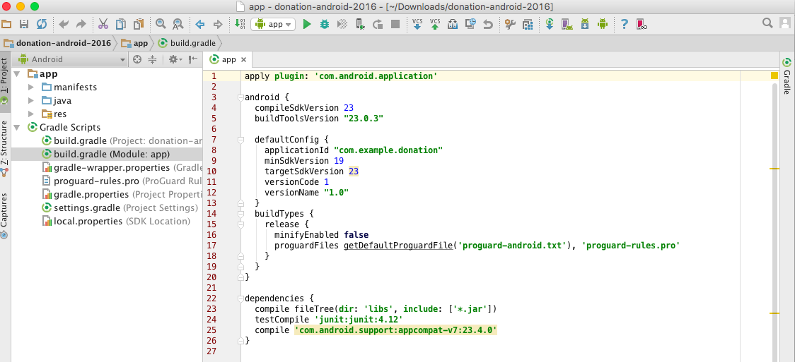

#Create Project

Create a new Android application as demonstrated in the following 5 screenshots:







Note the 'Minimum Required SDK' which may be different from the default (Figure 3).

The opening project perspective is shown in Figure 6.


The project will look like this:



With the activity_donate open in the visual designer:



It is important to become familiar with the structure and purpose of the three panes surrounding the Donation 'canvas':

##Palette:


##Component Tree (Outline)


##Properties


These views are closely related - and you will need to monitor the information displayed there continually as you evolve the appearance of your activities screens.

Before proceeding, open the file build.gradle in the Editor and modify as shown in Figure 12 and the code below:



```
apply plugin: 'com.android.application'

android {
  compileSdkVersion 23
  buildToolsVersion "23.0.3"

  defaultConfig {
    applicationId "com.example.donation"
    minSdkVersion 19
    targetSdkVersion 23
    versionCode 1
    versionName "1.0"
  }
  buildTypes {
    release {
      minifyEnabled false
      proguardFiles getDefaultProguardFile('proguard-android.txt'), 'proguard-rules.pro'
    }
  }
}

dependencies {
  compile fileTree(dir: 'libs', include: ['*.jar'])
  testCompile 'junit:junit:4.12'
  compile 'com.android.support:appcompat-v7:23.4.0'
}


```

Note that two files named build.gradle are present. Ensure you change the file within the app folder as shown in Figure 12.

- The settings in this file determine the lowest standard device on which the donation app will run.
    - In this case it should install and run, at a minimum, on a device specified Android 4.1 API (Jelly Bean).


