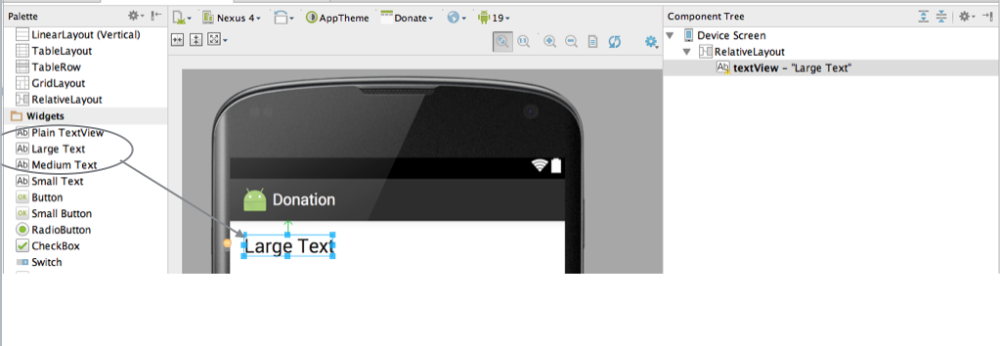
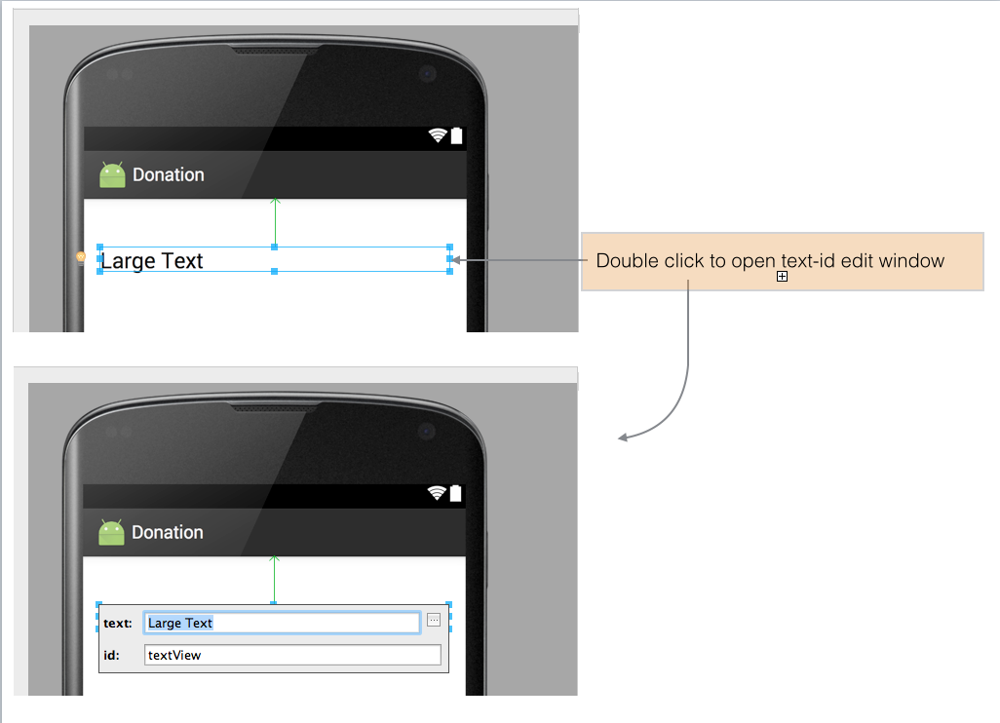
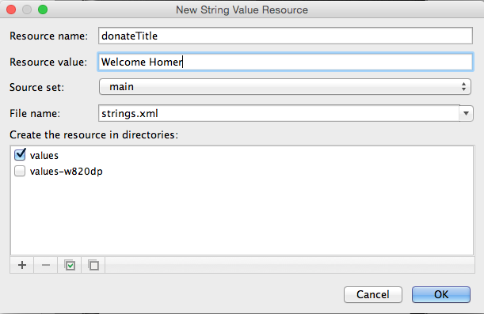
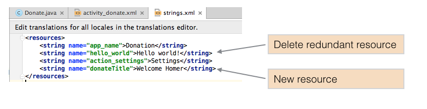

#Layout Donation Activity

For this lab, our objective is to reproduce in Android this feature from the web app:

In Android Studio, delete the current 'Hello World' text, and drag and drop a new'LargeText' form widget onto the canvas. 

Note carefully the following features:

- the guides tieing the text to the left, top and right corner
- in Component Tree - the name of the control has been changed from a default to 'donateTitle'. This is changed by selecting the item in outline, and selecting 'Edit ID' from the context menu.
- in Properties - where we entered 'Welcome Homer' into the text field

Recreate the above precisely.

You may toggle between the design and textual representation of the screen using the tabs located towards the foot of the Android Studio perspective as shown in Figure 9.

Closely inspect the following two files:

##res/layout/activity_dontate.xml
~~~xml
<RelativeLayout xmlns:android="http://schemas.android.com/apk/res/android"
                xmlns:tools="http://schemas.android.com/tools" android:layout_width="match_parent"
                android:layout_height="match_parent" android:paddingLeft="@dimen/activity_horizontal_margin"
                android:paddingRight="@dimen/activity_horizontal_margin"
                android:paddingTop="@dimen/activity_vertical_margin"
                android:paddingBottom="@dimen/activity_vertical_margin" tools:context=".Donate">

  <TextView
      android:layout_width="wrap_content"
      android:layout_height="wrap_content"
      android:textAppearance="?android:attr/textAppearanceLarge"
      android:text="@string/donateTitle"
      android:id="@+id/donateTitle"
      android:layout_alignParentTop="true"
      android:layout_alignParentStart="true"
      android:layout_alignParentLeft="true"
      android:layout_marginTop="23dp"
      android:layout_alignParentEnd="true"
      android:layout_alignParentRight="true"
      />
</RelativeLayout>
~~~

##res/values/strings.xml
~~~xml
<resources>
    <string name="app_name">Donation</string>
    <string name="action_settings">Settings</string>
    <string name="donateTitle">Welcome Homer</string>
</resources>

~~~

Note the relationship between 'donateTitle' in both files. Also note we have deleted the superfluous 'hello_world' string left over from the generated app as indicated in Figure 8.

Bring in the following string into the donate activity now - (medium text) - and follow the same procedure as above. The designer should look like this:

and our XML files will look like this:

~~~xml
<RelativeLayout xmlns:android="http://schemas.android.com/apk/res/android"
                xmlns:tools="http://schemas.android.com/tools" android:layout_width="match_parent"
                android:layout_height="match_parent" android:paddingLeft="@dimen/activity_horizontal_margin"
                android:paddingRight="@dimen/activity_horizontal_margin"
                android:paddingTop="@dimen/activity_vertical_margin"
                android:paddingBottom="@dimen/activity_vertical_margin" tools:context=".Donate">

  <TextView
      android:layout_width="wrap_content"
      android:layout_height="wrap_content"
      android:textAppearance="?android:attr/textAppearanceLarge"
      android:text="@string/donateTitle"
      android:id="@+id/donateTitle"
      android:layout_alignParentTop="true"
      android:layout_alignParentStart="true"
      android:layout_marginTop="23dp"
      android:layout_alignParentEnd="true"
      android:layout_alignParentLeft="true"
      android:layout_alignParentRight="true"
      />

  <TextView
      android:layout_width="wrap_content"
      android:layout_height="wrap_content"
      android:textAppearance="?android:attr/textAppearanceMedium"
      android:text="@string/donateSubtitle"
      android:id="@+id/donateSubTitle"
      android:layout_marginTop="22dp"
      android:layout_below="@+id/donateTitle"
      android:layout_alignParentStart="true"
      android:layout_alignRight="@+id/donateTitle"
      android:layout_alignParentRight="@+id/donateTitle"
      android:layout_alignParentLeft="true"
      />

</RelativeLayout>

~~~

~~~xml
<resources>
    <string name="app_name">Donation</string>
    <string name="action_settings">Settings</string>
    <string name="donateTitle">Welcome Homer</string>
    <string name="donateSubtitle">Please give generously</string>
</resources>

~~~

