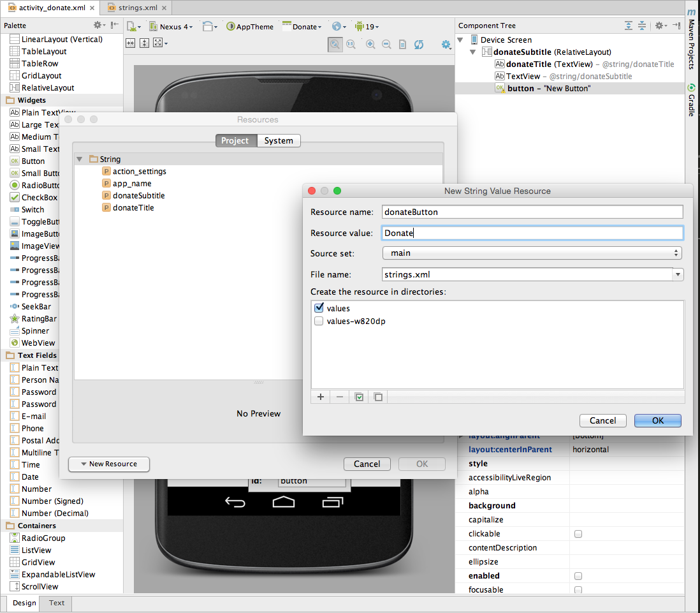

#Donate Button

Place a button directly on to the activity - attached to the bottom of the screen as shown:


Following a similar procedure as in the previous step, rename the button and add an id, as shown in Figures 2 and 3.




###activity_donate.xml 

```
<RelativeLayout xmlns:android="http://schemas.android.com/apk/res/android"
                xmlns:tools="http://schemas.android.com/tools" android:layout_width="match_parent"
                android:layout_height="match_parent" android:paddingLeft="@dimen/activity_horizontal_margin"
                android:paddingRight="@dimen/activity_horizontal_margin"
                android:paddingTop="@dimen/activity_vertical_margin"
                android:paddingBottom="@dimen/activity_vertical_margin" tools:context=".Donate">

  <TextView
    android:layout_width="wrap_content"
    android:layout_height="wrap_content"
    android:textAppearance="?android:attr/textAppearanceLarge"
    android:text="@string/donateTitle"
    android:id="@+id/donateTitle"
    android:layout_alignParentTop="true"
    android:layout_alignParentStart="true"
    android:layout_marginTop="23dp"
    android:layout_alignParentEnd="true"
    android:layout_alignParentLeft="true"
    android:layout_alignParentRight="true"
    />

  <TextView
    android:layout_width="wrap_content"
    android:layout_height="wrap_content"
    android:textAppearance="?android:attr/textAppearanceMedium"
    android:text="@string/donateSubtitle"
    android:id="@+id/donateSubTitle"
    android:layout_marginTop="22dp"
    android:layout_below="@+id/donateTitle"
    android:layout_alignParentStart="true"
    android:layout_alignRight="@+id/donateTitle"
    android:layout_alignParentRight="@+id/donateTitle"
    android:layout_alignParentLeft="true"
    />

  <Button
    android:layout_width="wrap_content"
    android:layout_height="wrap_content"
    android:text="@string/donateButton"
    android:id="@+id/donateButton"
    android:layout_alignParentBottom="true"
    android:layout_centerHorizontal="true" />

</RelativeLayout>


```

##strings.xml

```
<resources>
    <string name="app_name">Donation</string>
    <string name="action_settings">Settings</string>
    <string name="donateTitle">Welcome Homer</string>
    <string name="donateSubtitle">Please give generously</string>
    <string name="donateButton">Donate</string>
</resources>

```

If there is a deviation from the above - retrace your steps (delete the button) until you can match the above.

We can now switch our attention to the Java Activity class Donate:

```
package com.example.donation;

import android.os.Bundle;
import android.support.v7.app.AppCompatActivity;
import android.view.Menu;
import android.widget.Button;
import android.util.Log;

public class Donate extends AppCompatActivity
{

  @Override
  protected void onCreate(Bundle savedInstanceState)
  {
    super.onCreate(savedInstanceState);
    setContentView(R.layout.activity_donate);
  }

  @Override
  public boolean onCreateOptionsMenu(Menu menu)
  {
    // Inflate the menu; this adds items to the action bar if it is present.
    getMenuInflater().inflate(R.menu.menu_donate, menu);
    return true;
  }

  @Override
  public boolean onOptionsItemSelected(MenuItem item)
  {
    // Handle action bar item clicks here. The action bar will
    // automatically handle clicks on the Home/Up button, so long
    // as you specify a parent activity in AndroidManifest.xml.
    int id = item.getItemId();

    //noinspection SimplifiableIfStatement
    if (id == R.id.action_settings)
    {
      return true;
    }

    return super.onOptionsItemSelected(item);
  }
}

```

The reference to the menu item above requires a new folder in `res` named `menu` containing a file named `menu_donate.xml` with the following content:

```
<menu xmlns:android="http://schemas.android.com/apk/res/android"
      xmlns:app="http://schemas.android.com/apk/res-auto"
      xmlns:tools="http://schemas.android.com/tools"
      tools:context=".Donate">

  <item android:id="@+id/action_settings"
        android:title="@string/action_settings"
        android:orderInCategory="100"
        app:showAsAction="never"/>
</menu>

```

For any 'controls' a user can interact with we usually find it useful to associate a class member with that object. Currently we have one only on - a Button. The text fields we dont consider 'interactive' as such, so we will not include those.

Insert the following new field into the class:

```
  private Button donateButton;
```

The class will have to be imported. The class name will always match the name in the Palette:


We are free to call the variable anything we like. However, in order to keep confusion to a minimum, always call the variable by the same name you used in the Component Tree view:


In onCreate - we need to initialise this variable:

```
    donateButton = (Button) findViewById(R.id.donateButton);
```

We might also add a logging message so we can have some feedback as the app launches:

```
    Log.v("Donate", "got the donate button");
```


We should check the donate button actually exists before logging our success:

```
    if (donateButton != null)
    {
      Log.v("Donate", "Really got the donate button");
    }

```

This is the complete activity class:

```
package com.example.donation;

import android.os.Bundle;
import android.support.v7.app.AppCompatActivity;
import android.view.Menu;
import android.widget.Button;
import android.util.Log;

public class Donate extends AppCompatActivity {

    private Button donateButton;

    @Override
    protected void onCreate(Bundle savedInstanceState) {
        super.onCreate(savedInstanceState);
        setContentView(R.layout.activity_donate);

        donateButton = (Button) findViewById(R.id.donateButton);
        if (donateButton != null) {
            Log.v("Donate", "Really got the donate button");
        }
    }

    @Override
    public boolean onCreateOptionsMenu(Menu menu) {
        // Inflate the menu; this adds items to the action bar if it is present.
        getMenuInflater().inflate(R.menu.menu_donate, menu);
        return true;
    }
}


```

Finding the log message can be very difficult, unless you set a filter. 

- [LogCat documentation](https://developer.android.com/tools/debugging/debugging-studio.html) describes how to manage logging.

In the 'LogCat' view in Android Studio, create a filter like this:


If you then select the filter, we should see our message:


 


