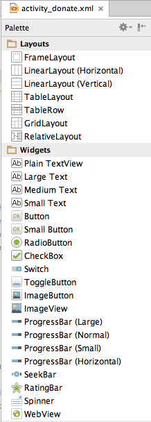

#Research + New Control Layout

Recall the UI we are trying to implement:

We need a Radio Buttons, some sort of selection/combo box + a progress bar. These can be found in various locations in the palette:

RadioGroup, ProgressBar and NumberPicker seem likely candidates. The names of these controls are exactly as advertised, and we can find them as illustrated in the preceeding Figures 2, 3 & 4. To verify this, try importing them at the top of the Donate activity class:

~~~java
import android.widget.RadioGroup;
import android.widget.NumberPicker;
import android.widget.ProgressBar;
~~~

... and we can bring in three fields into the class:

~~~java
  private RadioGroup   paymentMethod;
  private ProgressBar  progressBar;
  private NumberPicker amountPicker;
~~~

We can also open up three pages of documentation - which we can reverse engineer from the package/class names:

- <http://developer.android.com/reference/android/widget/RadioGroup.html>
- <http://developer.android.com/reference/android/widget/ProgressBar.html>
- <http://developer.android.com/reference/android/widget/NumberPicker.html>

Note this time we have gone to the Activity class before actually creating the controls. We should do this now - and remember to use the same names (for the IDs) as we create the controls.

Getting the layout +id names as shown above may take some practice. However, it is an essential skill to get on top of, even it it takes a lot of trial and error.

For reference purposes (try to do it your self), these are the relevant generated xml files:

~~~xml
<RelativeLayout xmlns:android="http://schemas.android.com/apk/res/android"
                xmlns:tools="http://schemas.android.com/tools"
                android:layout_width="match_parent"
                android:layout_height="match_parent"
                android:paddingBottom="@dimen/activity_vertical_margin"
                android:paddingLeft="@dimen/activity_horizontal_margin"
                android:paddingRight="@dimen/activity_horizontal_margin"
                android:paddingTop="@dimen/activity_vertical_margin"
                tools:context=".Donate" >

    <TextView
        android:id="@+id/donateTitle"
        android:layout_width="wrap_content"
        android:layout_height="wrap_content"
        android:layout_alignParentLeft="true"
        android:layout_alignParentRight="true"
        android:layout_alignParentTop="true"
        android:text="@string/donateTitle"
        android:textAppearance="?android:attr/textAppearanceLarge" />

    <TextView
        android:id="@+id/donateSubtitle"
        android:layout_width="wrap_content"
        android:layout_height="wrap_content"
        android:layout_alignParentLeft="true"
        android:layout_alignParentRight="true"
        android:layout_below="@+id/donateTitle"
        android:text="@string/donateSubtitle"
        android:textAppearance="?android:attr/textAppearanceMedium" />

    <RadioGroup
        android:id="@+id/paymentMethod"
        android:layout_width="wrap_content"
        android:layout_height="wrap_content"
        android:layout_above="@+id/progressBar"
        android:layout_alignLeft="@+id/donateSubtitle"
        android:layout_below="@+id/donateSubtitle"
        android:layout_marginLeft="14dp"
        android:layout_marginTop="26dp"
        android:layout_toLeftOf="@+id/amountPicker" >

        <RadioButton
            android:id="@+id/PayPal"
            android:layout_width="wrap_content"
            android:layout_height="wrap_content"
            android:checked="true"
            android:text="@string/PayPal" />

        <RadioButton
            android:id="@+id/Direct"
            android:layout_width="wrap_content"
            android:layout_height="wrap_content"
            android:text="@string/Direct" />

    </RadioGroup>

    <ProgressBar
        android:id="@+id/progressBar"
        style="?android:attr/progressBarStyleHorizontal"
        android:layout_width="wrap_content"
        android:layout_height="wrap_content"
        android:layout_above="@+id/donateButton"
        android:layout_alignParentLeft="true"
        android:layout_alignParentRight="true"
        android:layout_marginBottom="67dp" />

    <NumberPicker
        android:id="@+id/amountPicker"
        android:layout_width="wrap_content"
        android:layout_height="wrap_content"
        android:layout_alignRight="@+id/donateSubtitle"
        android:layout_alignTop="@+id/paymentMethod" />

    <Button
        android:id="@+id/donateButton"
        android:layout_width="wrap_content"
        android:layout_height="wrap_content"
        android:layout_alignParentBottom="true"
        android:layout_alignParentLeft="true"
        android:layout_marginBottom="15dp"
        android:onClick="donateButtonPressed"
        android:text="@string/donateButton" />

</RelativeLayout>
~~~

~~~xml
<resources>
  <string name="app_name">Donation</string>
  <string name="action_settings">Settings</string>
  <string name="donateTitle">Welcome Homer</string>
  <string name="donateSubtitle">Please give generously</string>
  <string name="donateButton">Donate</string>
  <string name="PayPal">PayPal</string>
  <string name="Direct">Direct</string>
</resources>
~~~

If we have our naming conventions right - then we can bind to these new controls in onCreate:

~~~java
    paymentMethod = (RadioGroup)   findViewById(R.id.paymentMethod);
    progressBar   = (ProgressBar)  findViewById(R.id.progressBar);
    amountPicker  = (NumberPicker) findViewById(R.id.amountPicker);
~~~

This is the complete Donate class:

~~~java
package com.example.donation;

import android.support.v7.app.AppCompatActivity;
import android.os.Bundle;
import android.util.Log;
import android.view.Menu;
import android.view.MenuItem;
import android.view.View;
import android.widget.Button;
import android.widget.RadioGroup;
import android.widget.NumberPicker;
import android.widget.ProgressBar;

public class Donate extends AppCompatActivity
{

    private Button donateButton;
    private RadioGroup paymentMethod;
    private ProgressBar progressBar;
    private NumberPicker amountPicker;

    @Override
    protected void onCreate(Bundle savedInstanceState)
    {
        super.onCreate(savedInstanceState);
        setContentView(R.layout.activity_donate);

        donateButton = (Button) findViewById(R.id.donateButton);
        paymentMethod = (RadioGroup)   findViewById(R.id.paymentMethod);
        progressBar   = (ProgressBar)  findViewById(R.id.progressBar);
        amountPicker  = (NumberPicker) findViewById(R.id.amountPicker);

        amountPicker.setMinValue(0);
        amountPicker.setMaxValue(1000);

    }

    @Override
    public boolean onCreateOptionsMenu(Menu menu)
    {
        // Inflate the menu; this adds items to the action bar if it is present.
        getMenuInflater().inflate(R.menu.menu_donate, menu);
        return true;
    }

    public void donateButtonPressed (View view)
    {
        Log.v("Donate", "Donate Pressed!");
    }

    @Override
    public boolean onOptionsItemSelected(MenuItem item)
    {
        // Handle action bar item clicks here. The action bar will
        // automatically handle clicks on the Home/Up button, so long
        // as you specify a parent activity in AndroidManifest.xml.
        int id = item.getItemId();

        //noinspection SimplifiableIfStatement
        if (id == R.id.action_settings)
        {
            return true;
        }

        return super.onOptionsItemSelected(item);
    }
}

~~~

