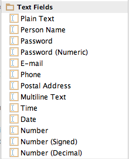
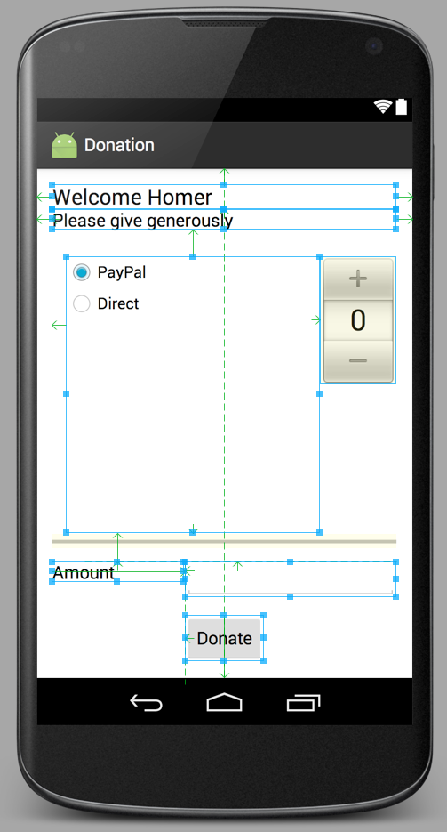

#Exercises

##Exercise 1:

Here is an archive of lab so far:

- [donation-android-2016](https://github.com/wit-ictskills-2016/donation-android-2016.git)

You may use this as a reference if you have any unresolved anomalies in your code.

The archive is tagged at end of each lab step. To obtain a snapshot at the end of, for example, step 2, simply run the command `git checkout 01_02`. In this case, 01_02 is a tag where 01 represents the first lab in the donation series of labs and 02 represents step 2.

You should now put your Donation application under git version control. You are already familiar with this procedure:

- cd into the project on your computer in a terminal
- create a suitable .gitignore file (sample below)
- run `git add .`
- commit with a suitable message
- create a repository on your Bitbucket account named `donation-android-2016'
- follow the Bitbucket documented procedure to establish tracking between local and remote repos
- run the push command to initialize the remote repo with the latest local snapshot.

Use this repository pair to maintain a record of the Android Donation app as you develop it further during the course.

Sample .gitignore file:

```
#built application files
*.apk
*.ap_

# files for the dex VM
*.dex

# Java class files
*.class

# generated files
bin/
gen/

# Local configuration file (sdk path, etc)
local.properties

# Windows thumbnail db
Thumbs.db

# OSX files
.DS_Store

# Android Studio
# https://www.jetbrains.com/idea/help/project.html
*.iml
.idea/workspace.xml
.gradle
build/
```

##Exercises 2:

Consider an alternative to the NumberPicker - specifically one of the "Text Fields" controls:



These are mostly EditView objects:

- <http://developer.android.com/reference/android/widget/EditText.html>

Redesign the activity to take a value from the picker or directly from a text view:



If the number picker is set to zero, then attempt to get a number from the text view.

Here is a hint (a version of donatButonPressed that does what we want):

~~~java
  public void donateButtonPressed (View view) 
  {
    String method = paymentMethod.getCheckedRadioButtonId() == R.id.PayPal ? "PayPal" : "Direct";
    progressBar.setProgress(totalDonated);

    int donatedAmount =  amountPicker.getValue();
    if (donatedAmount == 0)
    {
      String text = amountText.getText().toString();
      if (!text.equals(""))
        donatedAmount = Integer.parseInt(text);
    }
    totalDonated  = totalDonated + donatedAmount;
    Log.v("Donate", amountPicker.getValue() + " donated by " +  method + "\nCurrent total " + totalDonated);
   }
~~~

##Exercise 3:

Revise the app such that when the target is achieved (10000) - then no more donations accepted, and the user is made aware of this.

Hint - here is how you can display a simple alert:

~~~java
      Toast toast = Toast.makeText(this, "Target Exceeded!", Toast.LENGTH_SHORT);
      toast.show();
~~~

##Exercise 4:

Show on screen at all times the total amount donated.

You will use standard TextView for this:

- <http://developer.android.com/reference/android/widget/TextView.html>

You already have a number of these on screen. Your layout could be revised to look like this:


