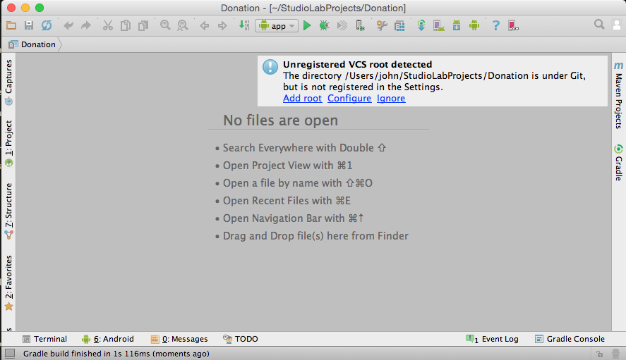

#Donation-01 Solutions

In this lab we shall continue work on the NUC devices.

You are recommend to tag each step.

Continue building on your previous app. Alternatively use this version, but if you do then it will be necessary to change the remote tracking repo (see Appendix).

[donation-android-2016](https://github.com/wit-ictskills-2016/donation-android-2016.git)

Launch Android Studio and open this project.

If the project is not present in the Recent Projects panel, open the project as shown in Figure 1:

You may be presented with a message as shown in Figure 2 indicating an unregistered version control system (VCS).

- Click **Add root**.

Once you have opened the project in Android Studio you are ready to proceed with the lab, the first part of which is to provide solutions to the exercises at the end of Donation-01.