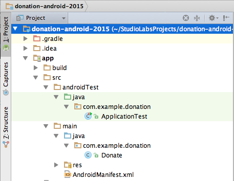

#Package Name

This version is a little misconfigured - we have a leftover - the package name 'com.example.donation' form the project generation wizard.  
This can be changed as follows:

- With the project imported to Android Studio, select Project in the Project Structure pane.
- Expand the folders in *src* to reveal *com.example.donation* packages in both *androidTest* and *main*.

- Create a new package *app.donation* in *androidTest/java*.
    - Drag the file *ApplicationTest* to this new package.
- Create a new package *app.donation* in *main/java*.
    - Drag file *Donate* to this new package.
- Both original packages, *com.example.donation* should be deleted automatically without user intervention.

- Change the package name to *app.donation* in *AndroidManifest.xml*.

- Change *applicationID* to *app.donation* in build.gradle.
    - Sync Now if prompted.

- Check that the import statement in *Donate.java* is as follows:

~~~
import android.widget.Toast;

import app.donation.R;

public class Donate extends AppCompatActivity
~~~

- Clean the project.

- Test by rebuilding (Build | Rebuild) and running (Run | Run 'app').
