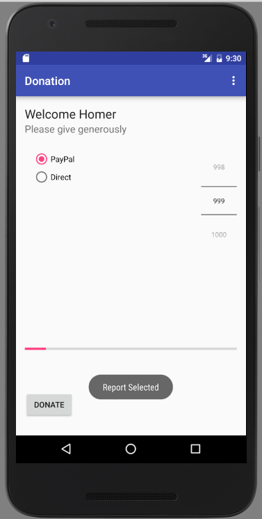

#Menu

Open `res/values/Strings.xml` and introduce a new String resource like this:

~~~xml
    <string name="menuReport">Report</string>
~~~

We have a menu resource called 'menu_donate.xml' in the `res/menu` folder. Modify this file by adding this new menu item:


```
  <item
       android:id="@+id/menuReport"
        android:orderInCategory="100"
        android:title="@string/menuReport"/>

```

(Make sure it is within the `<menu>` element)

In Donate.java, change the `onOptionsItemSelected` method to look like this:

~~~java
  @Override
  public boolean onOptionsItemSelected(MenuItem item)
  {
    switch (item.getItemId())
    {
      case R.id.menuReport:
        Toast.makeText(this, "Report Selected", Toast.LENGTH_SHORT).show();
        break;
    }
    return true;
  }
~~~

An import statement is required for Toast:

```
import android.widget.Toast;

```

Run the app and when you press the menu button (or the overflow menu) and select 'Report', you should see the toast message appear.

