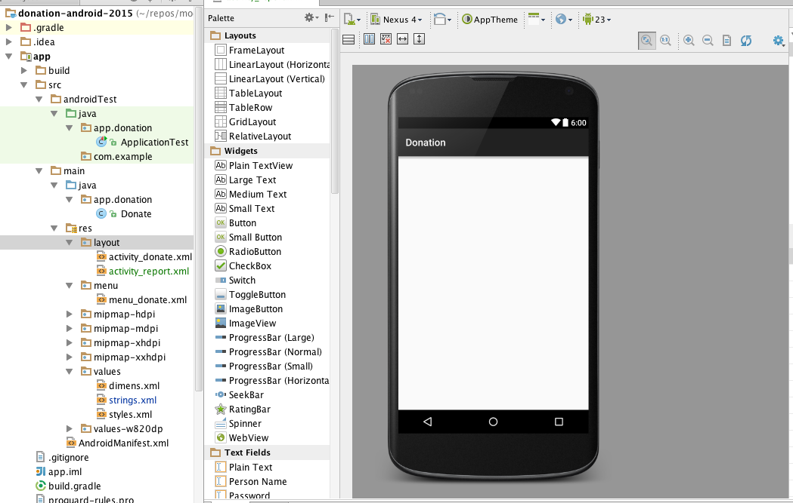
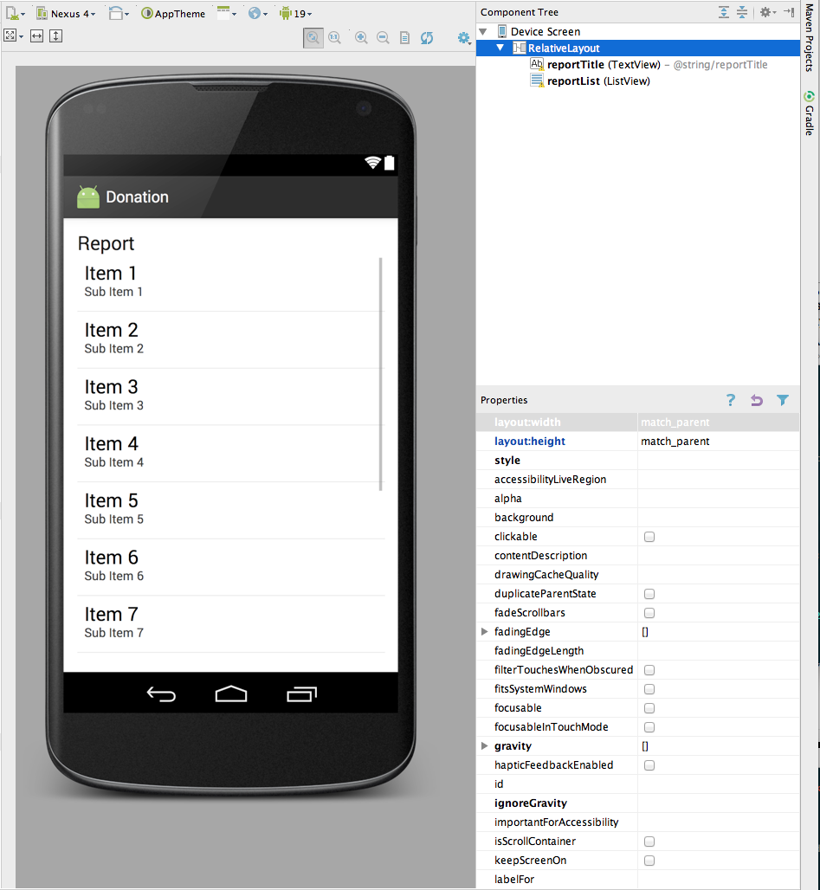
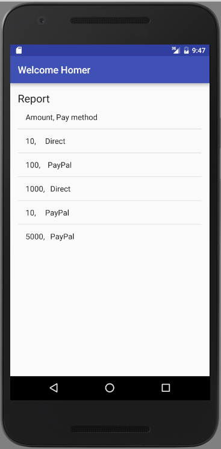

#Reports Activity

Before we start to design a new activity, Add a string resource in `res/values/strings.xml`:

```
<string name="reportTitle">Report</string>
```

Design a new layout called `activity_report`. Do this by locating the `res/layout` folder and selecting `new->layout resource file`:


Call the layout file `activity_report`



We would like the resource to look like this:



For the monment, to achieve this - just replace the xml with the following:


~~~xml
<RelativeLayout xmlns:android="http://schemas.android.com/apk/res/android"
    xmlns:tools="http://schemas.android.com/tools"
    android:layout_width="match_parent"
    android:layout_height="match_parent"
    android:paddingBottom="@dimen/activity_vertical_margin"
    android:paddingLeft="@dimen/activity_horizontal_margin"
    android:paddingRight="@dimen/activity_horizontal_margin"
    android:paddingTop="@dimen/activity_vertical_margin"
    tools:context=".Test" >

    <TextView
        android:id="@+id/reportTitle"
        android:layout_width="wrap_content"
        android:layout_height="wrap_content"
        android:layout_alignParentLeft="true"
        android:layout_alignParentRight="true"
        android:layout_alignParentTop="true"
        android:text="@string/reportTitle"
        android:textAppearance="?android:attr/textAppearanceLarge" />

    <ListView
        android:id="@+id/reportList"
        android:layout_width="match_parent"
        android:layout_height="wrap_content"
        android:layout_alignLeft="@+id/reportTitle"
        android:layout_below="@+id/reportTitle" >

    </ListView>

</RelativeLayout>
~~~

You should see the design render as above.

We can now introduce a new Class into app.donation to render this activity:

~~~java
package app.donation;

import app.donation.R;
import android.support.v7.app.AppCompatActivity;
import android.os.Bundle;
import android.widget.ArrayAdapter;
import android.widget.ListView;

public class Report extends AppCompatActivity
{
  ListView listView;

  static final String[] numbers = new String[] {
      "Amount, Pay method",
      "10,     Direct",
      "100,    PayPal",
      "1000,   Direct",
      "10,     PayPal",
      "5000,   PayPal"};

  @Override
  public void onCreate(Bundle savedInstanceState)
  {
    super.onCreate(savedInstanceState);
    setContentView(R.layout.activity_report);

    listView = (ListView) findViewById(R.id.reportList);
    ArrayAdapter<String> adapter = new ArrayAdapter<String>(this,  android.R.layout.simple_list_item_1, numbers);
    listView.setAdapter(adapter);
  }
}
~~~

This will display a hard-coded lists of donations.

Back in Donation class, change the Donate activity to load this view when 'Report' selected from menu:

~~~java
  @Override
  public boolean onOptionsItemSelected(MenuItem item)
  {
    switch (item.getItemId())
    {
      case R.id.menuReport : startActivity (new Intent(this, Report.class));
                             break;
    }
    return true;
  }
~~~

This requires an import statement:

```
import android.content.Intent;
```

All of this will not work until you add the activity specification to the AndroidManifest.xml file:

~~~xml
        <activity
            android:name="app.donation.Report"
            android:label="@string/donateTitle" >
        </activity>
~~~

The above must be carefuly positioned - this is the full `AndroidManifest.xml` file here:

~~~
<?xml version="1.0" encoding="utf-8"?>
<manifest xmlns:android="http://schemas.android.com/apk/res/android"
    package="app.donation" >

    <application
        android:allowBackup="true"
        android:icon="@mipmap/ic_launcher"
        android:label="@string/app_name"
        android:theme="@style/AppTheme" >
        <activity
            android:name="app.donation.Donate"
            android:label="@string/app_name" >
            <intent-filter>
                <action android:name="android.intent.action.MAIN" />
                <category android:name="android.intent.category.LAUNCHER" />
            </intent-filter>
        </activity>
        <activity
            android:name="app.donation.Report"
            android:label="@string/donateTitle" >
        </activity>
    </application>

</manifest>
~~~

Note the location of the new element.

Try it all now - it should load. Here is an example using the inbuilt emulator (AVD).




