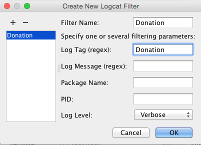

#Application Object

In order to keep our application design coherent, we now bring in an 'Application' object.

Create a new class called `DonationApp':

Incorporate this class here:

~~~java
package app.donation;

import android.app.Application;
import android.util.Log;

public class DonationApp extends Application
{
  @Override
  public void onCreate()
  {
    super.onCreate();
    Log.v("Donate", "Donation App Started");
  }
}
~~~

Application objects need to be referenced in the AndroidManifest.xml

~~~
android:name="app.donation.DonationApp"
~~~

It is inserted into the `application` element - here is the full manifest:

~~~xml
<?xml version="1.0" encoding="utf-8"?>
<manifest xmlns:android="http://schemas.android.com/apk/res/android"
    package="app.donation">

    <application
        android:allowBackup="true"
        android:icon="@mipmap/ic_launcher"
        android:label="@string/app_name"
        android:theme="@style/AppTheme"
        android:name="app.donation.DonationApp">
        <activity
            android:name="app.donation.Donate"
            android:label="@string/app_name" >
            <intent-filter>
                <action android:name="android.intent.action.MAIN" />
                <category android:name="android.intent.category.LAUNCHER" />
            </intent-filter>
        </activity>
        <activity
            android:name="app.donation.Report"
            android:label="@string/donateTitle" >
        </activity>
    </application>

</manifest>
~~~

Make sure the 'Donation App Started' appears in the logs when the application is started:

The filter used here is:

