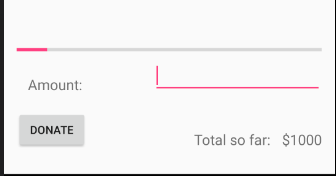
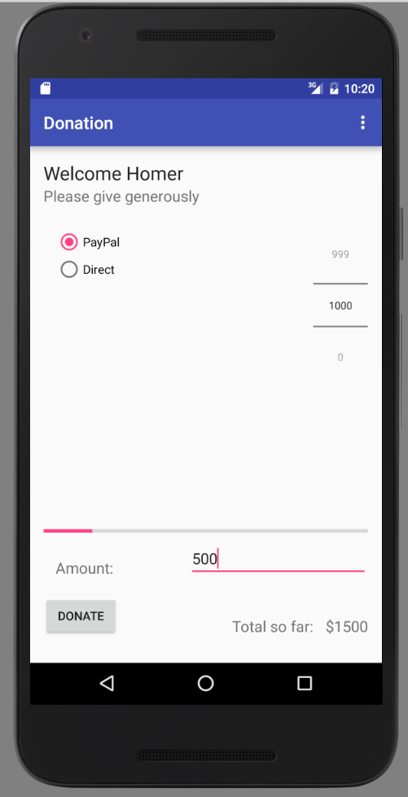

#Refactored Donate

The Donate activity can now be completely re factored to make use of the DonationApp object.

First, introduce this new member into the class:

~~~
  private DonationApp app;
~~~


and in the `onCreate` meethod, initialize app:

~~~
    app = (DonationApp) getApplication();
~~~

Finally, we can replace the `donatButtonPressed` method with this simplified version:

~~~

  public void donateButtonPressed (View view)
  {
    String method = paymentMethod.getCheckedRadioButtonId() == R.id.PayPal ? "PayPal" : "Direct";
    int donatedAmount =  amountPicker.getValue();
    if (donatedAmount == 0)
    {
      String text = amountText.getText().toString();
      if (!text.equals(""))
        donatedAmount = Integer.parseInt(text);
    }
    if (donatedAmount > 0)
    {
      app.newDonation(new Donation(donatedAmount, method));
      progressBar.setProgress(app.totalDonated);
      String totalDonatedStr = "$" + app.totalDonated;
      amountTotal.setText(totalDonatedStr);
    }
  }
~~~

Here is the complete `Donate` class if there is a problem:


~~~java
package app.donation;

import android.content.Intent;
import android.support.v7.app.AppCompatActivity;
import android.os.Bundle;
import android.view.Menu;
import android.view.MenuItem;
import android.view.View;
import android.widget.Button;
import android.widget.EditText;
import android.widget.RadioGroup;
import android.widget.NumberPicker;
import android.widget.ProgressBar;
import android.widget.TextView;

public class Donate extends AppCompatActivity
{
  private Button       donateButton;
  private RadioGroup   paymentMethod;
  private ProgressBar  progressBar;
  private NumberPicker amountPicker;
  private int          totalDonated;
  private int          target;

  private TextView     amountText;
  private TextView     amountTotal;

  private DonationApp app;

  @Override
  protected void onCreate(Bundle savedInstanceState)
  {
    super.onCreate(savedInstanceState);
    setContentView(R.layout.activity_donate);

    app = (DonationApp) getApplication();

    donateButton  = (Button) findViewById(R.id.donateButton);
    paymentMethod = (RadioGroup)   findViewById(R.id.paymentMethod);
    progressBar   = (ProgressBar)  findViewById(R.id.progressBar);
    amountPicker  = (NumberPicker) findViewById(R.id.amountPicker);
    amountTotal   = (TextView)     findViewById(R.id.amountTotal);
    amountText    = (EditText)     findViewById(R.id.amountText);

    amountPicker.setMinValue(0);
    amountPicker.setMaxValue(1000);
    progressBar.setMax(10000);

    totalDonated = 0;
    target = 10000;

  }

  @Override
  public boolean onCreateOptionsMenu(Menu menu)
  {
    // Inflate the menu; this adds items to the action bar if it is present.
    getMenuInflater().inflate(R.menu.menu_donate, menu);
    return true;
  }


  public void donateButtonPressed (View view)
  {
    String method = paymentMethod.getCheckedRadioButtonId() == R.id.PayPal ? "PayPal" : "Direct";
    int donatedAmount =  amountPicker.getValue();
    if (donatedAmount == 0)
    {
      String text = amountText.getText().toString();
      if (!text.equals(""))
        donatedAmount = Integer.parseInt(text);
    }
    if (donatedAmount > 0)
    {
      app.newDonation(new Donation(donatedAmount, method));
      progressBar.setProgress(app.totalDonated);
      String totalDonatedStr = "$" + app.totalDonated;
      amountTotal.setText(totalDonatedStr);
    }
  }

  @Override
  public boolean onOptionsItemSelected(MenuItem item)
  {
    switch (item.getItemId())
    {
      case R.id.menuReport : startActivity (new Intent(this, Report.class));
        break;
    }
    return true;
  }
}
~~~

The above will code will not compile because of missing widget in the layout - amountTotal and amountText:



Here is the refactored activity_donate.xml with the missing widgets followed by a representative picture of the Donation screen where donations have been made.

```

<RelativeLayout xmlns:android="http://schemas.android.com/apk/res/android"
    xmlns:tools="http://schemas.android.com/tools"
    android:layout_width="match_parent"
    android:layout_height="match_parent"
    android:paddingBottom="@dimen/activity_vertical_margin"
    android:paddingLeft="@dimen/activity_horizontal_margin"
    android:paddingRight="@dimen/activity_horizontal_margin"
    android:paddingTop="@dimen/activity_vertical_margin"
    tools:context=".Donate" >

    <TextView
        android:id="@+id/donateTitle"
        android:layout_width="wrap_content"
        android:layout_height="wrap_content"
        android:layout_alignParentLeft="true"
        android:layout_alignParentRight="true"
        android:layout_alignParentTop="true"
        android:text="@string/donateTitle"
        android:textAppearance="?android:attr/textAppearanceLarge" />

    <TextView
        android:id="@+id/donateSubtitle"
        android:layout_width="wrap_content"
        android:layout_height="wrap_content"
        android:layout_alignParentLeft="true"
        android:layout_alignParentRight="true"
        android:layout_below="@+id/donateTitle"
        android:text="@string/donateSubtitle"
        android:textAppearance="?android:attr/textAppearanceMedium" />

        <RadioGroup
            android:id="@+id/paymentMethod"
            android:layout_width="wrap_content"
            android:layout_height="wrap_content"
            android:layout_above="@+id/progressBar"
            android:layout_alignLeft="@+id/donateSubtitle"
            android:layout_below="@+id/donateSubtitle"
            android:layout_marginLeft="14dp"
            android:layout_marginTop="26dp"
            android:layout_toLeftOf="@+id/amountPicker" >

            <RadioButton
                android:id="@+id/PayPal"
                android:layout_width="wrap_content"
                android:layout_height="wrap_content"
                android:checked="true"
                android:text="@string/PayPal" />

            <RadioButton
                android:id="@+id/Direct"
                android:layout_width="wrap_content"
                android:layout_height="wrap_content"
                android:text="@string/Direct" />

        </RadioGroup>

        <ProgressBar
            android:id="@+id/progressBar"
            style="?android:attr/progressBarStyleHorizontal"
            android:layout_width="wrap_content"
            android:layout_height="wrap_content"
            android:layout_above="@+id/donateButton"
            android:layout_alignParentLeft="true"
            android:layout_alignParentRight="true"
            android:layout_marginBottom="67dp" />

        <NumberPicker
            android:id="@+id/amountPicker"
            android:layout_width="wrap_content"
            android:layout_height="wrap_content"
            android:layout_alignRight="@+id/donateSubtitle"
            android:layout_alignTop="@+id/paymentMethod" />

        <EditText
            android:id="@+id/amountText"
            android:layout_width="wrap_content"
            android:layout_height="wrap_content"
            android:layout_above="@+id/donateButton"
            android:layout_alignParentRight="true"
            android:layout_marginBottom="20dp"
            android:ems="10"
            android:inputType="number" >
            <requestFocus />
        </EditText>

        <TextView
            android:id="@+id/amountLabel"
            android:layout_width="wrap_content"
            android:layout_height="wrap_content"
            android:layout_alignBottom="@+id/amountText"
            android:layout_alignLeft="@+id/paymentMethod"
            android:labelFor="@id/amountText"
            android:text="@string/amount"
            android:textAppearance="?android:attr/textAppearanceMedium" />

        <Button
            android:id="@+id/donateButton"
            android:layout_width="wrap_content"
            android:layout_height="wrap_content"
            android:layout_alignParentBottom="true"
            android:layout_alignParentLeft="true"
            android:layout_marginBottom="15dp"
            android:onClick="donateButtonPressed"
            android:text="@string/donateButton" />

        <TextView
            android:id="@+id/amountTotal"
            android:layout_width="wrap_content"
            android:layout_height="wrap_content"
            android:layout_alignBottom="@+id/donateButton"
            android:layout_alignRight="@+id/amountText"
            android:text="@string/initialAmount"
            android:textAppearance="?android:attr/textAppearanceMedium" />

        <TextView
            android:id="@+id/totalLabel"
            android:layout_width="wrap_content"
            android:layout_height="wrap_content"
            android:layout_alignBaseline="@+id/amountTotal"
            android:layout_alignBottom="@+id/amountTotal"
            android:layout_toLeftOf="@+id/amountPicker"
            android:text="@string/amountSoFarLabel"
            android:textAppearance="?android:attr/textAppearanceMedium" />

</RelativeLayout>

```

