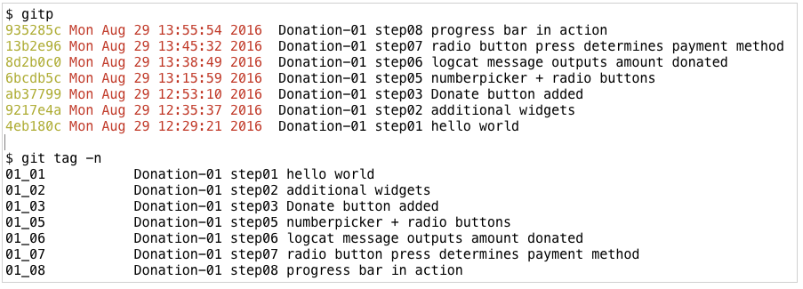

#Useful commands

##Linux

You create a folder with the mkdir command:

```
mkdir <new folder>
```
For example:

```
mkdir backup-projects
```
You may remove a folder and all its contents with this (dangerous) command:

```
rm -rf <folder name>
```

You may rename a file or folder with the `mv` command. For example to change the name of an existing file-a to file-b:

```
mv file-a file-b
```

##Git

If you wish take control of an application downloaded from a third party repo then it will be necessary to change the origin as follows:

- cd into the project in a terminal
- run this command:

```
git remote rm origin
```

Add an alternative, for example, as follows where https is the method of transfer:

```
git remote add origin https://<your domain>@bitbucket.org/<your domain>/<app name>
```


`gitp` is our customized command to pretty-print the logs of the most recent 10 commits.

```
alias gitp="git log --pretty=format:'%C(yellow)%h %<(24)%C(red)%ad  %Creset%s' --date=local --max-count=10"

```

This command outputs all the tags and their associated messages:

```
git tag -n
```




Here are the commands to configure your git installation:

```
git user.name  = "your name here"  <------ use double quotes
git user.email = "your email here" <------ use double quotes
// Check
git config [--global] user.name   
git config [--global] user.email            
```

You are not alone if you have difficulty understanding `man` pages. Here's a simple guide (that comes without a guarantee):

[Beginners Guide to man Pages](http://www.tfug.org/helpdesk/general/man.html)