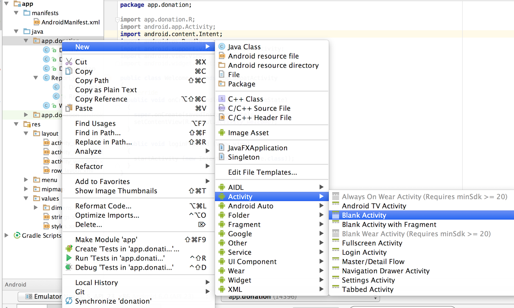
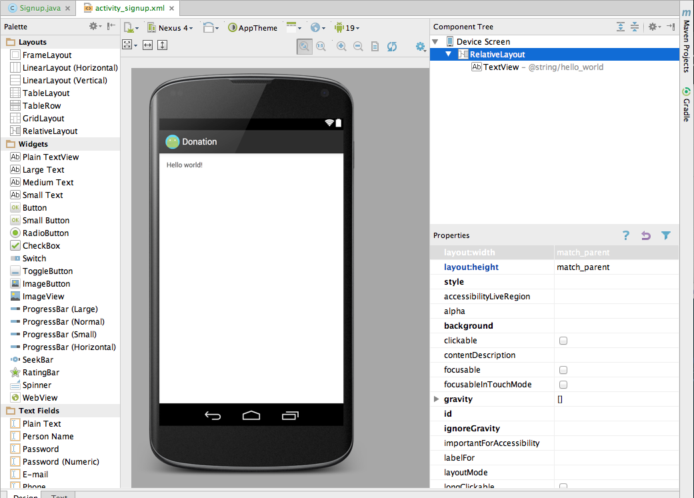
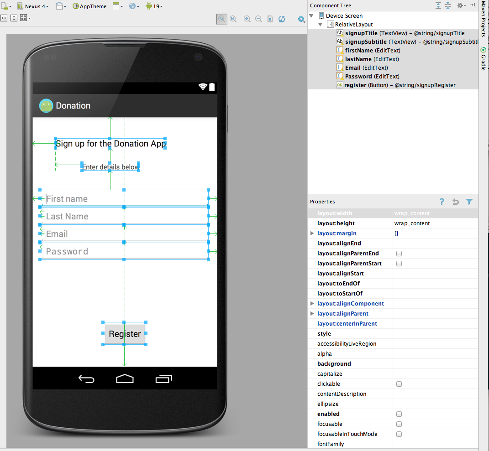

#Exercise 5 - Part 1 Signup Layout

Introduce a Signup Activity, which should present the user with:

- First Name
- Last Name
- Email
- Password

+ a 'Register' button.

Pressing Register should take you directly to "Donate" activity.

Also, refactor the Welcome screen such that the 'Sign up' button takes you to this, the sign up, screen.

#Solution

In the Exercise 4 we created and activity by separately creating layout and a class, and building each from scratch. This time we will use the create activity wizard. In doing so, keep a close eye the files the wizard generates or modifies.

Select the app.activities package, and select "File->New->Other" ... and follow the following entries:

Inspect each of the files altered or added to by the wizard:

- AndroidManifest.xml
- strings.xml
- activity_signup.xml
- menu_signip.xml
- Signup.java

Open the layout designer, and design a screen (*activity_signup.xml*) to look like this:

In particular, that we do not have a 'label' for first name (like we would have in a web app), but rather set a 'Hint'. This can be set in the Properties window as shown in Figure 8.  

When placing the text field on the canvas, select "Person Name" from the 'Text Widgets' palette

This is the layout so far:

~~~xml
<RelativeLayout xmlns:android="http://schemas.android.com/apk/res/android"
    xmlns:tools="http://schemas.android.com/tools"
    android:layout_width="match_parent"
    android:layout_height="match_parent"
    android:paddingBottom="@dimen/activity_vertical_margin"
    android:paddingLeft="@dimen/activity_horizontal_margin"
    android:paddingRight="@dimen/activity_horizontal_margin"
    android:paddingTop="@dimen/activity_vertical_margin"
    tools:context=".Donate" >

    <TextView
        android:id="@+id/signupTitle"
        android:layout_width="wrap_content"
        android:layout_height="wrap_content"
        android:layout_alignParentLeft="true"
        android:layout_alignParentTop="true"
        android:layout_marginLeft="32dp"
        android:layout_marginTop="28dp"
        android:text="@string/signupTitle"
        android:textAppearance="?android:attr/textAppearanceMedium" />

    <TextView
        android:id="@+id/signupSubtitle"
        android:layout_width="wrap_content"
        android:layout_height="wrap_content"
        android:layout_alignLeft="@+id/signupTitle"
        android:layout_below="@+id/signupTitle"
        android:layout_marginLeft="55dp"
        android:layout_marginTop="30dp"
        android:text="@string/signupSubtitle"
        android:textAppearance="?android:attr/textAppearanceSmall" />

    <EditText
        android:id="@+id/firstName"
        android:layout_width="wrap_content"
        android:layout_height="wrap_content"
        android:layout_alignParentLeft="true"
        android:layout_alignParentRight="true"
        android:layout_below="@+id/signupSubtitle"
        android:layout_marginTop="40dp"
        android:ems="10"
        android:hint="@string/signupFirstname"
        android:inputType="textPersonName" />

</RelativeLayout>
~~~

and strings.xml has these supporting definitions:

~~~xml
    <string name="title_activity_signup">Signup</string>
    <string name="signupTitle">Sign up for the Donation App</string>
    <string name="signupSubtitle">Enter details below</string>
    <string name="signupFirstname">First name</string>
~~~

Observe that we have removed the wizard-generated 'hello_world' resource from *strings.xml*.

Complete the layout now, select "Person Name", "Email" and "Password" from the text widgets pallette:

The email and password ids are exceptionally "Email" and "Password" (leading upper case letter). This is to avoid conflict with built in ids.

Set the 'Hints' as you go, and fix up the strings as we have been doing. This is the final version of the layout:

~~~xml
<RelativeLayout xmlns:android="http://schemas.android.com/apk/res/android"
    xmlns:tools="http://schemas.android.com/tools"
    android:layout_width="match_parent"
    android:layout_height="match_parent"
    android:paddingBottom="@dimen/activity_vertical_margin"
    android:paddingLeft="@dimen/activity_horizontal_margin"
    android:paddingRight="@dimen/activity_horizontal_margin"
    android:paddingTop="@dimen/activity_vertical_margin"
    tools:context=".Signup" >

    <TextView
        android:id="@+id/signupTitle"
        android:layout_width="wrap_content"
        android:layout_height="wrap_content"
        android:layout_alignParentLeft="true"
        android:layout_alignParentTop="true"
        android:layout_marginLeft="32dp"
        android:layout_marginTop="28dp"
        android:text="@string/signupTitle"
        android:textAppearance="?android:attr/textAppearanceMedium" />

    <TextView
        android:id="@+id/signupSubtitle"
        android:layout_width="wrap_content"
        android:layout_height="wrap_content"
        android:layout_alignLeft="@+id/signupTitle"
        android:layout_below="@+id/signupTitle"
        android:layout_marginLeft="55dp"
        android:layout_marginTop="30dp"
        android:text="@string/signupSubtitle"
        android:textAppearance="?android:attr/textAppearanceSmall" />

    <EditText
        android:id="@+id/firstName"
        android:layout_width="wrap_content"
        android:layout_height="wrap_content"
        android:layout_alignParentLeft="true"
        android:layout_alignParentRight="true"
        android:layout_below="@+id/signupSubtitle"
        android:layout_marginTop="40dp"
        android:ems="10"
        android:hint="@string/signupFirstname"
        android:inputType="textPersonName"/>
        
        <requestFocus />

    <EditText
        android:id="@+id/lastName"
        android:layout_width="wrap_content"
        android:layout_height="wrap_content"
        android:layout_alignLeft="@+id/firstName"
        android:layout_alignParentRight="true"
        android:layout_below="@+id/firstName"
        android:ems="10"
        android:hint="@string/signupLastName"
        android:inputType="textPersonName" >

    </EditText>

    <EditText
        android:id="@+id/Email"
        android:layout_width="wrap_content"
        android:layout_height="wrap_content"
        android:layout_alignLeft="@+id/lastName"
        android:layout_alignParentRight="true"
        android:layout_below="@+id/lastName"
        android:ems="10"
        android:hint="@string/signupEmail"
        android:inputType="textEmailAddress" />

    <EditText
        android:id="@+id/Password"
        android:layout_width="wrap_content"
        android:layout_height="wrap_content"
        android:layout_alignLeft="@+id/Email"
        android:layout_alignParentRight="true"
        android:layout_below="@+id/Email"
        android:ems="10"
        android:hint="@string/signupPassword"
        android:inputType="textPassword" />

    <Button
        android:id="@+id/signup"
        android:layout_width="wrap_content"
        android:layout_height="wrap_content"
        android:layout_alignParentBottom="true"
        android:layout_centerHorizontal="true"
        android:layout_marginBottom="28dp"
        android:text="@string/signupRegister" />

</RelativeLayout>
~~~

and the supporting Strings:

- Note: do not duplicate string resources.

~~~xml
    ...
    <string name="signupTitle">Sign up for the Donation App</string>
    <string name="signupSubtitle">Enter details below</string>
    <string name="signupFirstname">First name</string>
    <string name="signupLastName">Last Name</string>
    <string name="signupEmail">Email</string>
    <string name="signupPassword">Password</string>
    <string name="signupRegister">Register</string>
~~~

