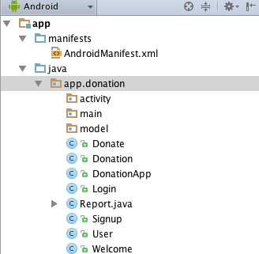
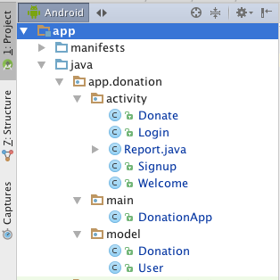

#Refactor Package Structure

Currently our project package structure looks like this:

This is a reasonable number of classes in the `app.donation` package, but we might consider it a bit cluttered. 

Here is a refactoring into three packages - this was achieved by:

##1. Selecting `activity` and creating three new packages inside it as shown here:

##2. Drag and drop the classes into the appropriate packages

Proceed with caution!

If drag and drop seems to be unavailable - exit and restart Android Studio, as the refactoring options may be temporarily disabled.

Drag/drop/refactor will make sure all the imports are correctly inserted - including changing AndroidManifest.xml, however you may need to allow time for the refactoring to 'catch up' (it is making significant changes) before you press on to the next one.

This represents a cleaner structure, and a better foundation should we introduce more models and activities.

