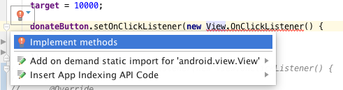
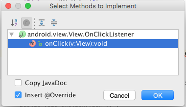
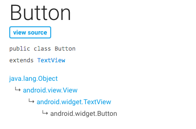

#Exercise 5 Solution (Anonymous class)

[5] Setting listeners was introduced in the slide deck `A First Android Application` on slides numbers 27 and 28. Three different styles were mentioned. We have already seen how setting a listener explicitly in a resource file is implemented in the donation app. This is illustrated in the code extract here taken from the file `res/layout/activity_donate.xml` (donateButtonPressed).

```
  <Button
      android:id="@+id/donateButton"
      android:layout_width="wrap_content"
      android:layout_height="wrap_content"
      android:layout_alignParentBottom="true"
      android:layout_alignParentLeft="true"
      android:layout_marginBottom="15dp"
      android:onClick="donateButtonPressed"
      android:text="@string/donateButton" />

```
Create two branches in your donation app, one named listener_1, the other listener_2. 

- Checkout out listener_1 branch.
- Implement the listener for donationButtonPressed using an anonymous class.
- Test, add and commit to your repo and push the new branch to your remote.
- Now check out listener_2 branch.
- Implement the listener using the listener interface.
- Test, add and commit to your repo and push the new branch to your remote.

##Solution (Anonymous class)

Delete this line from the Button xml definition:

```
      android:onClick="donateButtonPressed"
```

Make the following changes to `app/donation/activity/Donate.java`:

- In onCreate register a listener on Button donateButton. Begin with this skeleton code:

```
    donateButton.setOnClickListener(new View.OnClickListener() {
      
    });
```

This will generate an error that is resolved by implementing the sole View.OnClickListener method, `onClick`.





```
    donateButton.setOnClickListener(new View.OnClickListener() {


      @Override
      public void onClick(View v) {
        
      }
    });
```
Note the parameter type of onClick is View. A Button type is a View as may be seen in Figure 3, an extract from the official Android documentation.

The method setOnClickListener belongs to the View class and since a Button `is` a view, invoking the method on a Button object is legal.

See documentation: [Button](https://developer.android.com/reference/android/widget/Button.html) and [View.OnClickListener](https://developer.android.com/reference/android/view/View.OnClickListener.html).

See the [View](https://developer.android.com/reference/android/view/View.html) class for documentation on `setOnClickListener`, in particular noting the required parameter type.



The usual method of completing this would be to introduce the handler code in the onClick method. This would result in the following where we are using the body of the existing method `donateButtonPressed`.

```
    donateButton.setOnClickListener(new View.OnClickListener() {
      @Override
      public void onClick(View v) {
        String method = paymentMethod.getCheckedRadioButtonId() == R.id.PayPal ? "PayPal" : "Direct";
        int donatedAmount = amountPicker.getValue();
        if (donatedAmount == 0) {
          String text = amountText.getText().toString();
          if (!text.equals("")) {
            donatedAmount = Integer.parseInt(text);
          }
        }
        if (donatedAmount > 0) {
          app.newDonation(new Donation(donatedAmount, method));
          progressBar.setProgress(app.totalDonated);
          String totalDonatedStr = "$" + app.totalDonated;
          amountTotal.setText(totalDonatedStr);
        }

        amountText.setText("");
        amountPicker.setValue(0);
      }
    });

``` 
Test this by registering a user, signing in and making a donation. Use the debugger, placing a break point within `onClick(View v)` and observing that the execution path routes correctly. Check the Report screen to verify the donation is displayed.

We can remove much of this ugliness by actually invoking the existing `donateButtonPressed` method. The listener registration then becomes:

```
    donateButton.setOnClickListener(new View.OnClickListener() {
      @Override
      public void onClick(View v) {
        donateButtonPressed(v);
      }
    });
```
This is a considerable improvement. But if, as is typically the situation, there are several View event handlers within the activity then the `onClick` method is repeated for each handler. We show how to avoid this code repetition in the next step by using the interface approach (also known as the delegated method or pattern) to setting listeners.