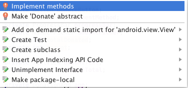
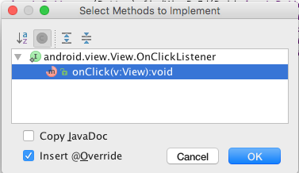

#Exercise 5 Solution (Interface)

Change the class Donate header so that it implements the View.OnClickListener interface.

```

public class Donate extends AppCompatActivity implements View.OnClickListener {
  ...
  ...
}

```

The error is resolved by implementing View.OnClickListener method as shown in Figures 1 and 2 here.





In onCreate register the event handler:

```
    donateButton.setOnClickListener(this);
```

Recall that the parameter type of setOnClickListener is View.OnClickListener. Because Donate now implements View.OnClickListener, `this` is a valid parameter.

Complete the implementation of onClickView:

```

  @Override
  public void onClick(View v) {
    switch (v.getId()) {
      case R.id.donateButton:
        donateButtonPressed(v);
    }
  }
```

This onClick implementation can now handle all View events. All that is required is to add the appropriate `case` block.

Test this by registering a user, signing in and making a donation. Use the debugger, placing a break point within `onClick(View v)` and observing that the execution path routes correctly. Check the Report screen to verify the donation is displayed.