#Create Project

Click on *Start a new Android Studio project* on the Quick Start panel in the Welcome screen.

- Complete the wizard steps as shown in the following screenshots:

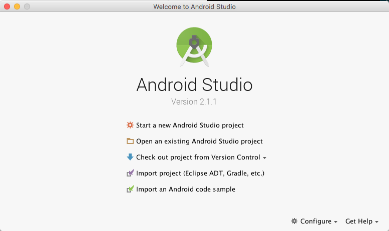 

- Carefully note the Project location you choose. We suggest you name the project folder *myrent-android-2015*.

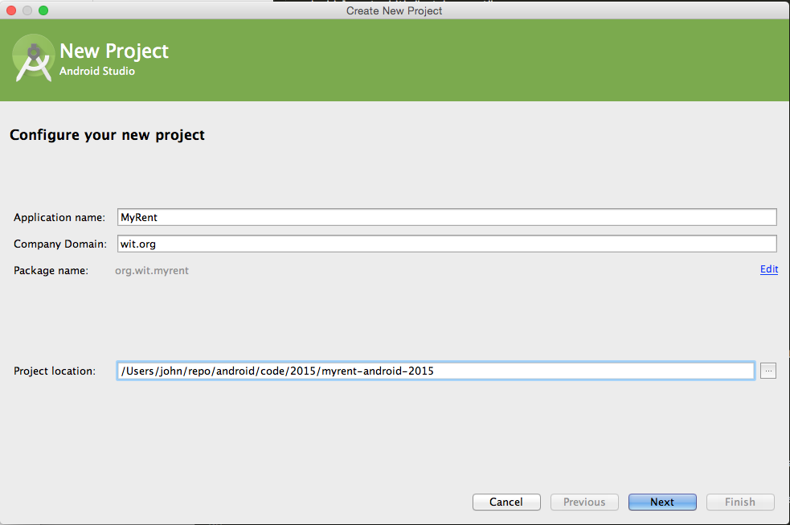
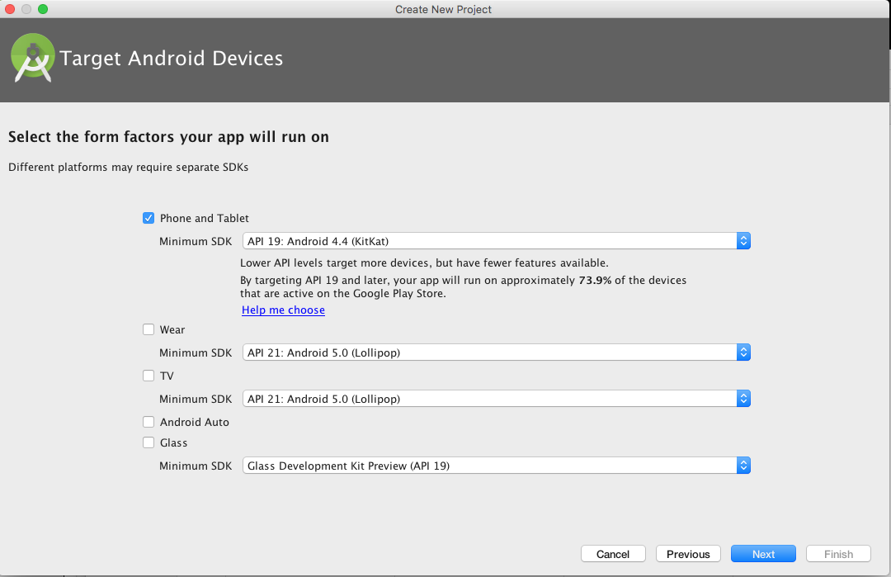
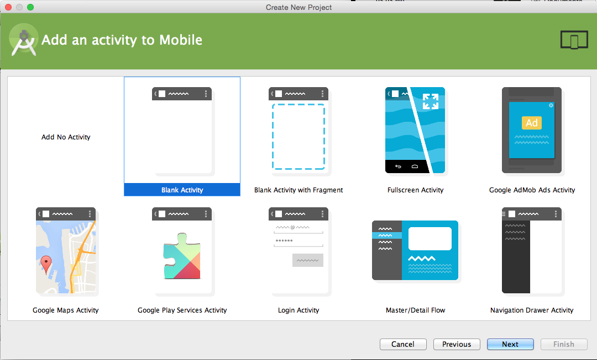
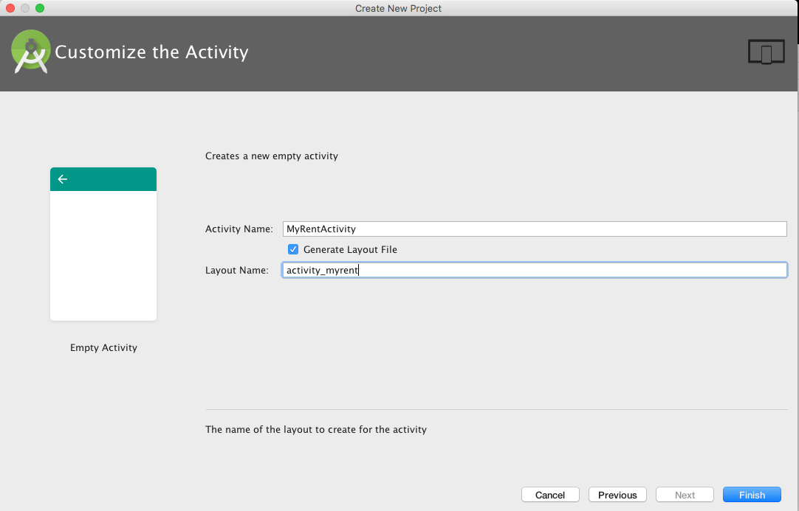

Replace build.gradle (Module:app) with the following version. Two build.gradle files exist: ensure you refactor the one specified here.

```
apply plugin: 'com.android.application'

android {
  compileSdkVersion 23
  buildToolsVersion "23.0.3"

  defaultConfig {
    applicationId "org.wit.myrent"
    minSdkVersion 19
    targetSdkVersion 23
    versionCode 1
    versionName "1.0"
  }
  buildTypes {
    release {
      minifyEnabled false
      proguardFiles getDefaultProguardFile('proguard-android.txt'), 'proguard-rules.pro'
    }
  }
}

dependencies {
  compile fileTree(dir: 'libs', include: ['*.jar'])
  testCompile 'junit:junit:4.12'
  compile 'com.android.support:appcompat-v7:23.4.0'
}

```
It is necessary to sync the project when build.gradle is changed:
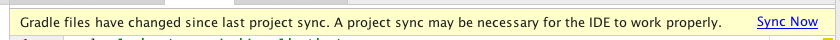

The default layout should now be as shown in Figure 6.

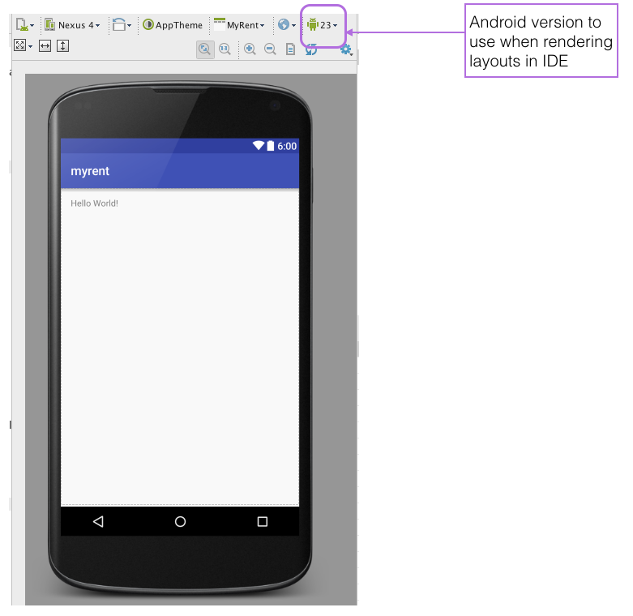
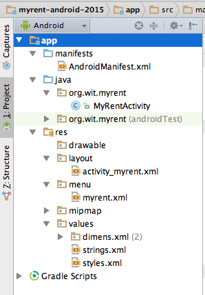

- Now in bash terminal cd to project folder, *myrent-android-2015*.
    - Run *git init* to create an empty repo.
    - In Sublime Text or other suitable text editor create a `.gitignore` file with the following content:

```
#built application files
*.apk
*.ap_


# files for the dex VM
*.dex

# Java class files
*.class

# generated files
bin/
gen/

# Local configuration file (sdk path, etc)
local.properties

# Windows thumbnail db
Thumbs.db

# OSX files
.DS_Store

# Android Studio
# https://www.jetbrains.com/idea/help/project.html
*.iml
.idea
.gradle
build/
```
- Add the code generated so far and make a first commit with a message such as:

    - <font color='green'>Baseline built using Android Studio 2.1.1 & Android 6.0 (API 23)</font>

Before committing check that git is properly configured with your name and email:

```
git config --global -l
git config --global user.name <your name>
git config --global user.email <your email>
```

```
git add .
git commit -m 'MyRent-00 (step 01): Baseline app built using Android Studio 1.3.2'
```
Create a tracking repository on your [Bitbucket](https://bitbucket.org/) account. Follow the Bitbucket instructions to associate your local repo with the remote repo and on making the initial push from local to remote.

- Progressively add and commit to the repo as you complete this and subsequent labs.
- We suggest you tag each lab's code v0, v1, v2 ..., each tag corresponding to a lab.
- Additionally, you may find it helpful to commit each step of each lab with a suitable message as exemplified in Figure 8 and relating to the Donation app encountered earlier in the course.

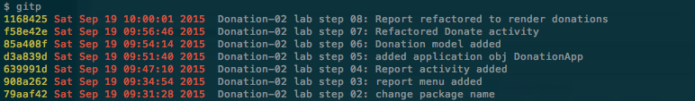

Install and launch the app on a device or emulator. Figure 9 is a screenshot of the app installed on the Android emulator.

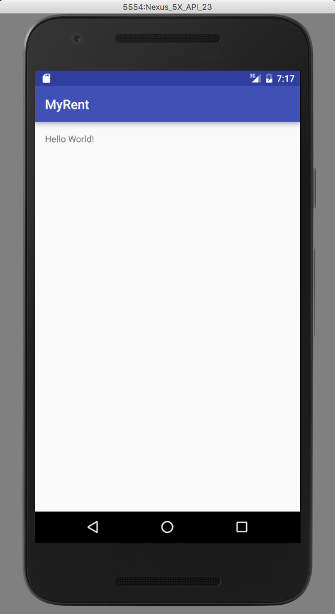

For reference, the sdk configuration shown in Figure 10 is that on which this lab is based. The latest Build-tools (23) and SDK Platform (API 23) are installed. Your platform configuration may vary from this. You may inspect your configuration by launching the SDK Manager as demonstrated in Figure 11.

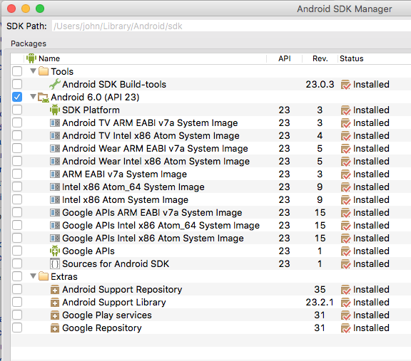

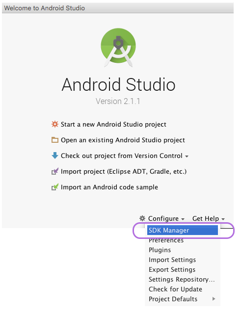

Figure 12 shows the lab module's build.gradle. Observe that the minSdkVersion is 16. The goal is that MyRent may be installed and run on phones from and including Jelly Bean version. Study the table [here](http://developer.android.com/guide/topics/manifest/uses-sdk-element.html#ApiLevels) to get an appreciation of the relationship between platform version (example Android 4.1) and API level (example JELLY_BEAN).

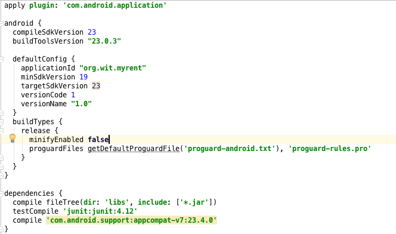
  
