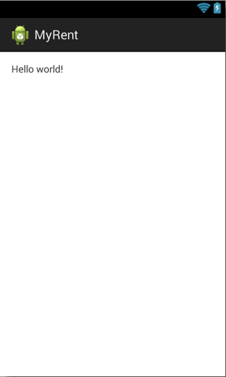
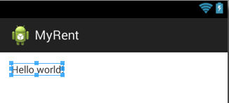

#Layout XML

Some of the key files of the application are identified in the screenshot of the Project Files Tools Window as illustrated in Figure 1.


**Layout XML Code**

The file *activity_myrent.xml* specifies the screen layout.

The textual content of the file is as follows. 


```
<RelativeLayout xmlns:android="http://schemas.android.com/apk/res/android"
    xmlns:tools="http://schemas.android.com/tools"
    android:layout_width="match_parent"
    android:layout_height="match_parent"
    android:paddingLeft="@dimen/activity_horizontal_margin"
    android:paddingRight="@dimen/activity_horizontal_margin"
    android:paddingTop="@dimen/activity_vertical_margin"
    android:paddingBottom="@dimen/activity_vertical_margin"
    tools:context=".MyRent">

    <TextView
        android:text="@string/hello_world"
        android:layout_width="wrap_content"
        android:layout_height="wrap_content" />

</RelativeLayout>
```
This translates to the graphical layout shown in Figure 2.



Tabs enable one to quickly switch between graphical and textual content as demonstrated in Figure 3.


From the XML above you can see that the layout comprises a TextView wrapped in a Relative Layout.

- A [Relative Layout](http://developer.android.com/guide/topics/ui/layout/relative.html) is a *parent* container for views, referred to as child views, that are arranged in relative positions to each other. In this app, to date, there is only one child view - a TextView.

- A [TextView](http://developer.android.com/reference/android/widget/TextView.html) displays text and is configured by default to be read-only. 

Both the RelativeLayout and TextView definitions contain attributes that determine characteristices such as, for example, their size and position. 

Thus, in the case of TextView, the attribute *android:layout_width*, whose value is *wrap_content*, determines that the view will be created just wide enough to contain the text specified by the attribute *android:text* (whose value is *@string/hello_world*).

This becomes clear if you select *Hello world* in the graphical representation of *activity_myrent.xml* as demonstrated in Figure 4.


Were the TextView attribute *android:layout_width* set to *fill_parent* the situation would be as represented in Figure 5.


A short tutorial is available is available [here](http://www.mkyong.com/android/android-wrap_content-and-fill_parent-example/) that demonstrates the effect of different values for *layout_width* and *layout_height* attributes.

An interesting feature of Android Studio may be observed here. Figure 6 below contains a screen shot of of *activity_myrent.xml*. At first glance the string *Hello world* seems to be hardwired. However if you hover over the string (as was done in preparing the screenshot) you will notice the underlying reference to *@string/hello_world* in the *res/values/strings.xml* file. This approach differs from that in Eclipse where *@string/hello_world* is displayed in the xml file. 

- You may disable this feature by accessing Preferences | Editor | Code Folding and unticking Android String References.

- It's also interesting to note that if you copy the textual content of *activity_myrent.xml* from Android Studio and paste it to a text editor, *@string/hello_world* is displayed, not *Hello world*.

- Hover over other attributes in the layout file, such as padding, to observe somewhat similar effects.


