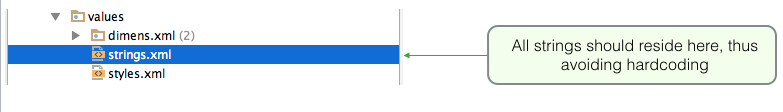
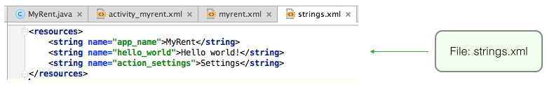
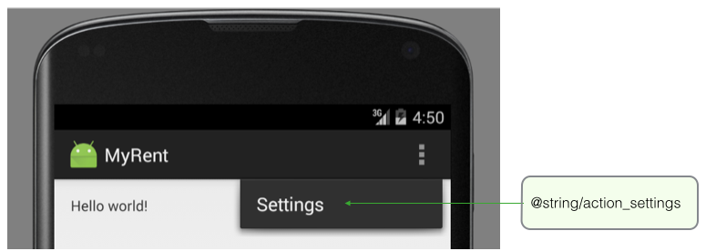
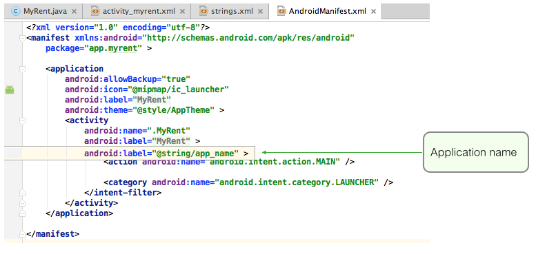
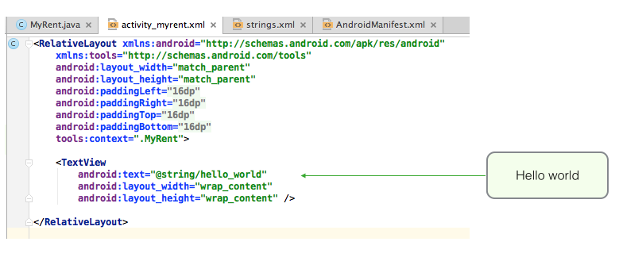
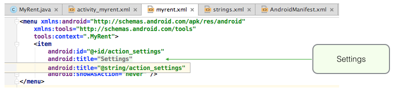

#Strings

The file *strings.xml*, located in *res/values*, contains all the text that *MyRent* application uses.

This arrangement, rather than hard-coding strings when and where required in the code, greatly facilites any changes to the strings, such as for example in localization - adapting your application to a new language.

Presently *strings.xml* contains only 3 entries (see Figure 2):

- The application name: MyRent
- The content displayed on running the app: *Hello world!*
- An Options Menu item - Settings - on the Action bar (Figure 3).

The name of the application may be obtained theoughout the application by accessing a string element thus:

**"@string/app_name"**

This is illustrated in Figure 4 below where the application's name is retrieved in *AndroidManifest.xml*.

Figure 5 shows how the *Hello world!* string, displayed when the application is launched, is obtained.

Figure 6 shows how an entry in the Action bar (Settings) is obtained.

 
 

