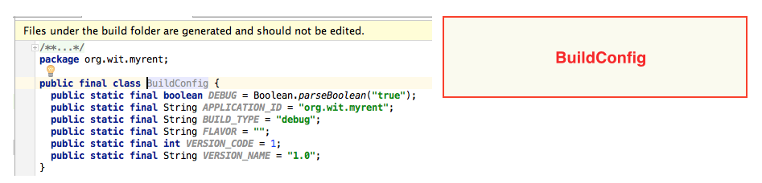
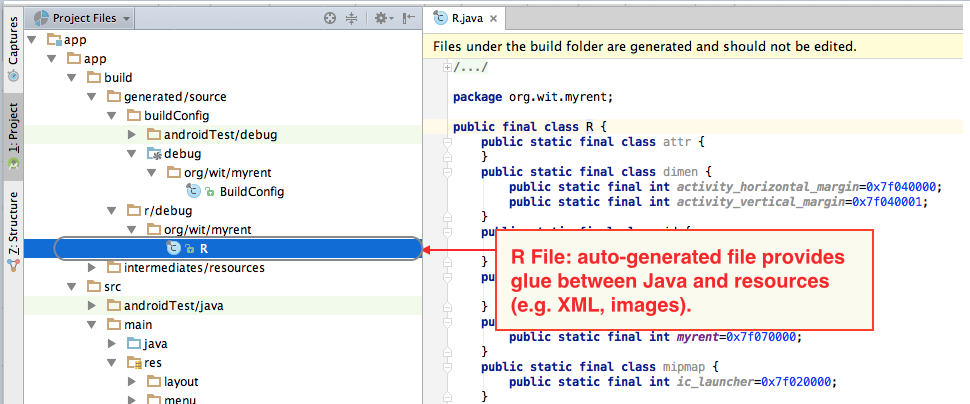

#R File

All auto-generated files are located in the *build* folder structure and should not be modified by the developer.

- BuildConfig.java contains a constant that allows one to run some code only in debug mode.

- The R file (R.java) is the glue between Java and resources, for example XML files, images and so on.
    - The file is automatically regenerated whenever a change is made to any of the content in the *res* directory.
        - For example, when an image is added, or when an XML file added or modified.

