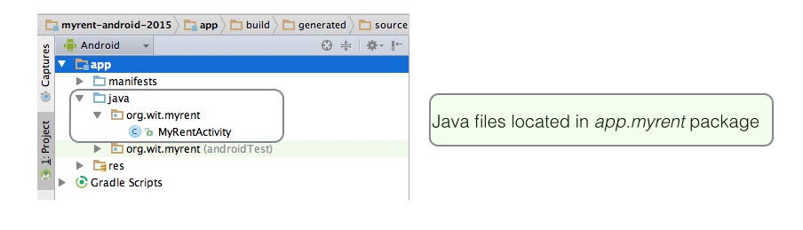
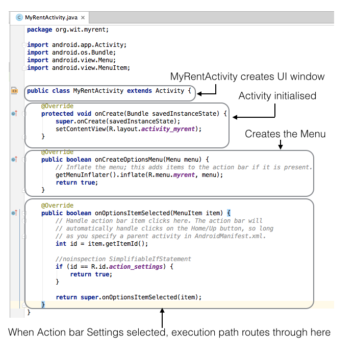
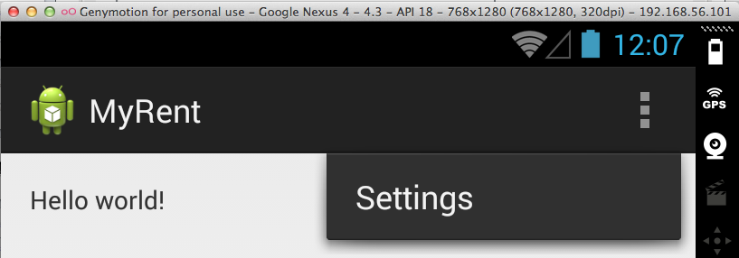
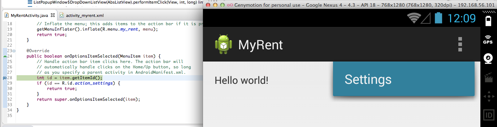

#Java

**MyRentActivity**

- This is a subclass of the Android class *Activity*
- An [Activity](http://developer.android.com/reference/android/app/Activity.html) creates (or inflates) a window within which are located UI components such as buttons, text and so on.

**onCreate**

- This method initializes the activity. 
- Note the argument to *setContentView*: *R.layout.activity_myrent*.
    - This is an integer constant that is autogenerated, the ID of the resource to be inflated, namely the MyRent layout.
    - A resource is some item of the application that is not code, such as for example an images, XML file, audio file and so on.

**onCreateOptions**

- This method inflates the menu and adds any items present to the Action bar.
    - In the case of MyRent this is shown in Figure 3 below.

**onOptionsItemSelected**

- When an item on the action bar is clicked the program's execution path routes through this method.
- Figure 3 below shows the situation where 
    - *MyRent* is run in debug mode,
    - The *Settings* menu item has been clicked
    - The program halts at a breakpoint in onOptionsItemSelected

