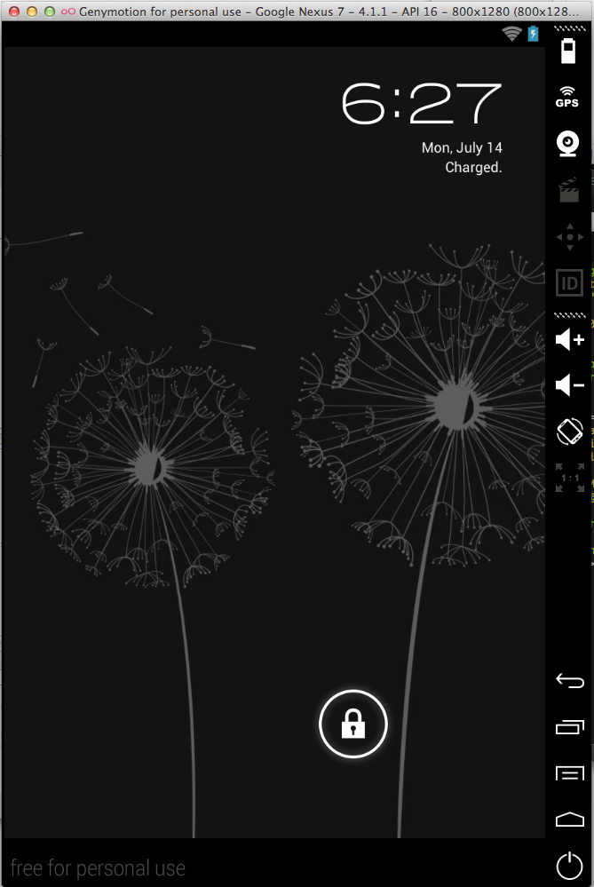

#Run App

This step only applies to those intending to use the Genymotion emulator.

**Start the Genymotion emulator**

- Press the Genymotion icon on the tool bar
- The Genymotion Virtual Device Manager opens
- Select an available device
    - For example *Google Nexus 7*
    - Note that, as previously mentioned, the particular device required to display Google Maps is
        - Google Nexus 4 - 4.3 - API - 768x1280
- Press the Start button on the right of the Device Manager window

- After a brief pause the emulator will launch (Figure 2)
    - Unlock by dragging lock icon to the margin.

If the emulator fails to launch on pressing the toolbar icon, launch it from the Start menu (Windows) or the Applications folder (Mac).

**Run the app**

Select *myrent-android* project in the Android Studio Package Explorer

- From the menu, execute the command    
    - Run As | Android Application (Figure 3)
- The Android Device Chooser window opens.
    - Press the radio button *Choose a running Android device* and select device (for example *genymotion-google-nexus* as shown in Figure 4).
    - Optionally, tick the box: *Use same device for future launches*
    - Press OK
- The application should open in the emulator as depicted in Figure 5
    - Reminder: unless the emulator is unlocked (by dragging the lock icon to the right margin) the application window may not appear.

