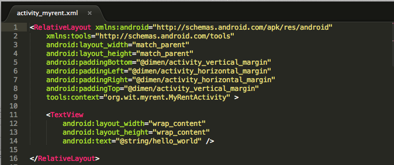
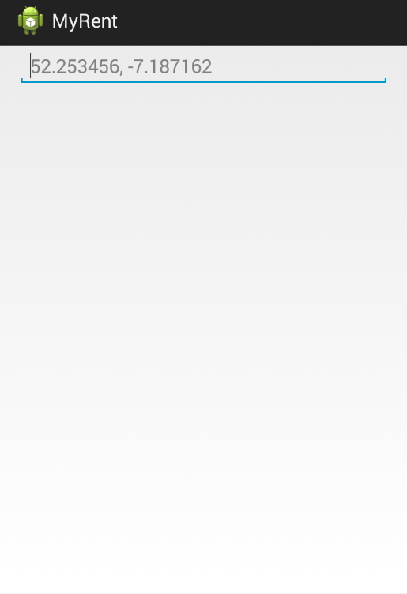

#Layout

A general note on layout development: Android Development Kit (ADK) provides two ways to to create a user interface (UI):

- Declarative
    - Use XML to define how the UI will look
    - Developing the UI declaratively has the advantage of providing immediate visual feedback.

- Programmatic
    - Write all necessary code in Java.

In this series of labs we shall develop the UI in XML but use Java to, where necessary, interact with UI components. For example when data is entered in a UI control (for example a text input component), then the ensuing operations will be handled programmatically using Java.

Back to the present iteration: We have completed the refactoring of the Java code.

Here we shall address the necessary changes to the layout.

First, we need to make a change to the file *res/values/strings.xml*.

The legacy code from the baseline MyRent app is as shown here in Figure 1:

  

Replace this with the following:

Filename: strings.xml

```
<resources>

    <string name="app_name">MyRent</string>
    <string name="title_activity_myrent">MyRentActivity</string>
    <string name="geolocation_hint">52.253456,-7.187162</string>
    <string name="action_settings">Settings</string>

</resources>
```
Observe that we have deleted the  *Hello world!* string and replaced it with a string describing the Geolocation hint.

Recall the output generated on launching the baseline app:


Our goal is now to replace this output with the following:


Open *activity_myrent.xml* in the folder *res/layout* 

Its content should be as shown in Figure 4:


Replace the content of the file with the following:

##activity_myrent.xml
```
<RelativeLayout xmlns:android="http://schemas.android.com/apk/res/android"
    xmlns:tools="http://schemas.android.com/tools"
    android:layout_width="match_parent"
    android:layout_height="match_parent"
    android:paddingBottom="@dimen/activity_vertical_margin"
    android:paddingLeft="@dimen/activity_horizontal_margin"
    android:paddingRight="@dimen/activity_horizontal_margin"
    android:paddingTop="@dimen/activity_vertical_margin"
    tools:context=".MyRentActivity" >

      <EditText
          android:id="@+id/geolocation"
          android:layout_width="match_parent"
          android:layout_height="wrap_content"
          android:layout_alignParentLeft="true"
          android:layout_alignParentRight="true"
          android:hint="@string/geolocation_hint" />

</RelativeLayout>
```

.

Study the Graphical Layout, Outline and Properties in the IDE, all as shown in Figure 5. 

- Use the tabs, *Graphical Layout* and *fragment_myrent.xml* (at the lower end of of the middle screen in the IDE) to switch between xml and graphical mode.
- Notice the reference to the hint *52.253456,-7.187162*:
    - @string/geolocation_hint
        - This is a reference to a string called *geolocation_hint* that is located in *res/values/string.xml*.
- Notice also the statement: *android:id = "@+id/geolocation"
    - The @+ indicates that an identifier named *geolocation* is being created and automatically assigned a value unique in this app.
        - This identifier is used in the Java code to obtain a reference to the EditText control. More on this later.
- **Tip**: We have chosen identifiers such as *geolocation* and *geolocation_hint* to be as self-documenting as possible. 
    - We could have accepted default names but to do so would make development all the more difficult. 
    - The practice that will be adopted in this set of labs, therefore, will be to choose names that can be easily associated with the entities they represent, that is, names that are as self-documenting as possible.


The application should be error free and capable of being launched and generating output as shown here in Figure 6.



**Tip**: in order to understand more clearly how layout works, refer to Figure 7 below which shows how selected parts of the UI may be colored during development.

- This requires adding a file *colors.xml*, defining the colors you require, to *res/values*. Here is an example:

Filename: colors.xml
```
<resources>
  <color name="red">#ffff0000</color>
  <color name="green">#FF99CC00</color>
  <color name="darkgreen">#124816</color>
  <color name="blue">#FF33B5E5</color>
  <color name="orange">#FFFFBB33</color>
  <color name="purple">#FFAA66CC</color>
  <color name="darkorange">#FFFF8800</color>
  <color name="black">#161803</color>
  <color name="white">#ffffff</color>
</resources>
```


