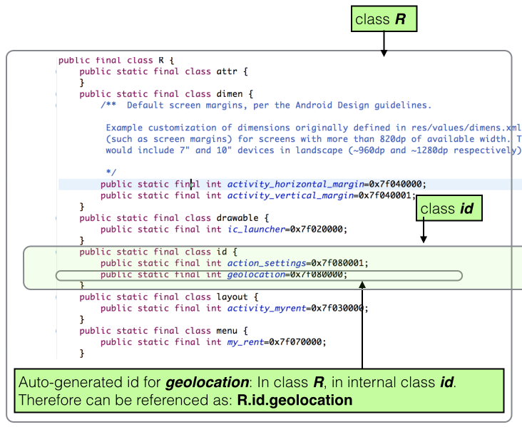
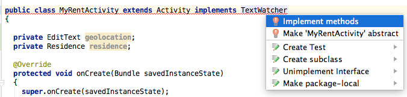
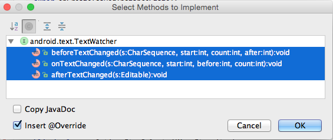
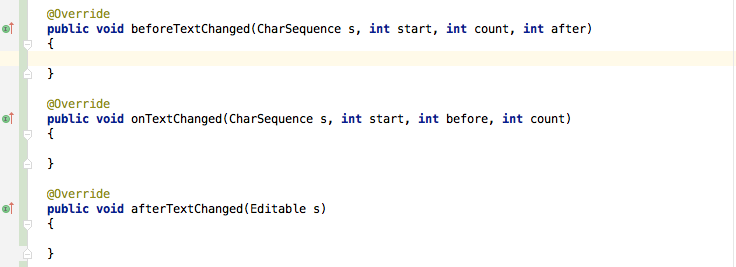
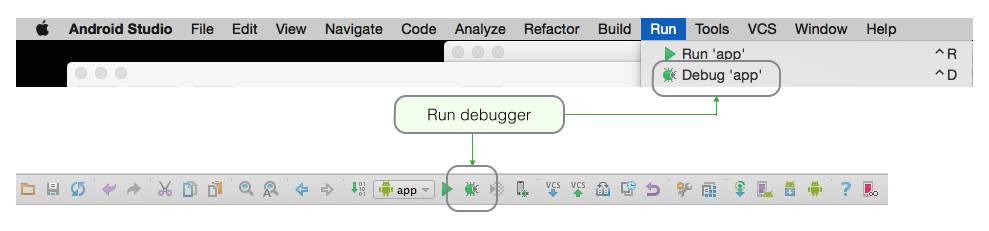
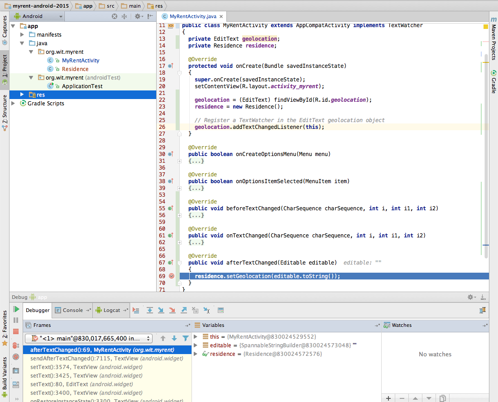
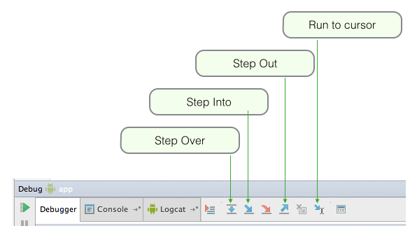
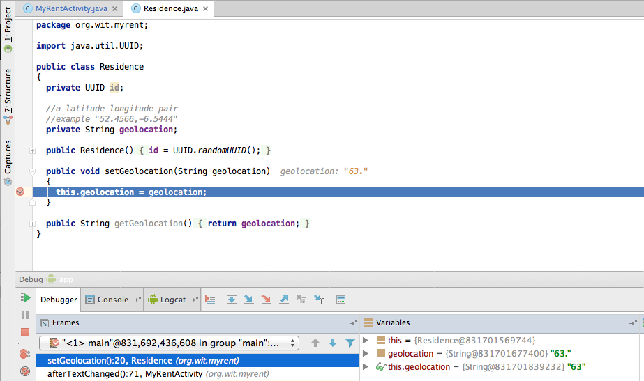

#Listeners

We shall now inject code into the MyRentActivity class that shall:

- Listen for changes to the Geolocation input control
- When changes are detected, that is when a user enters data, the listener will receive the data and transmit it to the model class, Residence.
- We shall introduce a Residence type field and instantiate this in the MyRentActivity onCreate method.
- We shall also introduce an EditText type field and assign to this a reference to the EditText in the layout screen.
    - We will use the *geolocation* auto-generated identifier to obtain a reference to this EditText control.
    - This reference is obtained from the expression *(EditText)View.findViewById(R.id.geolocation)*.
        - See Figure 1 below for an explanation of *R.id.geolocation*
    - We chose the name *geolocation* when writing the file *activity_myrent.xml*
        - *android:id="@+id/geolocation"*
        - Notice that, in the file *activity_myrent.xml*, there is a + sign in the value for android:id; this indicated an id will be autogenerated, located in the R file from where it is accessible in the Java, in this case from MyRentActivity.



Here are the steps in refactoring MyRentActivity to introduce a listener:

First introduce a reference to the model object + the TextEdit field:

```
public class MyRentActivity extends AppCompatActivity
{
  private EditText  geolocation;
  private Residence residence;

  ...
  ...
}

```
- An import is necessary:

```
import android.text.Editable;

```

- Now create both objects in the onCreate method:
```
  @Override
  protected void onCreate(Bundle savedInstanceState)
  {
    super.onCreate(savedInstanceState);
    setContentView(R.layout.activity_myrent);

    geolocation = (EditText) findViewById(R.id.geolocation);
    residence = new Residence();
  }
```

Next we implement the Listener interface:

~~~
public class MyRentActivity extends Activity implements TextWatcher
{
  ...
  ...
}
~~~

The following steps simplify the addition of interface methods:

- When you add the *implements TextWatcher* to the class header an error is indicated.
    - Caused by absence of interface's methods: these must be implemented in MyRentActivity.
- Place cursor anywhere in class header.
- Press Alt + Enter. This opens a window with a list of options. Select *Implement methods* and hit return. See Figure 2.


- You are then presented with a further window listing the methods to be overrideen as shown in Figure 3. Press OK.
- The methods are then implemented in outline: it remains for you to complete as appropriate. See Figure 4.



At this stage it is necessary to fully implement only *afterTextChanged*.

Here is the required implementation:

```
  @Override
  public void afterTextChanged(Editable editable)
  {
    residence.setGeolocation(editable.toString());
  }

  @Override
  public void beforeTextChanged(CharSequence c, int start, int count, int after)
  {
  }

  @Override
  public void onTextChanged(CharSequence c, int start, int count, int after)
  {
  }
```
These imports are required:

```
import android.text.Editable;
import android.text.TextWatcher;
```
It is also necessary to register a Textwatcher: add this code at the end of onCreate:

```
    // Register a TextWatcher in the EditText geolocation object
    geolocation.addTextChangedListener(this);
```

- Test the code by placing breakpoints at:<br>
    - *residence.setGeolocation* in *MyRentActivity.afterTextChanged*.
    - *setGeolocation* in *Residence* class.

- Launch MyRent using the debugger.


- Begin to input a new geolocation in the input window in MyRent emulator.
- The program should halt at the first breakpoint and it should be possible to see the inputted digits in the *Variables* window as shown in Figure 6.



- Figure 7 contains a screenshot of the debugger toolbar with notes explaining the function of those most frequently used. 

- Press *Run to cursor* to continue execution to the second breakpoint. Examine the values in Variable windows again: see Figure 8.



Let's examine the listener code in MyRentActivity in some detail.


- Note that we have created an instance variable *EditText geolocation*.

- The statement *geolocation = (EditText) v.findViewById(R.id.geolocation);* obtains a reference to the Geolocation input contol and assigns it to this instance variable.
    - R.id.geolocation is the id referencing this control.
  
- EditText is a subclass of [TextView](http://developer.android.com/reference/android/widget/TextView.html). TextView has a method *addTextChangedListener*. We invoke this method.
    - The signature of *addTextChangedListener* is:
  **public void addTextChangedListener (TextWatcher watcher)**.
    - [TextWatcher](http://developer.android.com/reference/android/text/TextWatcher.html) is an interface: it has 3 methods (that must be implemented on instantiation of a class implementing Textwatcher):
        - onTextChanged
        - beforeTextChanged
        - afterTextChanged
- It's becoming clearer what we have done, namely:
    - Obtained a reference to the UI Geolocation input control (*geolocation*)
    - Invoked the method *addTextChanged* on *geolocation*
    - As a parameter to addTextChangedListener, created an anonymous class that implemented the TextWatcher listener interface
        - Fully implemented the method we're interested in: *onTextChanged*
        - Implemented the remaining two methods as wrappers only.
            - Recall that in using an interface all its methods must be implemented, otherwise a compile-time error is generated.


For reference, here is the latest MyRentActivity class:

```
package org.wit.myrent;

import android.support.v7.app.AppCompatActivity;
import android.os.Bundle;
import android.text.Editable;
import android.text.TextWatcher;
import android.view.Menu;
import android.view.MenuItem;
import android.widget.EditText;

public class MyRentActivity extends AppCompatActivity implements TextWatcher
{
  private EditText geolocation;
  private Residence residence;

  @Override
  protected void onCreate(Bundle savedInstanceState)
  {
    super.onCreate(savedInstanceState);
    setContentView(R.layout.activity_myrent);

    geolocation = (EditText) findViewById(R.id.geolocation);
    residence = new Residence();

    // Register a TextWatcher in the EditText geolocation object
    geolocation.addTextChangedListener(this);
  }


  @Override
  public void beforeTextChanged(CharSequence charSequence, int i, int i1, int i2)
  {

  }

  @Override
  public void onTextChanged(CharSequence charSequence, int i, int i1, int i2)
  {

  }

  @Override
  public void afterTextChanged(Editable editable)
  {
    residence.setGeolocation(editable.toString());
  }
}

```
