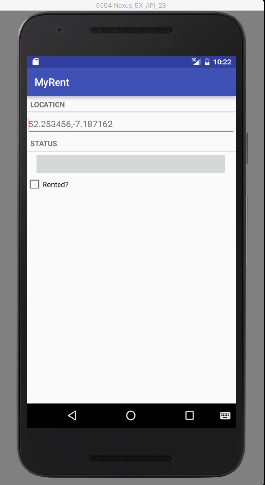

#Preview

At the end of this topic our goal is to have a screen looking something like this:

We will have added: 

- Section titles (LOCATION & STATUS)
- Button indicating the residence registration date
- Checkbox: a tick indicating the residence rented.

In the previous step we introduced a listener for the geolocation input (the latitude-longitude string).

In this step we shall:

- Add functionality to the Residence model, namely:
    - A Date field to indicate when the residence was registered with the MyRent app.
        - This shall be instantiated in the Residence constructor.
    - A boolean to indicate the rented status of the residence, that is whether or not the residence has a tenant.
    - We shall introduce a method to return a suitably formatted version of the Date object in the form of a string.
        - This shall be used as the button label in the STATUS section.
    - Setters and getters for the *rented* boolean.
- In *MyRentFragment.onCreate* add:
    - A listener to capture any change to the rented checkbox status in the UI.
        - Maintain the *Residence.rented* state up-to-date with any such changes.
    - A method to write the residence registration date to the date button in the UI.

