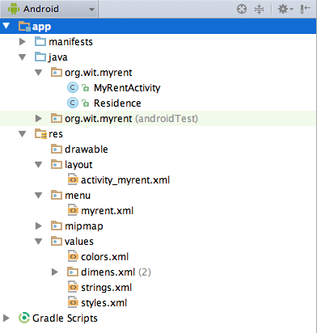
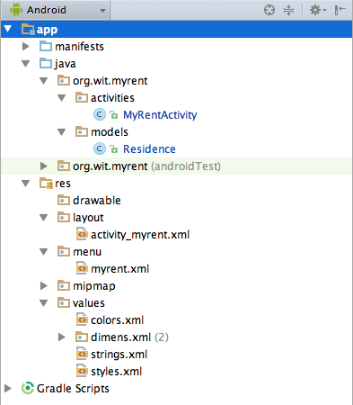
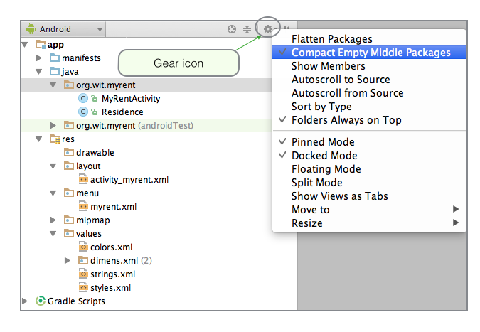
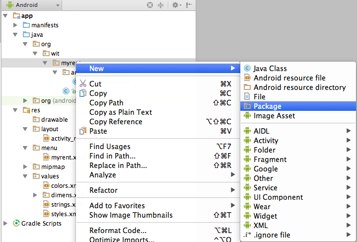
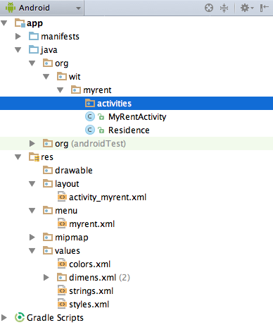
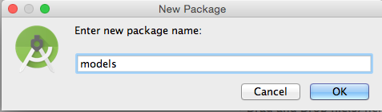
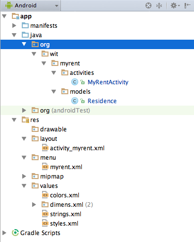
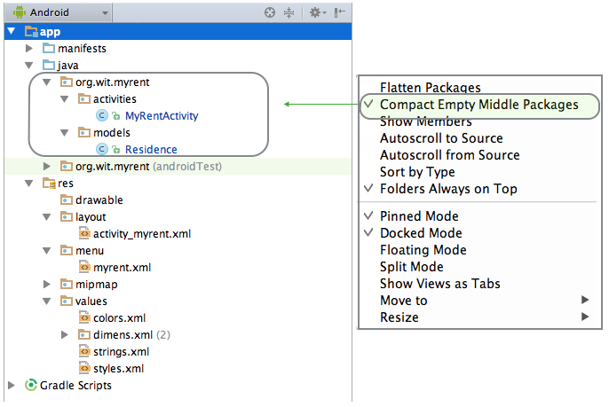

#Restructure MyRent

Continue building the MyRent app that you commenced in the previous lab.

Before we start to expand the project, we need to perform some rearranging so it can be extended in an orderly manner.

This is our current application workspace:

.. and this is a version we used in writing this lab:

Here is a detailed description on how this may be achieved:

- Select gear icon and untick *Compact Empty Middle Packages*. Observe the change to the package layout.  

- Select the *myrent* package and create a package named *activities* within *org.wit.myrent*.

- Drag and drop MyRentActivity into this new package.
- Create a package named *models* within *org.wit.myrent*.

- Drag and drop Residence into this new package. 

- Ensure that when the refactoring is complete you tick this menu item again resulting in the required layout as shown in Figure 2 above and again here in Figure 8.
