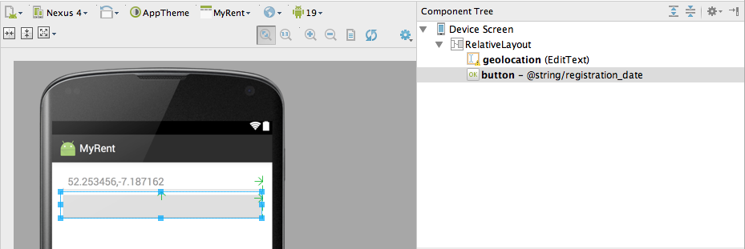
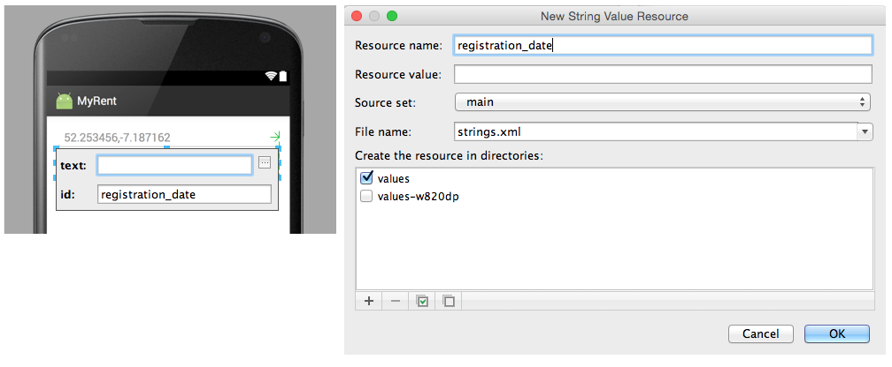
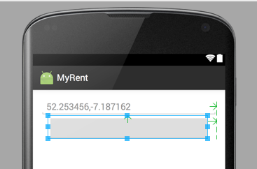
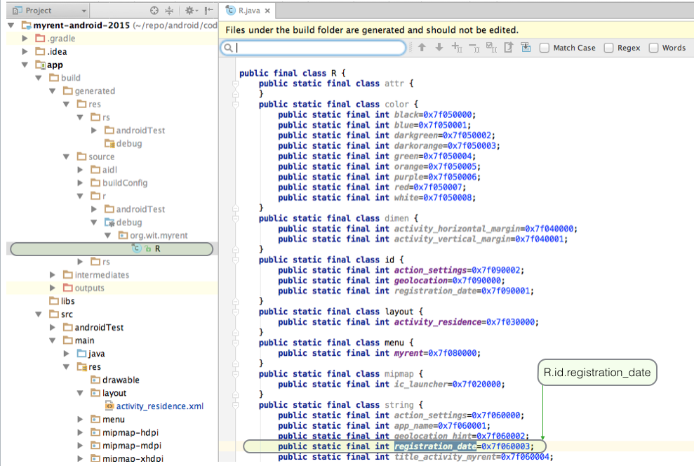
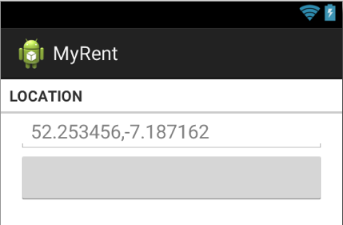
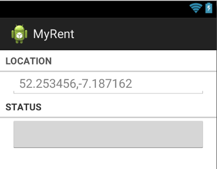

#Layout

Before proceeding make a name use the menu refactor command to rename MyRentActivity to ResidenceAcivity.

- This change is being made to provide nameing consistency with future classes that we shall be developing.

The previous iteration has one UI control, an EditText.

This iteration shall introduce:

- 2 section labels (LOCATION & STATUS).
- A button that will have a label representing the residence registration date and that will be added at runtime.
- A checkbox which when ticked indicates that the residence has a tenant.


**Button**

Select *activity_myrent.xml*, right click and using context menu commands *Refactor | Rename* change the name to *activity_residence.xml*.

Open *activity_residence.xml*.

Remove background, text and hint colouring (if not already done). This was introduced simply to demonstrate how it might be achieved. The refactored file is as follows:

```
<RelativeLayout xmlns:android="http://schemas.android.com/apk/res/android"
                xmlns:tools="http://schemas.android.com/tools"
                android:layout_width="match_parent"
                android:layout_height="match_parent"
                android:paddingBottom="@dimen/activity_vertical_margin"
                android:paddingLeft="@dimen/activity_horizontal_margin"
                android:paddingRight="@dimen/activity_horizontal_margin"
                android:paddingTop="@dimen/activity_vertical_margin"
                tools:context="app.myrent.ResidenceActivity" >

  <EditText
      android:id="@+id/geolocation"
      android:layout_width="match_parent"
      android:layout_height="wrap_content"
      android:layout_alignParentLeft="true"
      android:layout_alignParentRight="true"
      android:hint="@string/geolocation_hint"/>

</RelativeLayout>

```
A number of different approaches are available to change the layout. 

- Here we shall use a both the graphical display, XML and the outline view.

In graphical display mode drag a Button onto the MyRent canvas and resize using the handles so as to extend full width of the screen as shown in Figure 1.



Double click Button in Design view and complete the text (blank) and id (registration_date) fields as depicted in Figure 2.



Here is the resulting *strings.xml* file:

```
<resources>

  <string name="app_name">MyRent</string>
  <string name="title_activity_myrent">ResidenceActivity</string>
  <string name="geolocation_hint">52.253456,-7.187162</string>
  <string name="action_settings">Settings</string>
  <string name="registration_date"/>

</resources>
```

Open *activity_residence.xml* in Text mode and add this code to the Button element to set the margins:

```
        android:layout_marginLeft="16dp"
        android:layout_marginRight="16dp"
```

Observe in the Design view how button resizes (Figure 3).


Here is the refactored activity_residence.xml. Notice that we are changing the layout type to LinearLayout.

```
<LinearLayout xmlns:android="http://schemas.android.com/apk/res/android"
              android:layout_width="match_parent"
              android:layout_height="match_parent"
              android:orientation="vertical">

  <EditText
      android:id="@+id/geolocation"
      android:layout_width="match_parent"
      android:layout_height="wrap_content"
      android:hint="@string/geolocation_hint">
  </EditText>
  
  <Button
      android:id="@+id/registration_date"
      android:layout_width="match_parent"
      android:layout_height="wrap_content"
      android:layout_marginLeft="16dp"
      android:layout_marginRight="16dp"/>

</LinearLayout>
```


Observe that a button id has now been generated in the *R.java* file:




Next we shall add a section label and divider immediately before the geolocation node.

- Use the graphical editor and drag a TextView element into position.
- Then inspect the code in the xml editor.
    - Change the width to match parent.
    - Change the default android:text to @string/location.
    - Style the TextView with a list separator.
        - Use [R.attr.listSeparatorTextViewStyle](http://developer.android.com/reference/android/R.attr.html).
- In res/values/string.xml add a resource for location as follows here:

```
    <string name="location">Location</string>

```    
Here is the completed xml node for the location label:

~~~
    <TextView
         android:layout_width="match_parent"
         android:layout_height="wrap_content"
         android:text="@string/location"
         style="?android:listSeparatorTextViewStyle"/>

~~~


Implement these modifications and inspect the result in the Graphical Layout. You should be presented with that shown in Figure 5:



Finally, in this step, add a section label for status. 

Here is the xml:

```
    <TextView
        android:layout_width="match_parent"
        android:layout_height="wrap_content"
        android:text="@string/status"
        style="?android:listSeparatorTextViewStyle"
        />
```

Add the referenced string resource *status* in *res/values/strings.xml*:

```
    <string name="status">Status</string>
```

The result is shown in Figure 6.



We shall continue with the development of the layout in the following steps.

Here is the refactored *activity_residence* layout:

```
<LinearLayout xmlns:android="http://schemas.android.com/apk/res/android"
              android:layout_width="match_parent"
              android:layout_height="match_parent"
              android:orientation="vertical">

  <TextView
      style="?android:listSeparatorTextViewStyle"
      android:layout_width="match_parent"
      android:layout_height="wrap_content"
      android:text="@string/location"/>

  <EditText
      android:id="@+id/geolocation"
      android:layout_width="match_parent"
      android:layout_height="wrap_content"
      android:hint="@string/geolocation_hint">
  </EditText>

  <TextView
      style="?android:listSeparatorTextViewStyle"
      android:layout_width="match_parent"
      android:layout_height="wrap_content"
      android:text="@string/status"/>

  <Button
      android:id="@+id/registration_date"
      android:layout_width="match_parent"
      android:layout_height="wrap_content"
      android:layout_marginLeft="16dp"
      android:layout_marginRight="16dp"/>

</LinearLayout>
```

