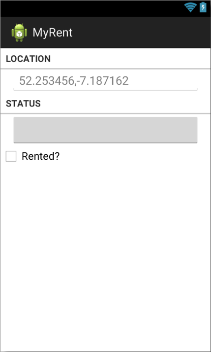

#Add Widgets

We shall now complete remaining work on the layout using the Graphical Layout and the Outline panel.

Here is the the layout at this stage of development.

~~~
<LinearLayout xmlns:android="http://schemas.android.com/apk/res/android"
    android:layout_width="match_parent"
    android:layout_height="match_parent"
    android:orientation="vertical" >

    <!-- LOCATION -->

    <TextView
        style="?android:listSeparatorTextViewStyle"
        android:layout_width="match_parent"
        android:layout_height="wrap_content"
        android:text="@string/location" />

    <LinearLayout
        android:layout_width="match_parent"
        android:layout_height="wrap_content"
        android:baselineAligned="false"
        android:orientation="horizontal" >

        <!-- Geolocation (GPS Coords) -->

        <EditText
            android:id="@+id/geolocation"
            android:layout_width="match_parent"
            android:layout_height="wrap_content"
            android:hint="@string/geolocation_hint" >

            <requestFocus />
        </EditText>

    </LinearLayout>

    <!-- STATUS -->

    <TextView
        style="?android:listSeparatorTextViewStyle"
        android:layout_width="match_parent"
        android:layout_height="wrap_content"
        android:text="@string/status" />
    
    <Button android:id="@+id/registration_date"
        android:layout_width="match_parent"
        android:layout_height="wrap_content"
        android:layout_marginLeft="16dp"
        android:layout_marginRight="16dp"
        />

</LinearLayout>
~~~

It remains only to add the checkbox.

With the Graphical Layout open, drag a CheckBox from the Form Widgets folder and drop directly underneath the *registration_date* button in the Outline panel.


Replace android:text attribute with string referenced in strings.xml and change the android:id, all as shown here:

```
  <CheckBox
      android:layout_width="wrap_content"
      android:layout_height="wrap_content"
      android:text="@string/isrented"
      android:id="@+id/isrented"
      android:checked="false"/>

```

Add a string resource for the checkbox:

```
  <string name="isrented">Rented?</string>

```
Because we have moved MyRentActivity to a new folder, a change to the manifest file is required:

```
    <activity android:name=".activities.MyRentActivity">

```

This concludes the layout design and implementation in this step. 

- Result to date shown in Figure 2:



The hierarchical arrangement of the layout is shown here in Figure 3.
 
- Notice that the LinearLayout orientation is vertical thus creating a stack of xml nodes comprising the various UI widgets.


 
 
