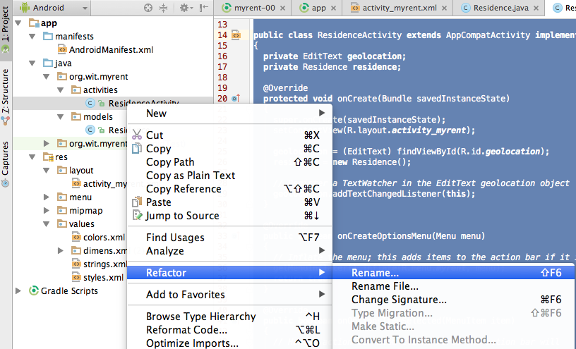

#Activity & Model Updates

Replace your Residence class with the following:

~~~
package org.wit.myrent.models;

import java.util.Date;
import java.util.Random;

public class Residence
{
  public Long id;
  public Long date;

  //a latitude longitude pair
  //example "52.4566,-6.5444"
  private String geolocation;
  public boolean rented;

  public Residence()
  {
    id = unsignedLong();
    date = new Date().getTime();
  }

  /**
   * Generate a long greater than zero
   * @return Unsigned Long value greater than zero
   */
  private Long unsignedLong() {
    long rndVal = 0;
    do {
      rndVal = new Random().nextLong();
    } while (rndVal <= 0);
    return rndVal;
  }
  
  public void setGeolocation(String geolocation)
  {
    this.geolocation = geolocation;
  }

  public String getGeolocation()
  {
    return geolocation;
  }

  public String getDateString() {
    return "Registered:" + dateString();
  }

  private String dateString() {
    String dateFormat = "EEE d MMM yyyy H:mm";
    return android.text.format.DateFormat.format(dateFormat, date).toString();
  }

}
~~~

Note that we have made the fields public for convenience. Also, we have introduced a new date and rented fields into the model.

Change the name of MyRentActivity to ResidenceActivity. This naming convention will prove more intuitive and consistent as you will see in later development iterations. 

- Use the Refactor command: select MyRentActivity and in the context menu Refactor | Rename as shown in Figure 1.

In ResidenceActivity introduce 2 new fields to access the new widgets we have just introduced:

~~~
  private CheckBox rented;
  private Button   dateButton;
~~~

and on OnCreate, we need to initialize these:

~~~
    dateButton  = (Button)   findViewById(R.id.registration_date);
    rented  = (CheckBox) findViewById(R.id.isrented);
    rented.setOnCheckedChangeListener(this);
~~~

Furthmore, we are going to disable the date button when the activity is created:

~~~
    dateButton .setEnabled(false);
~~~

Run the app now, and verify that the activity launches without incident.

We would now like to engage the checkbox rented. First, implement the OnCheckedChangeListener interface:

~~~
public class ResidenceActivity extends Activity implements TextWatcher, OnCheckedChangeListener
{
~~~

This will require the following import:

~~~
import android.widget.CompoundButton.OnCheckedChangeListener;
~~~

and this is the implementation:

~~~
  @Override
  public void onCheckedChanged(CompoundButton arg0, boolean isChecked)
  {
    Log.i(this.getClass().getSimpleName(), "rented Checked");
    residence.rented = isChecked;
  }
~~~

This completes the class. Here is the complete code to this stage:

~~~
package org.wit.myrent.activities;

import android.support.v7.app.AppCompatActivity;
import android.os.Bundle;
import android.text.Editable;
import android.text.TextWatcher;
import android.util.Log;
import android.view.Menu;
import android.view.MenuItem;
import android.widget.Button;
import android.widget.CheckBox;
import android.widget.CompoundButton;
import android.widget.EditText;

import org.wit.myrent.R;
import org.wit.myrent.models.Residence;

public class ResidenceActivity extends AppCompatActivity implements TextWatcher, CompoundButton.OnCheckedChangeListener
{
  private EditText geolocation;
  private Residence residence;

  private CheckBox rented;
  private Button dateButton;

  @Override
  protected void onCreate(Bundle savedInstanceState)
  {
    super.onCreate(savedInstanceState);
    setContentView(R.layout.activity_myrent);

    geolocation = (EditText) findViewById(R.id.geolocation);
    residence = new Residence();

    // Register a TextWatcher in the EditText geolocation object
    geolocation.addTextChangedListener(this);

    dateButton  = (Button)   findViewById(R.id.registration_date);
    rented      = (CheckBox) findViewById(R.id.isrented);

    dateButton .setEnabled(false);

  }

  @Override
  public void beforeTextChanged(CharSequence charSequence, int i, int i1, int i2)
  {

  }

  @Override
  public void onTextChanged(CharSequence charSequence, int i, int i1, int i2)
  {

  }

  @Override
  public void afterTextChanged(Editable editable)
  {
    residence.setGeolocation(editable.toString());
  }

  @Override
  public void onCheckedChanged(CompoundButton compoundButton, boolean isChecked)
  {
    Log.i(this.getClass().getSimpleName(), "rented Checked");
    residence.rented = isChecked;
  }
}

~~~

