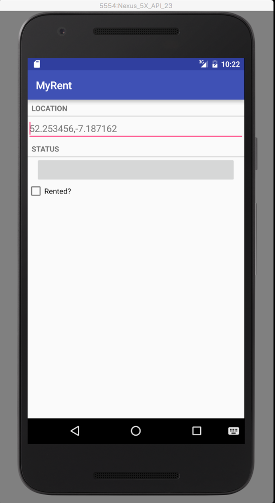

#Test

Run the app and check that the layout presented is as expected, something like that shown in Figure 1.

Run the app and use the debugger to ensure data is being transmitted to and from the Residence object.

- Run MyRent app on an emulator.
- Place a breakpoint at ResidenceActivity.afterTextChanged as shown in Figure 2.
- Tick the Rented? checkbox.
- Input a number in the Location input field.
  - The program should halt at the breakpoint.

Examine the state of the variables such as:

- this
- editable
- residence.date
- residence.geolocation
- residence.id
- residence.rented

Press the Run to Cursor toolbar icon to run to completion.

