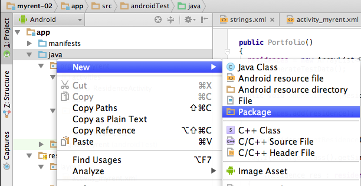
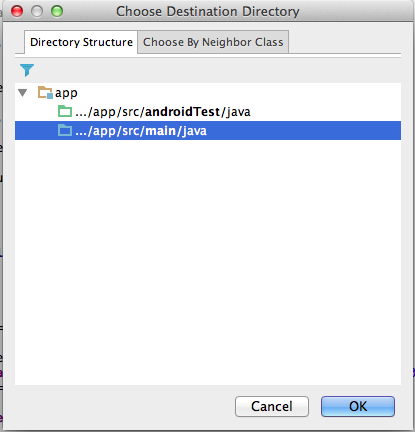
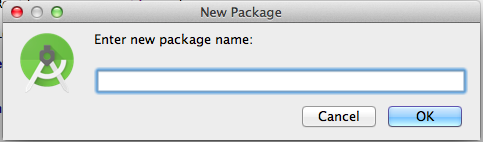

#Application

To manage the list of residences, we use an `Application` object. 

- This is an object created when the application is launched, and we are guaranteed that there will only ever be one of them. 
- This is extremely useful - and we would use it to create the single Portfolio object, which in turn contains the list of residences our app is managing.

Create a package called 'org.wit.myrent.app' and introduce the following class:

- To create the package, select *java* in the Android panel on the left of the Android Studio screen, right click to open the context menu and select new package. This opens the Choose Destination Directory window in which you should select the option *../app/src/main/java*. These steps are illustrated in Figures 1, 2 and 3 below.

Add the MyRentApp class to the newly created package:

~~~
package org.wit.myrent.app;

import org.wit.myrent.models.Portfolio;
import android.app.Application;

public class MyRentApp extends Application
{
  public Portfolio portfolio;

  @Override
  public void onCreate()
  {
    super.onCreate();
    portfolio = new Portfolio();
  }
}
~~~

We will not create  MyRentApp object, it will be created for us by the operating system (OS). 

- However, we do need to let the OS know that we have introduced an application object which is to be created. 
- This is done in the manifest file AndroidManifest.XML.

Adjust it now as follows:

~~~
  <application
      android:name=".app.MyRentApp"
      android:allowBackup="true"
      android:icon="@mipmap/ic_launcher"
      android:label="@string/app_name"
      android:supportsRtl="true"
      android:theme="@style/AppTheme">
~~~

Notice the new entry here:

~~~
    android:name=".app.MyRentApp"
~~~

Run the app now, and place a breakpoint in the onCreate method. If the app stops at this point, then you have successfully introduced an application object.

