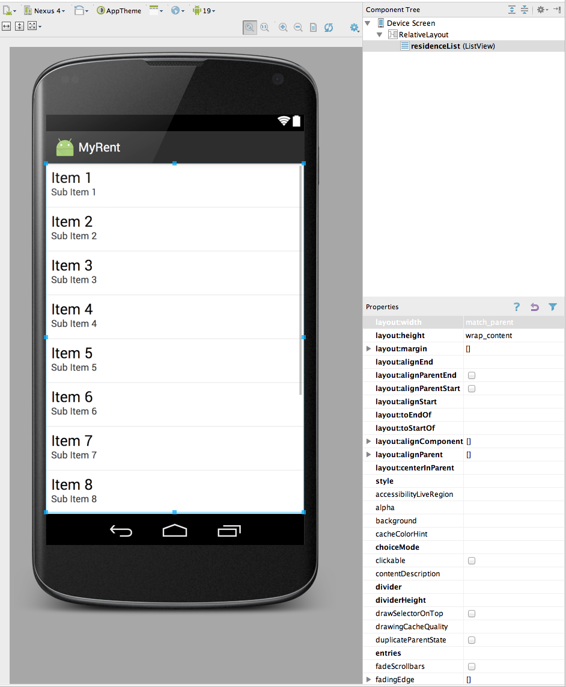
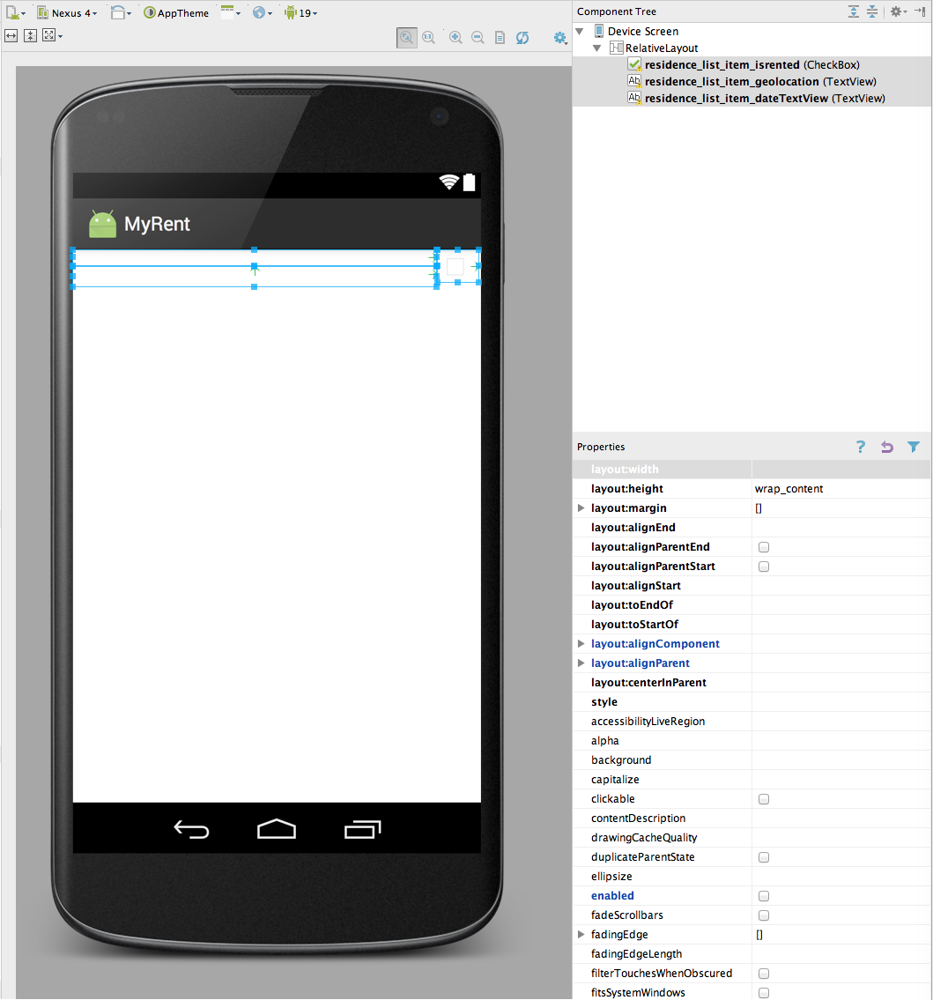
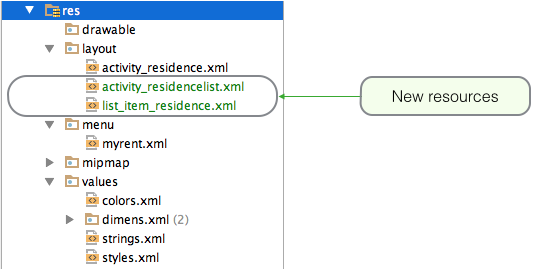

#Layouts

We need two new layout resources in order to build the list view:

- activity_residencelist.xml
- list_item_residence.xml

activity_residencelist represents a full activity containing a single ListView widget:

list_item_residence will represent an individual list item:

The screen shots Figures 1 & 2 above should give you enough clues to create these resources. They will be added to the res/layout folder in the project as shown in Figure 3:

Here are the full xml files for reference purposes:

##activity_residencelist.xml

~~~
<RelativeLayout xmlns:android="http://schemas.android.com/apk/res/android"
    xmlns:tools="http://schemas.android.com/tools"
    android:layout_width="match_parent"
    android:layout_height="match_parent">

    <ListView
        android:id="@+id/residenceList"
        android:layout_width="match_parent"
        android:layout_height="wrap_content" >
    </ListView>

</RelativeLayout>
~~~

##list_item_residence.xml

~~~
<RelativeLayout xmlns:android="http://schemas.android.com/apk/res/android"
    android:layout_width="match_parent"
    android:layout_height="match_parent"
    android:orientation="vertical">

    <CheckBox
        android:id="@+id/residence_list_item_isrented"
        android:layout_width="wrap_content"
        android:layout_height="wrap_content"
        android:gravity="center"
        android:layout_alignParentRight="true"
        android:enabled="false"
        android:focusable="false"
        android:padding="4dp"
         />

    <TextView
        android:id="@+id/residence_list_item_geolocation"
        android:layout_width="match_parent"
        android:layout_height="wrap_content"
        android:layout_toLeftOf="@id/residence_list_item_isrented"
        android:textStyle="bold"
        android:paddingLeft="4dp"
		android:paddingRight="4dp"
        />

    <TextView
        android:id="@+id/residence_list_item_dateTextView"
        android:layout_width="match_parent"
        android:layout_height="wrap_content"
        android:layout_below="@id/residence_list_item_geolocation"
        android:layout_toLeftOf="@id/residence_list_item_isrented"
        android:paddingLeft="4dp"
		android:paddingRight="4dp"
		android:paddingTop="4dp"/>

</RelativeLayout>
~~~

