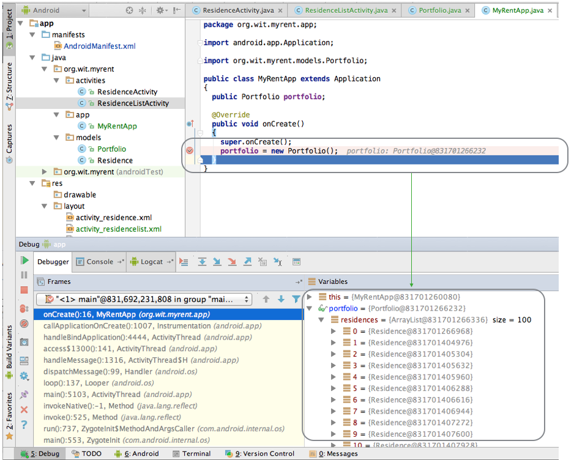

#ResidenceListActivity

We can now start to introduce the ResidenceListActivity class

##ResidenceListActivity

~~~
package org.wit.myrent.activities;

import org.wit.myrent.R;
import org.wit.myrent.app.MyRentApp;
import org.wit.myrent.models.Portfolio;
import android.widget.ListView;
import android.app.Activity;
import android.os.Bundle;

public class ResidenceListActivity extends Activity
{
  private ListView listView;
  private Portfolio portfolio;

  @Override
  public void onCreate(Bundle savedInstanceState)
  {
    super.onCreate(savedInstanceState);
    setTitle(R.string.app_name);
    setContentView(R.layout.activity_residencelist);

    listView = (ListView) findViewById(R.id.residenceList);

    MyRentApp app = (MyRentApp) getApplication();
    portfolio = app.portfolio;
  }
}
~~~

This version does not do much. However, if it is to be started at all, we need to change the AndroidManifest.xml again, indicating that this is the 'Launch' activity for the app:

~~~
<?xml version="1.0" encoding="utf-8"?>
<manifest xmlns:android="http://schemas.android.com/apk/res/android"
          package="org.wit.myrent">

  <application
      android:name=".app.MyRentApp"
      android:allowBackup="true"
      android:icon="@mipmap/ic_launcher"
      android:label="@string/app_name"
      android:theme="@style/AppTheme">

    <activity
        android:name=".activities.ResidenceListActivity"
        android:label="@string/app_name" >
      <intent-filter>
        <action android:name="android.intent.action.MAIN" />
        <category android:name="android.intent.category.LAUNCHER" />
      </intent-filter>
    </activity>

    <activity
        android:name=".activities.ResidenceActivity"
        android:label="@string/app_name">
    </activity>
  </application>

</manifest>

~~~

Inspect the above closely, and note how our app now contains 2 activities, with ResidenceListActivity being the 'MAIN' one.

Verify that the app runs corrrectly. Drop a breakpoint in the onCreate method above, and verify that the portfolio is properly initialised. Also notice that the listView is initialised.

