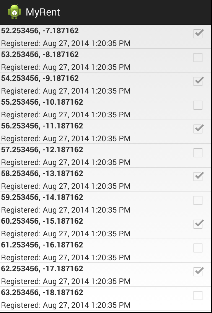

#Adapters

In order to update the list with the residence objects contained in the portfolio, we need an Adapter. 

- An Adapter is a special class we can append to the end of the existing ResidenceListActivity class (make sure it is outside the closing brace of ResidenceListActivity).

~~~
class ResidenceAdapter extends ArrayAdapter<Residence>
{
  private Context context;
  
  public ResidenceAdapter(Context context, ArrayList<Residence> residences)
  {
    super(context, 0, residences);
    this.context = context;
  }

  @Override
  public View getView(int position, View convertView, ViewGroup parent)
  {
    LayoutInflater inflater = (LayoutInflater) context.getSystemService(Context.LAYOUT_INFLATER_SERVICE);
    if (convertView == null)
    {
      convertView = inflater.inflate(R.layout.list_item_residence, null);
    }
    Residence res = getItem(position);

    TextView geolocation = (TextView) convertView.findViewById(R.id.residence_list_item_geolocation);
    geolocation.setText(res.geolocation);
    
    TextView dateTextView = (TextView) convertView.findViewById(R.id.residence_list_item_dateTextView);
    dateTextView.setText(res.getDateString());
    
    CheckBox rentedCheckBox = (CheckBox) convertView.findViewById(R.id.residence_list_item_isrented);
    rentedCheckBox.setChecked(res.rented);

    return convertView;
  }
}
~~~

Introducing *ResidenceAdapter* requires the following additional import statements:

```
import android.content.Context;
import android.view.LayoutInflater;
import android.view.View;
import android.view.ViewGroup;
import android.widget.ArrayAdapter;
import android.widget.CheckBox;
import android.widget.TextView;
import java.util.ArrayList;
import org.wit.myrent.models.Residence;

```

This class, ResidenceAdapter, acts as a mediator between our model and the view elements.

In order to incorporate it into ResidenceListActivity, first introduce a new field:

~~~
  private ResidenceAdapter adapter;
~~~


and the, in order to trigger it, we need the following code at the very end of OnCreate in ResidenceListActivity:

~~~
    adapter = new ResidenceAdapter(this, portfolio.residences);
    listView.setAdapter(adapter);
~~~

Run the app now - it should display the list of random residences:



This is the complete ResidenceListActivity class for references purposes:

~~~
package org.wit.myrent.activities;

import org.wit.myrent.R;
import org.wit.myrent.app.MyRentApp;
import org.wit.myrent.models.Portfolio;

import android.widget.ListView;
import android.app.Activity;
import android.os.Bundle;
import android.content.Context;
import android.view.LayoutInflater;
import android.view.View;
import android.view.ViewGroup;
import android.widget.ArrayAdapter;
import android.widget.CheckBox;
import android.widget.TextView;
import java.util.ArrayList;
import org.wit.myrent.models.Residence;

public class ResidenceListActivity extends Activity
{
  private ListView listView;
  private Portfolio portfolio;
  private ResidenceAdapter adapter;

  @Override
  public void onCreate(Bundle savedInstanceState)
  {
    super.onCreate(savedInstanceState);
    setTitle(R.string.app_name);
    setContentView(R.layout.activity_residencelist);

    listView = (ListView) findViewById(R.id.residenceList);

    MyRentApp app = (MyRentApp) getApplication();
    portfolio = app.portfolio;
    
    adapter = new ResidenceAdapter(this, portfolio.residences);
    listView.setAdapter(adapter);   
  }
}

class ResidenceAdapter extends ArrayAdapter<Residence>
{
  private Context context;

  public ResidenceAdapter(Context context, ArrayList<Residence> residences)
  {
    super(context, 0, residences);
    this.context = context;
  }

  @Override
  public View getView(int position, View convertView, ViewGroup parent)
  {
    LayoutInflater inflater = (LayoutInflater) context.getSystemService(Context.LAYOUT_INFLATER_SERVICE);
    if (convertView == null)
    {
      convertView = inflater.inflate(R.layout.list_item_residence, null);
    }
    Residence res = getItem(position);

    TextView geolocation = (TextView) convertView.findViewById(R.id.residence_list_item_geolocation);
    geolocation.setText(res.geolocation);

    TextView dateTextView = (TextView) convertView.findViewById(R.id.residence_list_item_dateTextView);
    dateTextView.setText(res.getDateString());

    CheckBox rentedCheckBox = (CheckBox) convertView.findViewById(R.id.residence_list_item_isrented);
    rentedCheckBox.setChecked(res.rented);

    return convertView;
  }
}
~~~