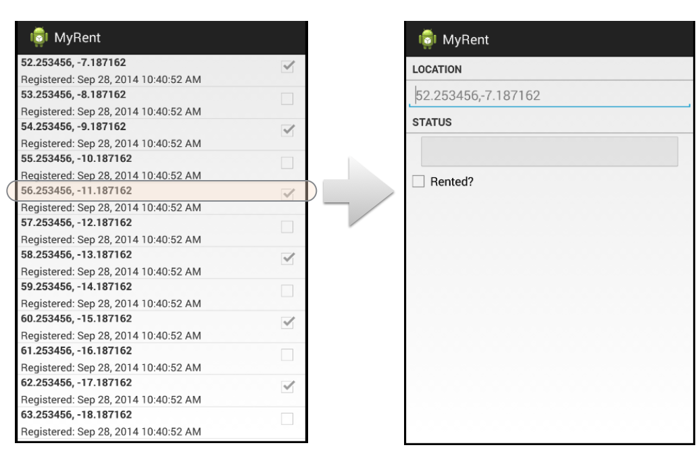

#Intents

Currently the application just displays the list, and we do not have any way of navigating from the list to individual residences. To bind them we will first have to listen for clicks on the list in ResidenceListActivity. This requires that we implement OnItemClickListener:

~~~
public class ResidenceListActivity extends Activity  implements AdapterView.OnItemClickListener
~~~

Use Android Studio method of adding the required interface method. This is described in detail in step 09 of lab MyRent-00.

~~~
  @Override
  public void onItemClick(AdapterView<?> parent, View view, int position, long id)
  {

  }
~~~


Replace the above generated method with the following version (we have changed the argument names to more meaningful ones):

~~~
  @Override
  public void onItemClick(AdapterView<?> parent, View view, int position, long id)
  {
    Intent intent = new Intent(this, ResidenceActivity.class);
    startActivity(intent);
  }
~~~

Import the *Intent* class:

```
import android.content.Intent;
```

If the user clicks on an item, we should start our ResidenceActivity - the one we designed earlier. Try this now.

It doesnt work? This is because we didnt install the ResidenceListActivity object as a listener. Add this line to OnCreate:


~~~
    listView.setOnItemClickListener(this);
~~~

You should now be able to navigate from any list item to the detail view as shown in Figure 1.

- Note however that, for the moment, the detailed view rendered is always the first in the list irrespective of which list item is clicked.



For reference, this is the complete ResidenceListActivity and ResidenceAdapter classes at this stage:

~~~
package org.wit.myrent.activities;

import org.wit.myrent.R;
import org.wit.myrent.app.MyRentApp;
import org.wit.myrent.models.Portfolio;
import org.wit.myrent.models.Residence;

import android.content.Context;
import android.content.Intent;
import android.view.LayoutInflater;
import android.view.View;
import android.view.ViewGroup;
import android.widget.AdapterView;
import android.widget.ArrayAdapter;
import android.widget.CheckBox;
import android.widget.ListView;
import android.app.Activity;
import android.os.Bundle;
import android.widget.TextView;

import java.util.ArrayList;

public class ResidenceListActivity extends Activity  implements AdapterView.OnItemClickListener
{
  private ListView listView;
  private Portfolio portfolio;
  private ResidenceAdapter adapter;

  @Override
  public void onCreate(Bundle savedInstanceState)
  {
    super.onCreate(savedInstanceState);
    setTitle(R.string.app_name);
    setContentView(R.layout.activity_residencelist);

    listView = (ListView) findViewById(R.id.residenceList);

    MyRentApp app = (MyRentApp) getApplication();
    portfolio = app.portfolio;

    adapter = new ResidenceAdapter(this, portfolio.residences);
    listView.setAdapter(adapter);
    listView.setOnItemClickListener(this);

  }

  @Override
  public void onItemClick(AdapterView<?> parent, View view, int position, long id)
  {
    Intent intent = new Intent(this, ResidenceActivity.class);
    startActivity(intent);
  }
}

class ResidenceAdapter extends ArrayAdapter<Residence>
{
  private Context context;

  public ResidenceAdapter(Context context, ArrayList<Residence> residences)
  {
    super(context, 0, residences);
    this.context = context;
  }

  @Override
  public View getView(int position, View convertView, ViewGroup parent)
  {
    LayoutInflater inflater = (LayoutInflater) context.getSystemService(Context.LAYOUT_INFLATER_SERVICE);
    if (convertView == null)
    {
      convertView = inflater.inflate(R.layout.list_item_residence, null);
    }
    Residence res = getItem(position);

    TextView geolocation = (TextView) convertView.findViewById(R.id.residence_list_item_geolocation);
    geolocation.setText(res.geolocation);

    TextView dateTextView = (TextView) convertView.findViewById(R.id.residence_list_item_dateTextView);
    dateTextView.setText(res.getDateString());

    CheckBox rentedCheckBox = (CheckBox) convertView.findViewById(R.id.residence_list_item_isrented);
    rentedCheckBox.setChecked(res.rented);

    return convertView;
  }
}
~~~

