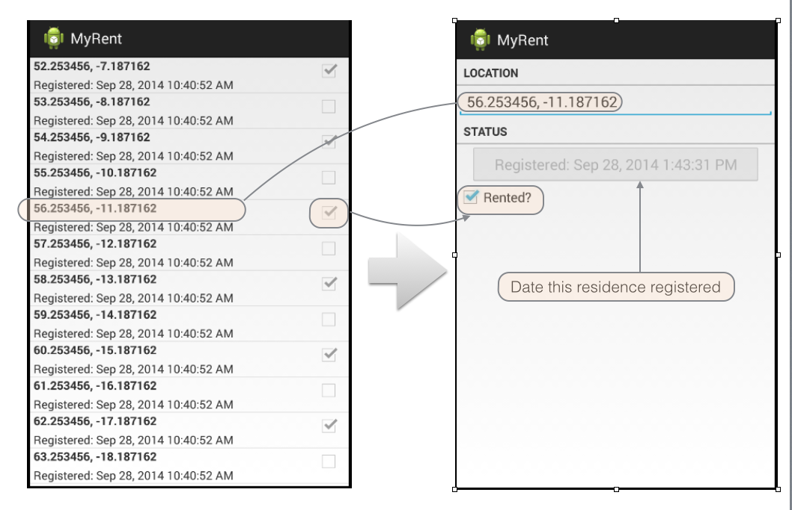

#Activity Arguments

- When ResidenceActivity is started, it doesn't seem to display anything useful - and certainly not the items in the list we started it from. 
    - Study Figure 1 in the previous step where this is illustrated.

- We need to be able to pass information to ResidenceActivity, so it can display the correct Residence model object - that which we have selected in the list of residences. 
- This will involve making changes in both ResidenceListActivity and ResidenceActivity.

In ResidenceListActivity replace *onItemClick* with the following modified code:

```
  @Override
  public void onItemClick(AdapterView<?> parent, View view, int position, long id)
  {
    Residence residence = adapter.getItem(position);
    Intent intent = new Intent(this, ResidenceActivity.class);
    intent.putExtra("RESIDENCE_ID", residence.id);
    startActivity(intent);
  }

```

In the above. notice that:

- The argument *residence.id* in *putExtra* represents the residence the user clicked on (by position). 
    - We obtain this from the portfolio and then pass it to the intent as an **extra** data item.

In ResidenceActivity first introduce a new field:

~~~
  private Portfolio portfolio; 
~~~

Then, at the end of onCreate, initialise this field:

~~~
    MyRentApp app = (MyRentApp) getApplication();
    portfolio = app.portfolio;
~~~

Add these imports:

```
import org.wit.myrent.models.Portfolio;
import org.wit.myrent.app.MyRentApp;

```

Now we can recover the ID passed to us via the intent:

~~~
    Long resId = (Long) getIntent().getExtras().getSerializable("RESIDENCE_ID");
~~~

and get the Residence Object from the portfolio:

~~~
    Long resId = (Long) getIntent().getExtras().getSerializable("RESIDENCE_ID");
    residence = portfolio.getResidence(resId);
~~~

This is the complete four lines we add:

~~~
    MyRentApp app = (MyRentApp) getApplication();
    portfolio = app.portfolio;    
    
    Long resId = (Long) getIntent().getExtras().getSerializable("RESIDENCE_ID");
    residence = portfolio.getResidence(resId);
~~~

Now all that remains is to send the residence data to the view widgets. We can write a special method for that:

~~~
  public void updateControls(Residence residence)
  {
    geolocation.setText(residence.geolocation);
    rented.setChecked(residence.rented);
    dateButton.setText(residence.getDateString());
  }
~~~

and call this method if we are sure we found a valid reference:

~~~
    if (residence != null)
    {
      updateControls(residence);
    }
~~~

Build and launch the app:

- We should now ne able to navigate and inspect the details of any Residence from the list as illustrated in Figure 1.



This is the complete new version of ResidenceActivity:

~~~
package org.wit.myrent.activities;

import android.support.v7.app.AppCompatActivity;
import android.os.Bundle;
import android.text.Editable;
import android.text.TextWatcher;
import android.util.Log;
import android.view.Menu;
import android.view.MenuItem;
import android.widget.Button;
import android.widget.CheckBox;
import android.widget.CompoundButton;
import android.widget.EditText;

import org.wit.myrent.R;
import org.wit.myrent.app.MyRentApp;
import org.wit.myrent.models.Portfolio;
import org.wit.myrent.models.Residence;


public class ResidenceActivity extends AppCompatActivity implements TextWatcher, CompoundButton.OnCheckedChangeListener
{
  private EditText geolocation;
  private Residence residence;

  private CheckBox rented;
  private Button dateButton;

  private Portfolio portfolio;

  @Override
  protected void onCreate(Bundle savedInstanceState)
  {
    super.onCreate(savedInstanceState);
    setContentView(R.layout.activity_myrent);

    geolocation = (EditText) findViewById(R.id.geolocation);
    residence = new Residence();

    // Register a TextWatcher in the EditText geolocation object
    geolocation.addTextChangedListener(this);

    dateButton  = (Button)   findViewById(R.id.registration_date);
    rented      = (CheckBox) findViewById(R.id.isrented);
    rented.setOnCheckedChangeListener(this);
    
    dateButton .setEnabled(false);

    MyRentApp app = (MyRentApp) getApplication();
    portfolio = app.portfolio;

    Long resId = (Long) getIntent().getExtras().getSerializable("RESIDENCE_ID");
    residence = portfolio.getResidence(resId);
    if (residence != null)
    {
      updateControls(residence);
    }

  }

  public void updateControls(Residence residence)
  {
    geolocation.setText(residence.geolocation);
    rented.setChecked(residence.rented);
    dateButton.setText(residence.getDateString());
  }

  @Override
  public void beforeTextChanged(CharSequence charSequence, int i, int i1, int i2)
  {

  }

  @Override
  public void onTextChanged(CharSequence charSequence, int i, int i1, int i2)
  {

  }

  @Override
  public void afterTextChanged(Editable editable)
  {
    residence.setGeolocation(editable.toString());
  }

  @Override
  public void onCheckedChanged(CompoundButton compoundButton, boolean isChecked)
  {
    Log.i(this.getClass().getSimpleName(), "rented Checked");
    residence.rented = isChecked;
  }
}


~~~


