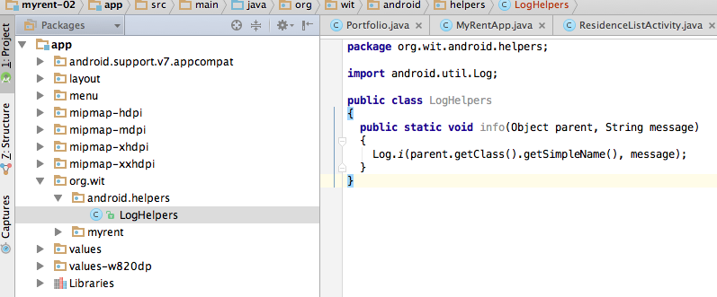
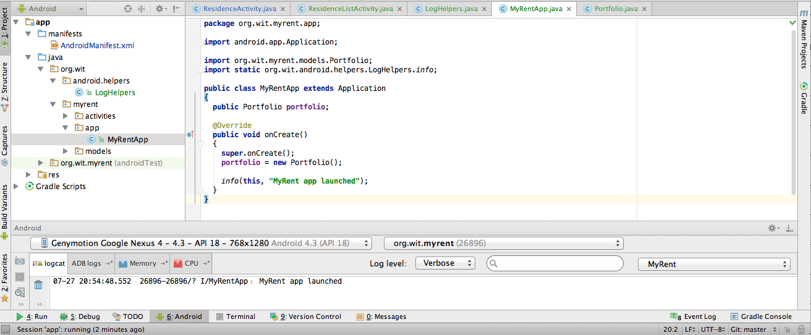

#LogHelpers

Our final step will be to incorporate some helper classes, upon which we will build later. Create a new package called 'org.wit.android.helpers' - and introduce this class:

~~~
package org.wit.android.helpers;

import android.util.Log;

public class LogHelpers
{
  public static void info(Object parent, String message)
  {
    Log.i(parent.getClass().getSimpleName(), message);
  }
}
~~~

Follow the procedure we described earlier in this lab to create the new package. Once the package has been created, it may help to switch to the Packages view before creating the new class - as shown in Figure 1.

This class doesn't do much - but it might make is more inclined to use logging more frequently - as the class wraps up the log call into something easier to type.

So, for instance, in MyRentApp, import the above as follows:

~~~
import static org.wit.android.helpers.LogHelpers.info;
~~~

(the import syntax is slightly different, as we are importing a specific method)

Then, in onCreate we can have this:

~~~
  @Override
  public void onCreate()
  {
    super.onCreate();
    portfolio = new Portfolio();

    info(this, "MyRent app launched");
  }
~~~

You might consider introducing other log messages in the app now. THe advantage of logs is that you can quickly appreciate the health of various aspects of the app by looking at the logs.

The application at the end of this lab is available for reference here: [myrent-02](https://github.com/wit-ictskills-2016/myrent-02.git)

