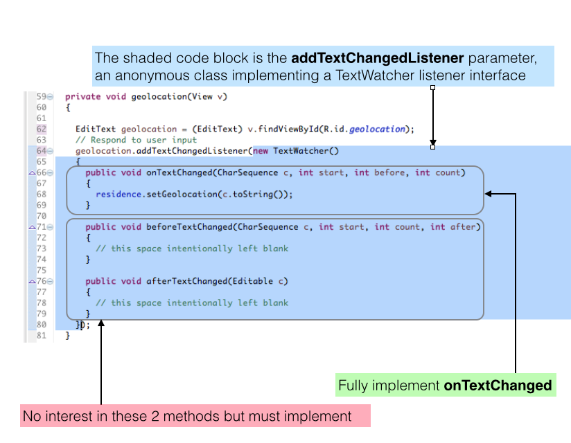

#ResidenceActivity

Here is an extract from ResidenceActivity.java where the TextWatcher listener is introduced by means of an anonymous class:

```
  EditText geolocation;
  ...
  ...
  ...
  private void geolocation(View v)
  {
    // Respond to user input
    geolocation = (EditText) v.findViewById(R.id.geolocation);
    geolocation.addTextChangedListener(new TextWatcher()
    {
      public void onTextChanged(CharSequence c, int start, int before, int count)
      {
        residence.setGeolocation(c.toString());
      }

      public void beforeTextChanged(CharSequence c, int start, int count, int after)
      {
        // this space intentionally left blank
      }

      public void afterTextChanged(Editable c)
      {
        // this space intentionally left blank
      }
    });
  }

```
Figure 1 provides an outline analysis of the method.



In the following steps we shall develop short programs that will, hopefully, explain more fully how the pattern in this method, *geolocation*, works.

We shall select names for classes, interface and methods that, where appropriate, are the same as in *geolocation*.

