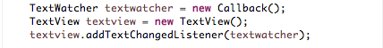

#Callback (Anonymous class method)

We shall now dispense with the *Callback* class

- Create a new package in the *callbacks* project named *org.wit.callbackanon*.
- Copy the file *EventLoop.java* from org.wit.callback to the new package.

- A number of errors will be indicated which may be resolved by adding the following import statements:

```
import org.wit.callback.TextView;
import org.wit.callback.TextWatcher;
```

Study the original EventLoop code:


Note the content of Callback:


Open org.wit.callbackanon.EventLoop.java and:

- Delete the line that instantiates a new Callback object: *TextWatcher textwatcher = new Callback();*
    - We no longer require Callback
- Replace the line: *textview.addTextChangedListener(textwatcher);* with this code:

```
    textview.addTextChangedListener(new TextWatcher()
    {
      @Override
      public void onTextChanged(String changedtext)
      {
        System.out.println(changedtext);
      }

    });
```

It should be clear what's happening: we have dispensed with the class Callback and instead used its content within what is referred to as an anonymous class as a parameter to *addTextChangedListener*..

- Official documentation on the anonymous class syntax is available in the [Java Tutorial](http://docs.oracle.com/javase/tutorial/java/javaOO/anonymousclasses.html).

Here is the final refactored EventLoop code:

Filename: EventLoop.java

```
package org.wit.callbackanon;

import org.wit.callback.TextView;
import org.wit.callback.TextWatcher;

//Class to simulate a short-lived event loop
public class EventLoop
{

  public static void main(String[] args)
  {

    TextView textview = new TextView();

    // We use an anonymous class instead of the Callback object
    textview.addTextChangedListener(new TextWatcher()
    {
      @Override
      public void onTextChanged(String changedtext)
      {
        System.out.println(changedtext);
      }

    });

    // The simulated event loop
    int val = 0;
    do
    {
      if (val % 100 == 0)
      {
        textview.setPredicate(true); // the trigger to fire an event
      }
      textview.doWork();// invoked repeatedly and triggers event when predicate
                        // true
      val += 1;
    } while (val < 500);// we expect 5 events to be triggered
  }
}
```
Figure 1 below presents a flow diagram of the program.

