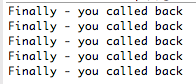

#Callback (Delegated method)

- Create a package in *callbacks* project named *org.wit.callbackimpl*.
- Copy the file *EventLoop.java* from org.wit.callbackanon to the new package.


- Reorganize EventLoop 
    - by moving its functionality to a method:
        - public void runloop()
    - Instantiating EventLoop within the *main* method
    - Invoking *runloop* on the newly creaed Eventloop object.


Here is the refactored class:

org.wit.callbackimpl.EventLoop.java

```
package org.wit.callbackimpl;

import org.wit.callback.TextView;
import org.wit.callback.TextWatcher;

//Class to simulate a short-lived event loop
public class EventLoop
{

  private void runloop()
  {
    TextView textview = new TextView();

    // We use an anonymous class instead of the Callback object
    textview.addTextChangedListener(new TextWatcher()
    {
      @Override
      public void onTextChanged(String changedtext)
      {
        System.out.println(changedtext);
      }

    });

    // The simulated event loop
    int val = 0;
    do
    {
      if (val % 100 == 0)
      {
        textview.setPredicate(true); // the trigger to fire an event
      }
      textview.doWork();// invoked repeatedly and triggers event when predicate
                        // true
      val += 1;
    } while (val < 500);// we expect 5 events to be triggered    
  }
  
  
  public static void main(String[] args)
  {
    EventLoop obj = new EventLoop();
    obj.runloop();
  }    
}
```

- Test that the result of this change has no noticeable effect on the output:


- As shown in Figure 1, replace the anonymous class with the *this* reference.
    - Remember that here *this* is a reference to the instance of EventLoop that has been created.


- This change will trigger an error:


- The reason for the error is that the signature of *addTextChangedListener* clearly shows that a TextWatcher type is expected as a parameter whereas we have supplied it with an EventLoop reference.


- We can eliminate the error by:
    - Having EventLoop implement TextWatcher
        - Doing so means that *this*, a reference to EventLoop, becomes an acceptable parameter
    - We are then obliged to implement the method declared in TextWatcher, namely *onTextChanged*.

Change the signature of EventLoop to the following:

```
public class EventLoop implements TextWatcher
```
Use QuickFix to override *onTextChanged* in the class:

```
  @Override
  public void onTextChanged(String changedtext)
  {
    // TODO Auto-generated method stub
    
  }
```

Finally, fully implement *onTextChanged*:

```
      @Override
      public void onTextChanged(String changedtext)
      {
        System.out.println(changedtext);
      }
```
The application should now be error-free. 

- Run it and observe the result as before:


Here is the final version of *EventLoop*:

```
package org.wit.callbackimpl;

import org.wit.callback.TextView;
import org.wit.callback.TextWatcher;

//Class to simulate a short-lived event loop
public class EventLoop implements TextWatcher
{

  public void runloop()
  {    
    TextView textview = new TextView();

    // EventLoop implements TextWatcher
    // Consequently "this" a legal parameter here
    textview.addTextChangedListener(this);

    // The simulated event loop
    int val = 0;
    do
    {
      if (val % 100 == 0)
      {
        textview.setPredicate(true); // the trigger to fire an event
      }
      textview.doWork();// invoked repeatedly, triggers event when predicate true
      val += 1;
    } while (val < 500);// we expect 5 events to be triggered 
  }
  public static void main(String[] args)
  {
    EventLoop obj = new EventLoop();
    obj.runloop();

  }

  @Override
  public void onTextChanged(String changedtext)
  {
    System.out.println(changedtext);
    
  }
}
```
