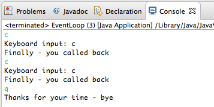

#Exercise 1

Modify the the Delegate callback method as follows:

- Introduce a new interface, KeyBoardListener, inherited from the existing interface TextWatcher.
    - The interface to have one method: **void onKeyBoardInput()**
- Introduce a new class called KeyPress, a subclass of TextView
    - In Keypress, override the TextView method *doWork* as indicated below.
- Modify EventLoop as follows:
    - The class should implement the new interface only
    - Rather than TextView textview being an instance of TextView, have it be an instance of the derived class Keypress.
    - In the simulated event loop capture a character from a keyboard press.
        - If the character is "c":
          - Set the predicate *true*.
          - Implement the necessary interface method(s).
        - If the character is "q", quit the program.
    - Here is sample output:
    
  - EventLoop is provided in skeleton form below.

Here is the package and file arrangement you are recommended to use:

- Create a new package **org.wit.callbackexercise**.
  - Populate this package with 
    - Two new classes:
        - EventLoop
        - Keypress
    - One new interface
        - KeyBoardListener


Here is skeleton code for EventLoop class with hints 

```
package org.wit.callbackexercise;

import java.util.Scanner;

import org.wit.callback.TextView;

//Class to simulate a short-lived event loop
public class EventLoop 
{
  String keyboardInput;
  static Scanner in = new Scanner(System.in);
  
  public void runloop()
  {
    TextView textview = new Keypress();
    // EventLoop implements KeyBoardListener
    // Consequently "this" a legal parameter here
    textview.addTextChangedListener(...);
    // The simulated event loop
    do
    {
      keyboardInput = keyboard();
      if (keyboardInput.equals("c"))
      {
        textview.setPredicate(true); // the trigger to fire an event
      }
      textview.doWork();//if predicate true then trigger event in doWork
    } while (keyboardInput.equals("q") == false);
    System.out.println("Thanks for your time - bye");
  }

  /*
   * Capture and return a single keyboard character
   */
  public String keyboard()
  {
    String s = "";
    if(in.hasNext())
    {
      s = in.next();
    }
    return s;
  }
  
  public static void main(String[] args)
  {
    EventLoop obj = new EventLoop();
    obj.runloop();
    in.close();
  }
}
```

Here is a skeleton of the derived Keypress class:

```
package org.wit.callbackexercise;

import org.wit.callback.TextView;

public class Keypress extends TextView
{
  public void addKeyBoardListener(KeyBoardListener listener)
  {
    // Save the event object for later use.
    //TODO ...
  }
  
  // This method will be invoked repeatedly in an event loop
  @Override
  public void doWork()
  {
    // Check the predicate, which is set elsewhere.
    if (somethingHappened)
    {
      // Signal the event by invoking the interface's method.
      //TODO: Invoke: onKeyBoardInput();
      //TODO: Invoke: onTextChanged("Finally - you called back");
      somethingHappened = false;
    }
  }
}
```

Here are suggested class diagrams for the solution.


