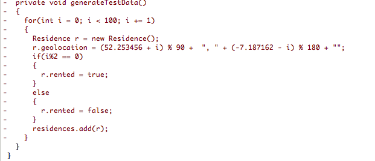

#Activities (ResidenceListActivity)

Here we shall provide the coding to respond to menu selection:

Import the helpers provided in the previous step:

```
import static org.wit.android.helpers.IntentHelper.startActivityWithData;
import static org.wit.android.helpers.IntentHelper.startActivityWithDataForResult;
```

This import statement is necessary:
```
import android.view.MenuItem;
```

Now override *onOptionsItemSelected* to respond to selecting the menu item to create a new residence instance:

```
  @Override
  public boolean onOptionsItemSelected(MenuItem item)
  {
    switch (item.getItemId())
    {
      case R.id.menu_item_new_residence: Residence residence = new Residence();
                                         portfolio.addResidence(residence);
                                         startActivityWithDataForResult(this, ResidenceActivity.class, "RESIDENCE_ID", residence.id, 0);
                                         return true;    
                                    
      default: return super.onOptionsItemSelected(item);
    }
  } 
```

Add this line of code to *onItemClick*

```
startActivityWithData(this, ResidenceActivity.class, "RESIDENCE_ID", residence.id);
```

Delete remaining lines code: 


Here is refactored method:

```
  @Override
  public void onItemClick(AdapterView<?> parent, View view, int position, long id)
  {
    Residence residence = adapter.getItem(position);
    startActivityWithData(this, ResidenceActivity.class, "RESIDENCE_ID", residence.id);
  }
```
We no longer use test data. Delete this line from Portfolio:


Delete the now redundant method, also in Portfolio: *generateTestData*



One small final change to org.wit.myrent.models.Residence:

- Add a default value for geoloction in the default constructor:

```
    geolocation = "52.253456,-7.187162";
```
This will ensure the the residence list will always display some meaningful data.

Here is the modified constructor:

```
  public Residence()
  {
    id = unsignedLong();
    date = new Date().getTime();
    geolocation = "52.253456,-7.187162";
  }
```
Check that the app works as expected:

- Launch the app and select the menu item (+)
- Optionally, make some changes to the residence data in the detail view
- Switch back to the list view using the back-button.

You should be presented with something similar to that shown in Figure 1.

