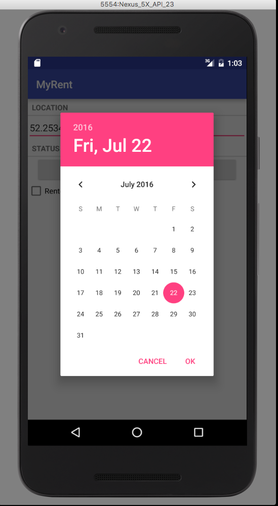

#Activities (ResidenceActivity)

We shall now implement the code to allow a user to set the registration date of a residence.


In *org.wit.myrent.activities.ResidenceActivity* add these import statements:

```
import java.util.Calendar;
import java.util.Date;
import java.util.GregorianCalendar;

import android.app.DatePickerDialog;
import android.view.View;
import android.view.View.OnClickListener;
```


Delete line disabling date button:


Change the signature of ResidenceActivity class by adding 

- View.OnClickListener
- DatePickerDialog.OnDateSetListener

to the list of implemented interfaces:

```
public class ResidenceActivity extends Activity implements TextWatcher, OnCheckedChangeListener, View.OnClickListener, DatePickerDialog.OnDateSetListener
{
...
...
}
```

This change will trigger errors. Add unimplemented methods manually or using the Android Studio hot keys to autogenerate the methods (as described in detail in previous labs such as in step 9 MyRent-00):

- public void onDateSet(DatePicker view, int year, int monthOfYear, int dayOfMonth)
- public void onClick(View v)

Here is the implementation of these methods:

```
  @Override
  public void onClick(View view)
  {
    switch (view.getId())
    {
      case R.id.registration_date      : Calendar c = Calendar.getInstance();
                                         DatePickerDialog dpd = new DatePickerDialog (this, this, c.get(Calendar.YEAR), c.get(Calendar.MONTH), c.get(Calendar.DAY_OF_MONTH));
                                         dpd.show();
                                         break; 
    }
  }
```

```
  @Override
  public void onDateSet(DatePicker view, int year, int monthOfYear, int dayOfMonth)
  {
    Date date = new GregorianCalendar(year, monthOfYear, dayOfMonth).getTime();
    residence.date = date.getTime();
    dateButton.setText(residence.getDateString());
  }
```
Set the date button listener in *onCreate*:

```
dateButton  .setOnClickListener(this);
```
Launch the app and test that this code works as intended:

- Create a new residence
- Change the registration date
- Return to the list view and create a further residence.
- Return to the list view, click on the first residence, which opens its detail view, and observe that it retains the modified date.



For reference, here is the completed ResidenceActivity class:

```
package org.wit.myrent.activities;

import android.support.v7.app.AppCompatActivity;
import android.os.Bundle;
import android.text.Editable;
import android.text.TextWatcher;
import android.util.Log;
import android.widget.Button;
import android.widget.CheckBox;
import android.widget.CompoundButton;
import android.widget.DatePicker;
import android.widget.EditText;

import org.wit.myrent.R;
import org.wit.myrent.app.MyRentApp;
import org.wit.myrent.models.Portfolio;
import org.wit.myrent.models.Residence;

import java.util.Calendar;
import java.util.Date;
import java.util.GregorianCalendar;
import android.app.DatePickerDialog;
import android.view.View;
import android.view.View.OnClickListener;


public class ResidenceActivity extends AppCompatActivity implements TextWatcher,
    CompoundButton.OnCheckedChangeListener,
    View.OnClickListener,
    DatePickerDialog.OnDateSetListener

{
  private EditText geolocation;
  private Residence residence;

  private CheckBox rented;
  private Button dateButton;

  private Portfolio portfolio;

  @Override
  protected void onCreate(Bundle savedInstanceState) {
    super.onCreate(savedInstanceState);
    setContentView(R.layout.activity_residence);

    geolocation = (EditText) findViewById(R.id.geolocation);
    residence = new Residence();

    // Register a TextWatcher in the EditText geolocation object
    geolocation.addTextChangedListener(this);

    dateButton = (Button) findViewById(R.id.registration_date);
    dateButton  .setOnClickListener(this);

    rented = (CheckBox) findViewById(R.id.isrented);

    MyRentApp app = (MyRentApp) getApplication();
    portfolio = app.portfolio;
    Long resId = (Long) getIntent().getExtras().getSerializable("RESIDENCE_ID");
    residence = portfolio.getResidence(resId);
    if (residence != null) {
      updateControls(residence);
    }
  }

  public void updateControls(Residence residence) {
    geolocation.setText(residence.geolocation);
    rented.setChecked(residence.rented);
    dateButton.setText(residence.getDateString());
  }

  @Override
  public void beforeTextChanged(CharSequence charSequence, int i, int i1, int i2) {

  }

  @Override
  public void onTextChanged(CharSequence charSequence, int i, int i1, int i2) {

  }

  @Override
  public void afterTextChanged(Editable editable) {
    residence.setGeolocation(editable.toString());
  }

  @Override
  public void onCheckedChanged(CompoundButton compoundButton, boolean isChecked) {
    Log.i(this.getClass().getSimpleName(), "rented Checked");
    residence.rented = isChecked;
  }

  @Override
  public void onClick(View view) {
    switch (view.getId())
    {
      case R.id.registration_date      : Calendar c = Calendar.getInstance();
        DatePickerDialog dpd = new DatePickerDialog (this, this, c.get(Calendar.YEAR), c.get(Calendar.MONTH), c.get(Calendar.DAY_OF_MONTH));
        dpd.show();
        break;
    }
  }

  @Override
  public void onDateSet(DatePicker view, int year, int monthOfYear, int dayOfMonth) {
    Date date = new GregorianCalendar(year, monthOfYear, dayOfMonth).getTime();
    residence.date = date.getTime();
    dateButton.setText(residence.getDateString());
  }
}

```

The application at the end of this lab is available for reference here: [myrent-03](https://github.com/wit-ictskills-2016/myrent-03.git)
