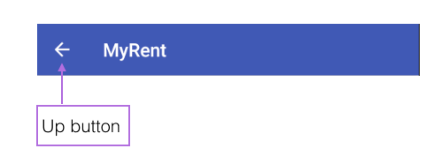

#Up Button

All screens should offer a navigation route to their parent screens by pressing on the *Up* button located in the action bar as shown, for example, here in Figure 1.

Pressing the Up button should route one to the logical parent screen. The parent screen is declared in the manifest file.

In the case of MyRent, a call to *setDisplayHomeAsUpEnabled()* in the ResidenceFragment facilitates switching to the ResidenceListFragment screen when the Up button is pressed.

The following steps describe the process in detail.