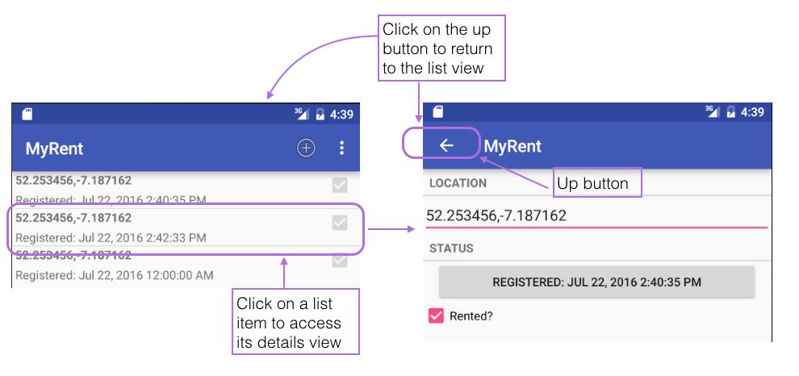

#AndroidManifest

The final piece of the puzzle is the layout in the manifest the parent/child relationship between the ResidenceListActivity and ResidenceActivity classes:

~~~
    <activity
      android:name=".activities.ResidenceActivity"
      android:label="@string/app_name" >  
      <meta-data android:name="android.support.PARENT_ACTIVITY" 
                 android:value=".activities.ResidenceListActivity"/>  
    </activity> 
~~~

In the above we are establishing this relationship. The navigation mechanism should work as expected now.

Here is the complete manifest file for reference purposes:

~~~
<?xml version="1.0" encoding="utf-8"?>
<manifest xmlns:android="http://schemas.android.com/apk/res/android"
          package="org.wit.myrent">

  <application
      android:name=".app.MyRentApp"
      android:allowBackup="true"
      android:icon="@mipmap/ic_launcher"
      android:label="@string/app_name"
      android:theme="@style/AppTheme">

    <activity
        android:name=".activities.ResidenceListActivity"
        android:label="@string/app_name" >
      <intent-filter>
        <action android:name="android.intent.action.MAIN" />
        <category android:name="android.intent.category.LAUNCHER" />
      </intent-filter>
    </activity>

    <activity
        android:name=".activities.ResidenceActivity"
        android:label="@string/app_name">
        <meta-data android:name="android.support.PARENT_ACTIVITY" 
                   android:value=".activities.ResidenceListActivity"/>
    </activity>
  </application>

</manifest>
~~~

Test the back button as indicated in Figure 1.

The application at the end of this lab is available for reference here: [myrent-05](https://github.com/wit-ictskills-2016/myrent-05.git)