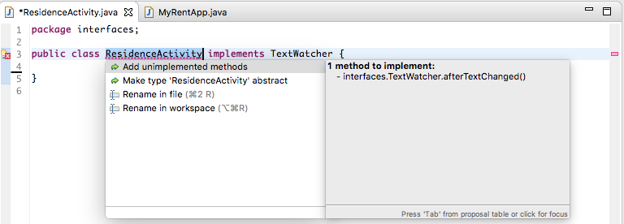
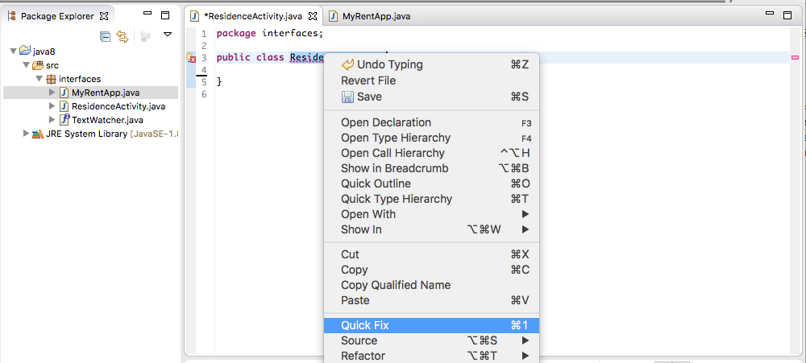
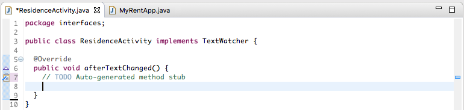
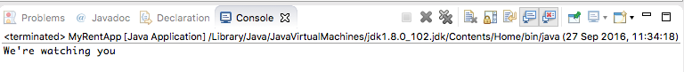

#Interface (Java 7)

Using Eclipse IDE or equivalent create a Java project named `java8`. Create a package `interfaces` in this project. We shall introduce an interface `TextWatcher`, a class named `ResidenceActivity` that implements TextWatcher and a class `MyRentApp` containing a `main` method to run the application. The starter code is provided below. 

```
package interfaces;

public interface TextWatcher {

  // abstract method declaration
  void afterTextChanged();
}

```
Interface abstract methods have implied qualifiers `public` and `abstract` so that `void afterTextChanged()` could have been written in the more verbose style `public abstract void afterTextChanged()`.

```
package interfaces;

public class ResidenceActivity implements TextWatcher {

}

```
Note that an `abstract` method does not have an implementation.

```
package interfaces;

public class MyRentApp {

  public static void main(String[] args) {
    ResidenceActivity activity = new ResidenceActivity();
    activity.afterTextChanged();
  }
}


```

The above code will not compile because we have not implemented the abstract method declared in the TextWatcher interface that the ResidenceActivity class implements. 



To resolve this error modify ResidenceActivity (manually or using Quick Fix).





Complete ResidenceActivity by fully implementing the body of `afterTextChanged`, in this case by adding a simple print statement.

```
package interfaces;

public class ResidenceActivity implements TextWatcher {

  @Override
  public void afterTextChanged() {
    System.out.println("We're watching you");
  }
}

```

Run the app. The output displayed in the console should resemble that shown in Figure 4.
