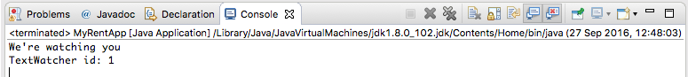
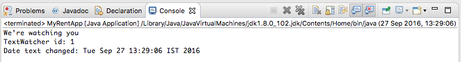
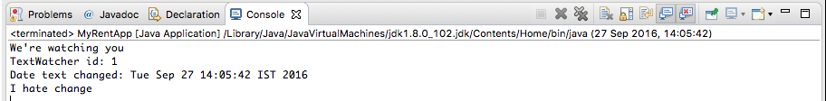
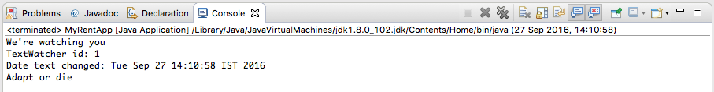

# Interface (Java 8)

The [official documentation](https://docs.oracle.com/javase/tutorial/java/IandI/createinterface.html) defines an interface as follows:

- In the Java programming language, an interface is a reference type, similar to a class, that can contain only constants, method signatures, default methods, static methods, and nested types.

This contrasts to what we have been using to date (Java 7) in which the only valid entity in an interface type has been one or more abstract method declarations.

We shall provide some simple examples of the implementation of the following:

- [const declarations](https://docs.oracle.com/javase/tutorial/java/IandI/interfaceDef.html)
- [static methods](https://docs.oracle.com/javase/tutorial/java/IandI/defaultmethods.html#static)
- [default methods](https://docs.oracle.com/javase/tutorial/java/IandI/defaultmethods.html)


## Constant

Introduce a constant value to TextWatcher:

```
package interfaces;

import java.util.Date;

public interface TextWatcher {
  
  // const declaration
  int id = 1;
    
  // abstract method declaration
  void afterTextChanged();
}

```

Add this snippet to MyRentApp.main:

```

    // A ResidenceActivity type 'is' a TextWatcher
    System.out.println("TextWatcher id: " + activity.id);
```

Build and run the app. The output should resemble that in Figure 1.



An explanation as to why `public abstract` and `static final` may be omitted before variables and static methods in interface definitions is provided in this [Stackoverflow article: Despite the fact that this question...](http://stackoverflow.com/questions/161633/should-methods-in-a-java-interface-be-declared-with-or-without-a-public-access-m).

## Static method

We demonstrate the use of an interface static method as follows:

Add the method definition to the interface.

```
  // static method
  static long beforeTextChanged() {
    return new Date().getTime();
  }
```

Here is the refactored interface:

```
package interfaces;

import java.util.Date;

public interface TextWatcher {
  
  // const declaration
  int id = 1;
  
  // static method
  static long beforeTextChanged() {
    return new Date().getTime();
  }
  
  // abstract method
  void afterTextChanged();
}

```

Add a date field in the activity class that implements the interface and initialize this within the activity constructor:

```
package interfaces;

public class ResidenceActivity implements TextWatcher {

  long dateTextChanged;
  
  @Override
  public void afterTextChanged() {
    System.out.println("We're watching you");
    
  }

  public ResidenceActivity() {
    dateTextChanged = TextWatcher.beforeTextChanged();
  }
}

```

Test by adding this code snippet to MyRentApp.main:

```
    // Date text changed
    String date = new  Date(activity.dateTextChanged).toString();
    System.out.println("Date text changed: " + date);
```


Run the app. The output displayed in the console should resemble that shown in Figure 2. Observe how the static method is invoked: `TextWatcher.beforeTextChanged()`.



## Default method

Default interface methods have been provided to facilitate backward compatibility with older Java releases. We have the option of using the default method or overriding it in ResidenceActivity. We shall do both. First we implement and use the default method. Modify TextWatcher to include such a method:

```
  // default method
  default void onTextChanged() {
    System.out.println("I hate change");
  }
```

Test this by adding the following code snippet to MyRentApp.main:

```
    // Test default interface method
    activity.onTextChanged();
```

You may be puzzled at why this works. The method onTextChanged is invoked on an object of ResidenceActivity. Yet nowhere in ResidenceAcivity is `onTextChanged` implemented. The answer is that because ResidenceActivity implements TextWatcher the default TextWatcher methods become available for direct invocation on ResidenceActivity objects.

Build and run the app. Expected output is shown here in Figure 3.



Now, override the default method in ResidenceActivity:

```
  @Override
  public void onTextChanged() {
    System.out.println("Adapt or die");
  }
```
Without making any further changes run the app. Expected output is shown here in Figure 4.



Reference: [Java 8 Default Methods Explained in 5 Minutes](https://blog.idrsolutions.com/2015/01/java-8-default-methods-explained-5-minutes/).

Reference: Default methods and Static methods in interfaces are also discussed on pages 14 - 17 inclusive in Java SE 8 for the Really Impatient by Cay Horstmann (Pearson 2014).

Here is the final TextWatcher, MyRentApp and ResidenceActivity code:

```

package interfaces;

import java.util.Date;

public interface TextWatcher {
  
  // const declaration
  int id = 1;
  
  // static method
  static long beforeTextChanged() {
    return new Date().getTime();
  }
  
  // abstract method
  void afterTextChanged();
  
  // default method
  default void onTextChanged() {
    System.out.println("I hate change");
  }
}

```

```
package interfaces;

public class ResidenceActivity implements TextWatcher {

  long dateTextChanged;
  
  @Override
  public void afterTextChanged() {
    System.out.println("We're watching you");
    
  }
  
  @Override
  public void onTextChanged() {
    System.out.println("Adapt or die");
  }
  
  public ResidenceActivity() {
    dateTextChanged = TextWatcher.beforeTextChanged();
  }
  
}

```

```
package interfaces;

import java.util.Date;

public class MyRentApp {

  public static void main(String[] args) {
    
    ResidenceActivity activity = new ResidenceActivity();
    activity.afterTextChanged();
    
    // A ResidenceActivity type 'is' a TextWatcher
    System.out.println("TextWatcher id: " + activity.id);
    
    // Date text changed
    String date = new  Date(activity.dateTextChanged).toString();
    System.out.println("Date text changed: " + date);
    
    // Test default interface method
    activity.onTextChanged();
  }

}

```
