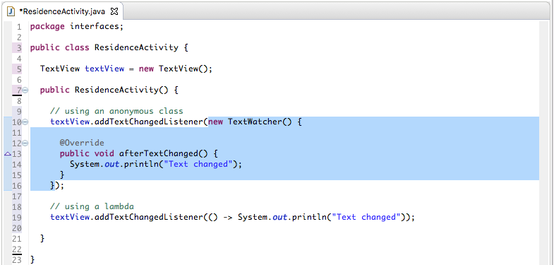

#Anonymous class

We shall lead in to demonstrating use of a lambda by first describing an anonymous class and then in the next step introducing `functional interfaces`. We will then be in a position to replace the anonymous class, the subject of our demo, with a lambda.

Some changes are required to the application as follows:

- delete or comment out MyRentApp.main method. We will not be running the application in this and following steps.

```
package interfaces;

public class MyRentApp {

  public static void main(String[] args) {
    
    ResidenceActivity activity = new ResidenceActivity();
    
  }
}

```

- Introduce a simple TextView class containing a TextWatcher field and a method to set a listener:

```

package interfaces;


public class TextView
{
  private TextWatcher textwatcher;

  public void addTextChangedListener(TextWatcher textwatcher)
  {
    this.textwatcher = textwatcher;

  }
}
```

- Declare and initialize a TextView field in ResidenceActivity.

```
  TextView textView = new TextView();


```

- In a ResidenceActivity default constructor invoke addTextChangedListener on this TextView field:

```
textView.addTextChangedListener();
```
This will generate an error because we have not provided a suitable parameter.

Recall the signature of TextView.addTextChangedListener:

```
 addTextChangedListener(TextWatcher textwatcher)
```

We shall satisfy this parameter requirement with an anonymous class. First we shall implement the class and then describe how it works.

- Modify textView.addTextChangedListener by introducing an anonymous class of type TextWatcher as a parameter as follows:

```
    textView.addTextChangedListener(new TextWatcher() {
      
    });
```

- Errors are still presenent because the abstract method `void afterTextChanged()` has not been implemented. Implement this and the error disappears.

```
    textView.addTextChangedListener(new TextWatcher() {

      @Override
      public void afterTextChanged() {
        // TODO Auto-generated method stub
      
      }
      
    });
```
- Replace the stub code with a message. Here is the completed constructor:

```
  public ResidenceActivity() {
    textView.addTextChangedListener(new TextWatcher() {

      @Override
      public void afterTextChanged() {
        System.out.println("Text changed");
      
      }
      
    });
  }
```

What is referred to as anonymous class is highlighted in blue in Figure 1 here. What takes place transparent to the user is that a synthetic class is created and this class implements the TextWatcher interface. An object of the class is then created, a reference to which is passed as a parameter to the method `TextView.addTextChangedListener`. This object satisfies the typing requirement of the parameter, namely TextWatcher.





