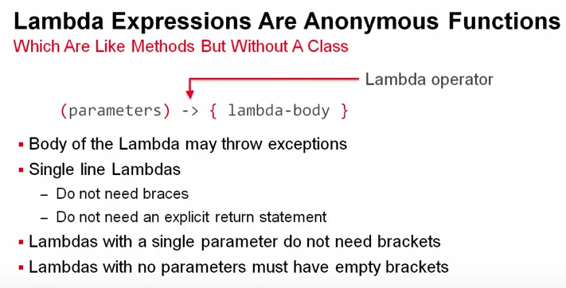
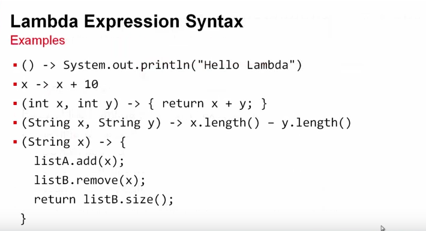
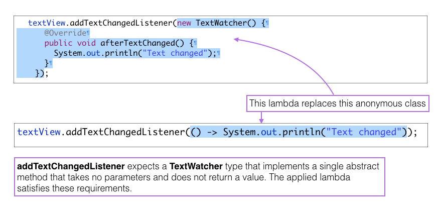
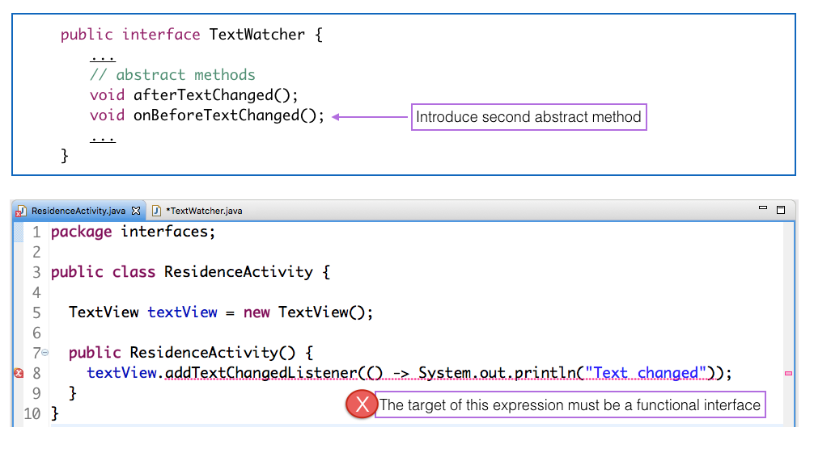

# Lambda expressions

A lambda expression could be described as an anonymous function - a block of code that is capable of expressing behaviour, is not associated with any class and that does not have a name.

Figures 1 and 2<sup>1</sup> illustrate the syntax of lambda expressions.





Consider, for example, the third lambda in Figure 2:

```
(int x, int y) -> {return x + y;}
```
The behaviour of this lambda is equivalent to that of the following method:

```
int add(int x, int y) {
  return x + y;
}
```

A lambda expression becomes a valid parameter to a method where an object of a class that implements an interface with a single abstract method is expected. Such an interface is referred to as a `functional interface` as explained in an earlier step. We have already encountered an example of in practice. Here, again, is the signature of the TextView method to add a listener:

```
addTextChangedListener(TextWatcher textwatcher)                      
```
The formal parameter is `TextWatcher textwatcher`. Thus an object of a class that implements the TextWatcher interface satisfies the parameter type requirement. And so in this situation we may apply a lambda. This is illustrated in Figure 3 below.

Here is the completed ResidenceActivity in which the anonymous class is replaced by a lambda.

```

package interfaces;

public class ResidenceActivity {

  TextView textView = new TextView();
  
  public ResidenceActivity() {  
    textView.addTextChangedListener(() -> System.out.println("Text changed"));
  }
}


```

Compare the above to the following in which an anonymous class is used:

```
package interfaces;

public class ResidenceActivity {

  TextView textView = new TextView();

  public ResidenceActivity() {
    textView.addTextChangedListener(new TextWatcher() {

      @Override
      public void afterTextChanged() {
        System.out.println("Text changed");
      }
    });
  }
}

```



Experiment by adding a second abstract method to TextWatcher. In doing so, TextWatcher ceases to be a functional interface.

```
void onBeforeTextChanged();
```
Observe an error is now generated in ResidenceActivity. This is caused by an attempt to convert a non-functional interface to a lambda expression. See Figure 4.


## 
<sup>1</sup> [JDK 8 Lambdas MOOC Course. Oracle. Simon Ritter](https://www.youtube.com/watch?v=WXtVHTGDV9g&list=PLMod1hYiIvSZL1xclvHcsV2dMiminf19x&index=1). See Lesson 1-2.