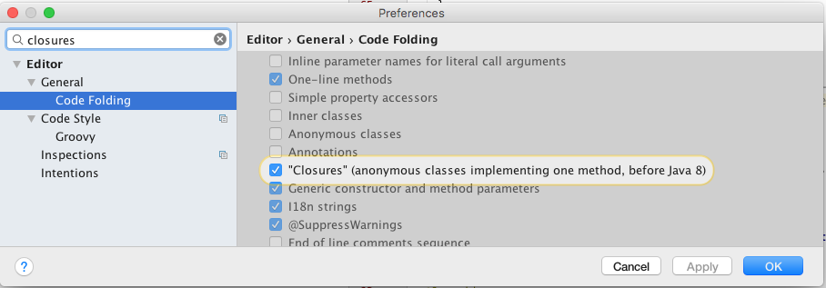
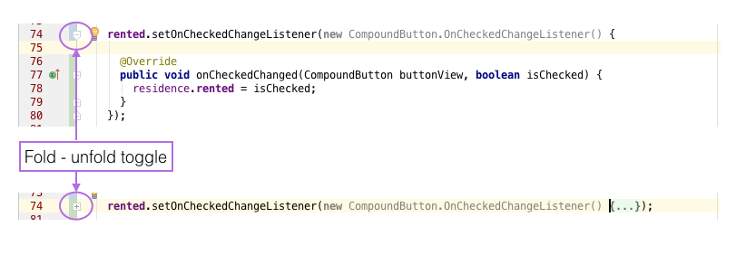
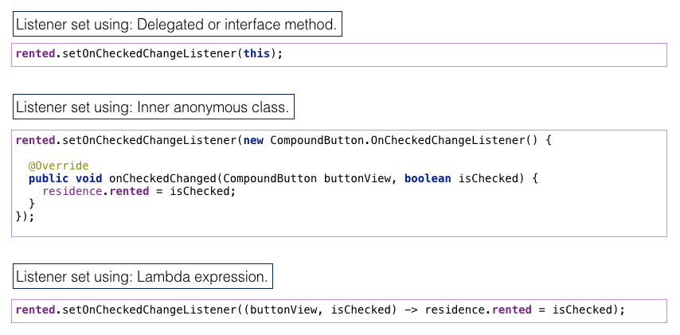

#Lambdas & Android (Convert anonymous class)

Open ResidenceActivity.java in Android Studio.

We shall confine ourselves to refactoring the check box code only. Presently the listener associated with this widget is set using the interface or delegated method. We will change this to the use of an anonymous class and then convert the anonymous class to a lambda expression.

- Delete or comment out `CompoundButton.OnCheckedChangeListener` from the class header. This now becomes:

```
public class ResidenceActivity extends AppCompatActivity implements TextWatcher,
    View.OnClickListener,
    DatePickerDialog.OnDateSetListener
```

Replace `rented.setOnCheckedChangeListener(this);` so as to use an anonymous inner class:

```
    rented.setOnCheckedChangeListener(new CompoundButton.OnCheckedChangeListener() {

      @Override
      public void onCheckedChanged(CompoundButton buttonView, boolean isChecked) {
        residence.rented = isChecked;
      }
    });
```

Toggle the code folding icon (+|-) immediately to the left of the line of code beginning `rented.set...`. Observe the folding feature. This is available if the appropriate setting is enabled in the Android Studio Preferences (Figures 1 & 2).

- Editor > General > Code Folding
    - "Closures (anonymous classes implementing one method, before Java 8"





We are allowed to convert this inner anonymous class to a lambda expression because the [`OnCheckedChangedListener`](https://developer.android.com/reference/android/widget/CompoundButton.OnCheckedChangeListener.html) interface contains a single abstract method and thus qualifies as a functional interface. This method, `onCheckedChanged`, has 2 parameters - a CompoundButton and a boolean. The lambda expression can infer these types and so it is not necessary to explicitly specify them. Here is the replacement lambda:

```
rented.setOnCheckedChangeListener((button, isChecked) -> residence.rented = isChecked);
```
Test the app by created both a checked and unchecked residence, closing the app, reopening and ensuring the check box state is correctly represented. 

To summarize, three approaches to setting a listener are illustrated in Figure 3.

 

Add, commit and push this branch (lambda) to your remote repo. Then checkout the master branch and continue further labs from this point.
